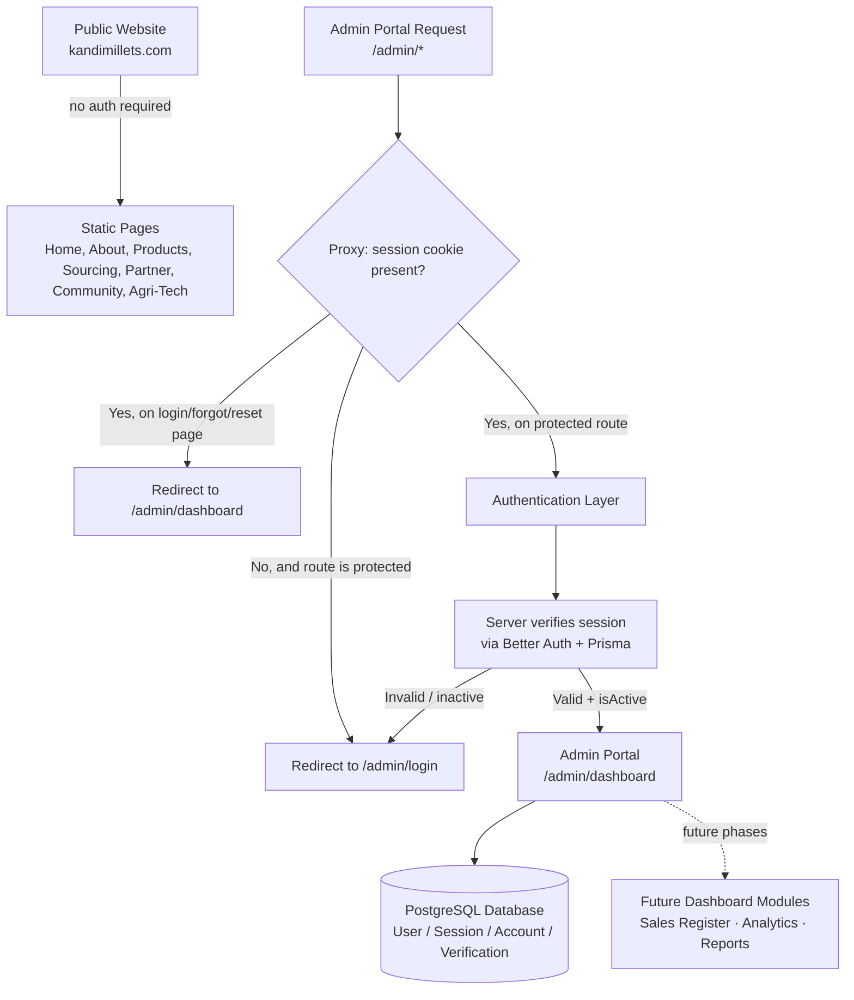
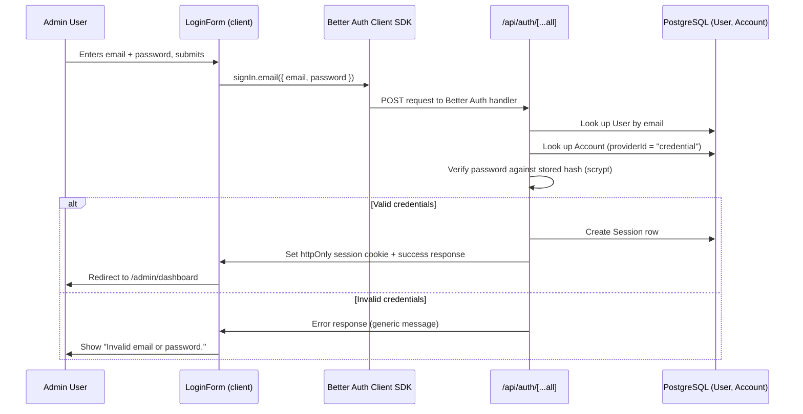
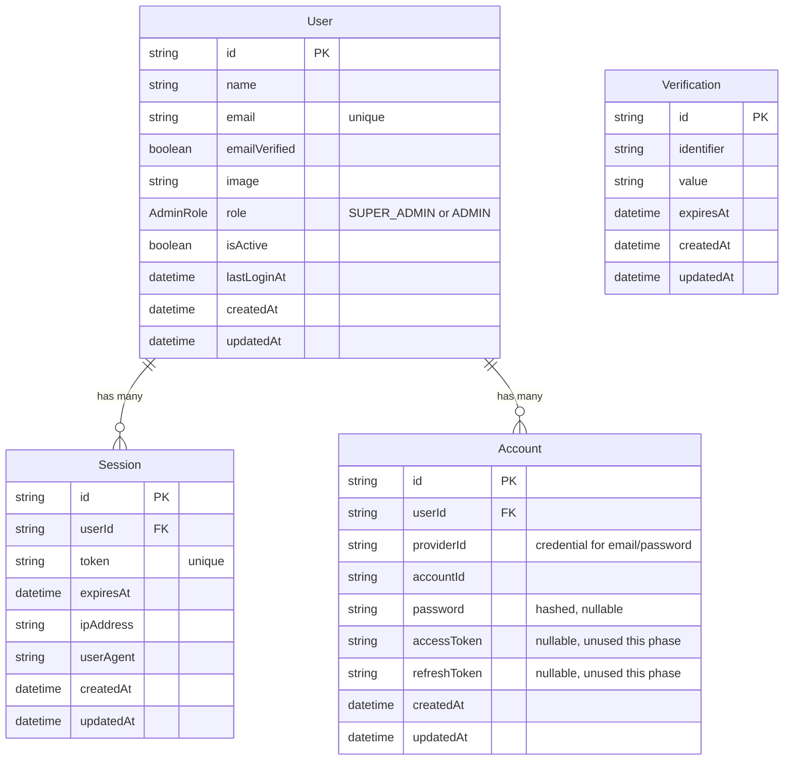
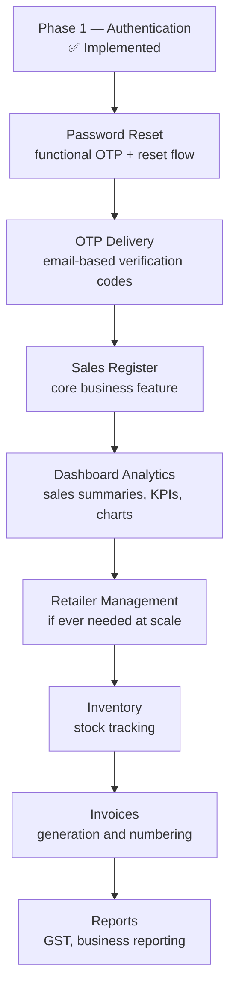

# Kandimillets Admin Portal — System Documentation

> **Status:** Phase 1 (Authentication Foundation) — implemented.
> **Audience:** Engineers who need to understand, operate, or extend the admin subsystem without reading the source first.
> **Scope of this document:** The `/admin` subsystem only. For the public marketing site, see [`ARCHITECTURE.md`](../ARCHITECTURE.md).

---

## Table of Contents

1. [Overview](#1-overview)
2. [Architecture](#2-architecture)
3. [Tech Stack](#3-tech-stack)
4. [Authentication](#4-authentication)
5. [Authorization](#5-authorization)
6. [Database](#6-database)
7. [Security](#7-security)
8. [Environment Variables](#8-environment-variables)
9. [Deployment](#9-deployment)
10. [Future Roadmap](#10-future-roadmap)
11. [Maintenance](#11-maintenance)
12. [Recovery](#12-recovery)

---

## 1. Overview

### Purpose of the Admin Portal

The Admin Portal is an internal, non-public application layered on top of the existing Kandimillets marketing website. It exists to give the business's own staff — not customers, not retailers, not the public — a private place to eventually manage day-to-day business operations: sales records, product performance, and business reporting.

Phase 1, documented here, delivers only the **authentication foundation** that every later feature depends on: a way for a small, fixed set of named individuals to sign in securely, and a way to keep everyone else out.

### Business Goals

- Give the business owner (and family/staff who help run it) a private tool that is *not* the public website.
- Guarantee that only pre-approved individuals can ever access it — **there is no public registration, and there never will be**.
- Build the authentication layer once, correctly, so every future admin feature (sales register, analytics, reporting) can be added behind it without re-solving login, sessions, or access control.

### Why Authentication Exists

The admin portal will eventually hold commercially sensitive information — sales figures, retailer relationships, payment status, business performance. Even though Phase 1 contains no such data yet, the authentication layer is built first and treated as security-critical, because:

- Every future feature is added *behind* this gate, not alongside it.
- Retrofitting proper authentication after sensitive data already exists is far riskier than building it first.
- The business explicitly named exactly three authorized individuals — the system must enforce that boundary from day one.

### Relationship with the Public Website

The public website (`kandimillets.com` — the product catalog, sourcing story, partner inquiry form, etc.) and the Admin Portal (`/admin`) are two logically separate applications that happen to share one Next.js codebase and one deployment.

- The public site is **statically generated, content-driven, and has no login** — it is unaffected by anything described in this document.
- The admin portal is **dynamically rendered, database-backed, and requires authentication** for every page except the login/forgot-password/reset-password screens.
- They share the same Tailwind design tokens (colors, fonts, card styles) purely for visual consistency, but share **no layout, no navigation, and no runtime state**. A visitor to the public site never loads any admin code, and an admin session cookie is scoped only to `/admin` routes' redirect logic — public pages never check for it.

---

## 2. Architecture

### High-Level Flow



### How Route Groups Isolate the Admin System

Next.js **route groups** — folders wrapped in parentheses, e.g. `(site)` — organize routes without adding a segment to the URL. This is the mechanism used to physically separate the public site from the admin portal inside one `src/app/` tree:

```
src/app/
├── layout.tsx              ← Root layout: fonts + <html>/<body> shell ONLY
├── globals.css
├── sitemap.ts / robots.ts  ← Public-site SEO files
│
├── (site)/                 ← Route group: PUBLIC WEBSITE
│   ├── layout.tsx          ← Navbar, Footer, FloatingCTA, all public SEO metadata
│   ├── page.tsx            ← "/"
│   ├── about/page.tsx      ← "/about"
│   ├── products/...        ← "/products", "/products/[slug]"
│   ├── sourcing/page.tsx   ← "/sourcing"
│   ├── partner/page.tsx    ← "/partner"
│   ├── community/page.tsx ← "/community"
│   ├── agri-tech/page.tsx ← "/agri-tech"
│   └── actions.ts          ← Public inquiry-form Server Action
│
├── admin/                   ← NOT a route group — "admin" IS the URL prefix
│   ├── layout.tsx           ← Admin shell: no Navbar/Footer, noindex metadata
│   ├── login/page.tsx       ← "/admin/login"
│   ├── forgot-password/page.tsx  ← "/admin/forgot-password" (placeholder)
│   ├── reset-password/page.tsx   ← "/admin/reset-password" (placeholder)
│   └── dashboard/page.tsx   ← "/admin/dashboard" (protected)
│
└── api/auth/[...all]/route.ts   ← Better Auth's catch-all API handler
```

Key point: `(site)` is a **route group** (parentheses — invisible in the URL), while `admin` is a **regular folder** (its name *is* part of the URL, `/admin/...`). Because they are siblings under `src/app/`, each gets its own `layout.tsx` with completely independent chrome:

- The root `layout.tsx` provides only the shared HTML shell and web fonts — nothing else.
- `(site)/layout.tsx` renders the public `Navbar`, `Footer`, `FloatingCTA`, and owns all the public SEO metadata (Open Graph, Twitter cards, keywords).
- `admin/layout.tsx` renders none of that. It sets `robots: { index: false, follow: false }` so search engines never index it, and provides only a minimal branded background — no public navigation exists inside `/admin` at all.

This means a change to the public Navbar can never accidentally affect the admin portal, and vice versa — the two layouts do not import from each other. The isolation is structural (separate files, separate component trees), not just a naming convention.

---

## 3. Tech Stack

| Technology | Why it was selected |
|---|---|
| **Next.js 16 (App Router)** | Already the framework for the public site — reusing it avoids running two separate applications/deployments. App Router gives file-system routing, Server Components, Server Actions, and Route Handlers, all of which the admin portal uses directly. |
| **React 19** | Ships with Next.js 16. `useActionState` (used elsewhere in the codebase for the public inquiry form) is part of the same React version, keeping form-handling patterns consistent. |
| **TypeScript** | The entire codebase is TypeScript already. Prisma generates fully-typed database models; Better Auth infers types from its own config — both integrate naturally with a strict TypeScript project and catch schema/config mismatches at compile time. |
| **Tailwind CSS** | Reused, not re-decided. The admin portal borrows the exact same design tokens (`green-*`, `brown-*`, `gold-*`, `warm-*`, `premium-card`, `font-heading`) defined in `globals.css`, so the admin login screen looks like it belongs to the same product without writing any new CSS system. |
| **Better Auth** | Chosen over building custom authentication after an explicit architecture review (see [`ARCHITECTURE.md` § "Admin Portal Architecture"](../ARCHITECTURE.md)). Reasoning: password hashing, session management, and cookie security are exactly the kind of code that quietly goes wrong over a multi-year lifetime if hand-rolled. Better Auth is self-hosted (no vendor lock-in, no per-user SaaS cost), integrates with the project's own PostgreSQL database via Prisma, and ships first-class Next.js support (`nextCookies()` plugin, `toNextJsHandler`). |
| **Prisma** | The ORM connecting Better Auth to PostgreSQL. Chosen for strong TypeScript type generation, a mature migration workflow, and first-class support as a Better Auth database adapter (`@better-auth/prisma-adapter`). |
| **PostgreSQL** | A relational database is the correct fit for a system whose near-term future is a **Sales Register** — tabular, relational data (dates, amounts, retailers, products) that will need joins, aggregation, and financial-grade consistency. This was decided (and MongoDB/Google Sheets explicitly rejected) during the architecture review. |
| **Vercel** | The existing/intended deployment target for the whole project (per project README and prior architecture decisions). Vercel Postgres / Neon-backed Postgres is the natural database pairing for a Vercel-deployed Next.js app. |
| **Session Cookies (httpOnly)** | Better Auth's session strategy stores a database-backed session referenced by an httpOnly cookie, rather than a purely stateless JWT. This was a deliberate choice: it means a session can be revoked in real time (relevant to the `isActive` flag — see [§5](#5-authorization)) rather than having to wait for a token to expire. |

---

## 4. Authentication

### Login Flow



In code terms: `src/components/admin/LoginForm.tsx` is a client component. On submit, it calls `signIn.email({ email, password })` from the Better Auth React client (`src/lib/auth/auth-client.ts`). This makes a request to the catch-all API route (`src/app/api/auth/[...all]/route.ts`), which delegates entirely to the Better Auth server instance (`src/lib/auth/auth.ts`). Better Auth does the lookup, password verification, session creation, and cookie-setting internally — none of that is custom code in this project.

### Session Creation

When login succeeds, Better Auth:
1. Creates a row in the `Session` table (id, `userId`, `token`, `expiresAt`, `ipAddress`, `userAgent`).
2. Sets an **httpOnly** cookie on the response containing a reference to that session, via the `nextCookies()` plugin (required specifically so Next.js Server Actions/Route Handlers are allowed to set cookies).
3. Session expiry defaults to Better Auth's own default: **7 days**, refreshed on use (`updateAge` of 1 day) — this is what implements "remember me" behavior without any extra code, and is unmodified from Better Auth's defaults.

### Session Validation

There are **two independent checks**, deliberately layered as defense-in-depth:

1. **Fast check — `src/proxy.ts`** (Next.js's request-interception layer, run before any page renders). This calls `getSessionCookie(request)` from `better-auth/cookies`, which only checks that a correctly-signed session cookie is present — it does **not** query the database. This is what redirects an unauthenticated visitor away from `/admin/dashboard` to `/admin/login` before any page code runs.
2. **Full check — inside the protected page itself.** `src/app/admin/dashboard/page.tsx` independently calls `auth.api.getSession({ headers: await headers() })`, which *does* query the database (via Prisma) to confirm the session row still exists and is unexpired, and returns the associated `User` record. If this returns `null`, the page redirects to `/admin/login` again, even if the proxy's cookie check passed.

This two-layer design exists because a cryptographically valid cookie does not guarantee the underlying session or user is still supposed to have access (for example, if an admin is deactivated — see [§5](#5-authorization)) — only the database-backed check can know that.

### Logout

`src/components/admin/LogoutButton.tsx` calls `signOut()` from the Better Auth client. This deletes the corresponding `Session` row in the database and clears the session cookie in the same request — logout is an immediate, server-side revocation, not just a client-side cookie deletion.

### Password Hashing

**Why Better Auth's default scrypt hashing is used, not bcrypt:**

Better Auth ships its own maintained password hashing implementation (scrypt) with built-in constant-time verification. During implementation, a deliberate choice was made **not** to override this with a custom bcrypt implementation, even though earlier planning documents mentioned "bcrypt/Argon2." The reasoning:

- Overriding Better Auth's `password.hash`/`password.verify` means the project would own that cryptographic code going forward — exactly the class of hand-rolled security logic the architecture review warned against.
- Better Auth's default is actively maintained upstream; using it as-is means password-hashing correctness is not this project's burden to carry for the next decade.
- The seed script (see [§6](#6-database)) uses the *exact same* `hashPassword` function Better Auth uses internally (`better-auth/crypto`), so seeded passwords are guaranteed to verify correctly at login — there is no risk of a custom hasher and Better Auth's verifier disagreeing.

### Why Public Signup Is Permanently Disabled

The Better Auth server config (`src/lib/auth/auth.ts`) sets:

```ts
emailAndPassword: {
  enabled: true,
  disableSignUp: true,
}
```

`disableSignUp: true` makes Better Auth's own sign-up endpoint refuse every request, unconditionally. This is not a UI-level restriction (e.g. "there's no sign-up page linked anywhere") — it is enforced at the API layer, so even a direct request to Better Auth's sign-up endpoint is rejected. This directly implements the business rule: **there are exactly three authorized users, and no mechanism exists anywhere in the system for a fourth account to self-register.** New admin accounts can only ever be created by (a) the seed script (this phase), or (b) a future "admin creates admin" feature built by an already-authenticated administrator (a later phase — not yet implemented).

---

## 5. Authorization

### Current State: Role Field Exists, Enforcement Does Not (Yet)

The `User` model (see [§6](#6-database)) has a `role` column of type `AdminRole`, with two values:

- **`SUPER_ADMIN`** — assigned to the two personally-named administrators (Shaurya, Father) in the seed script.
- **`ADMIN`** — assigned to the shared "Business Email" account in the seed script.

**Important — read carefully:** in Phase 1, the `role` field is *stored* on every user but is **not yet read or enforced anywhere in the application code.** Every authenticated admin currently has identical access (the one dashboard placeholder page). There is no route, page, or Server Action in this phase that checks `role` before allowing an action. This is intentional, not an oversight — see below.

### Why the Role Field Already Exists

The field was added now, ahead of any feature that needs it, because retrofitting a permissions concept onto a system where staff already depend on "logged in = full access" is a materially harder and riskier change than reserving the column today. This follows directly from the architecture review's conclusion that role/permission modeling is one of the few things worth over-preparing for, because the business explicitly anticipates growth beyond the founding three users (warehouse staff, an accountant) in later phases.

### Current Permissions

| Role | What it can currently do |
|---|---|
| `SUPER_ADMIN` | Sign in, view the placeholder dashboard, sign out. Identical to `ADMIN` today. |
| `ADMIN` | Sign in, view the placeholder dashboard, sign out. Identical to `SUPER_ADMIN` today. |

### Future Permissions (Not Implemented — Planned Direction Only)

The intended long-term distinction, to be implemented alongside future features (not committed to code yet):

- **`SUPER_ADMIN`** — expected to gain the exclusive ability to create/deactivate other admin accounts ("admin creates admin"), and full access to every future module (Sales Register, analytics, reports).
- **`ADMIN`** — expected to retain day-to-day operational access (e.g. entering sales records) without account-management privileges.
- A more granular permission model (e.g. distinguishing warehouse staff who can only enter data from an accountant who can only view financial reports) was flagged in the architecture review as something to design *before* onboarding any non-founding user, but is explicitly out of scope until that becomes a real near-term need.

---

## 6. Database

### Entity-Relationship Overview



### `User`

The core admin-identity table. Holds `name`, unique `email`, `emailVerified`, optional `image` — all part of Better Auth's canonical schema — plus three fields added specifically for this project:

- **`role`** (`AdminRole` enum) — see [§5](#5-authorization). Reserved now, enforced later.
- **`isActive`** (boolean, defaults `true`) — reserved for deactivating an admin's access without deleting their history. Not yet checked anywhere in application code in this phase (see [§11](#11-maintenance) for the manual workaround today).
- **`lastLoginAt`** (nullable datetime) — reserved for tracking when an admin last signed in. **Not yet written to** by any code in this phase — Better Auth does not populate this automatically; it is a placeholder column awaiting a future hook that updates it on successful login.

### `Session`

One row per active login. Holds the session `token` (referenced by the httpOnly cookie), `expiresAt`, and the `ipAddress`/`userAgent` captured at creation time. Deleting a session row (which `signOut()` does) immediately invalidates that cookie's access, regardless of its stated expiry.

### `Account`

Stores *how* a user authenticates. For this project, only one `providerId` is ever used: `"credential"`, meaning email+password. The `password` column holds the scrypt hash — never plaintext. The OAuth-related columns (`accessToken`, `refreshToken`, `idToken`, `scope`, token expiry fields) are part of Better Auth's canonical schema for social-login providers; **they are unused in this project** since no social/OAuth login exists or is planned, but are kept because Better Auth's Prisma adapter expects this exact model shape.

### `Verification`

A generic short-lived token store (`identifier`, `value`, `expiresAt`) that Better Auth uses internally for flows like email verification and password reset. It exists in the schema now because Better Auth's adapter requires the model to be present, but **no code in this phase writes to or reads from it** — the forgot-password/reset-password pages are placeholders (see [§10](#10-future-roadmap)).

### Relationships

- `User 1 —— * Session`: one admin can have multiple concurrent sessions (e.g. signed in on two devices); deleting the `User` cascades and deletes all their `Session` rows.
- `User 1 —— * Account`: modeled as one-to-many because Better Auth's schema supports multiple sign-in methods per user (e.g. password + a future social login); in practice, today, every `User` has exactly one `Account` row (`providerId: "credential"`). Deleting the `User` cascades and deletes their `Account` rows.

### Future Models (Not Implemented — Purpose Only, No Schema Invented Here)

These are named in prior architecture-review conversations as planned future additions. Their purpose is recorded here for context; **no fields, types, or migrations for them exist yet**, and none are described beyond their intended role:

- **Sales** — the planned Sales Register: the core future business feature, recording individual sales transactions (retailer, product, quantities, amounts, payment status) month by month.
- **Audit Logs** — planned to record *who* changed *what* and *when* for data mutations (not just login events, which is all that's tracked today via the `Session` table's implicit history). Identified in the architecture review as necessary before multiple non-founding staff are trusted to edit financial records.
- **Retailers** — a planned normalized entity for the businesses Kandimillets sells to, replacing what would otherwise be error-prone free-text retailer names once the Sales Register exists.

---

## 7. Security

### Implemented in Phase 1

| Practice | Status | Detail |
|---|---|---|
| **HttpOnly cookies** | ✅ Implemented | Better Auth sets the session cookie as httpOnly unconditionally — this is not a configurable-off default in this project; client-side JavaScript can never read the session token. |
| **Secure cookies** | ✅ Implemented | Better Auth marks cookies `Secure` automatically in production. This project additionally forces `useSecureCookies: true` whenever `NODE_ENV === "production"`, in `src/lib/auth/auth.ts`, so this guarantee doesn't depend on Better Auth's environment auto-detection alone. |
| **SameSite** | ✅ Implemented (Better Auth default) | Better Auth's default cookie attributes include a `SameSite` policy suitable for same-origin session cookies. Not overridden in this project. |
| **Password hashing** | ✅ Implemented | scrypt via Better Auth's own maintained implementation — see [§4](#4-authentication). No plaintext password is ever stored or logged. |
| **Session validation (defense-in-depth)** | ✅ Implemented | Two-layer check described in [§4](#4-authentication): fast cookie check in `proxy.ts`, full database check in the protected page itself. |
| **No public registration** | ✅ Implemented | `disableSignUp: true` enforced at the Better Auth API layer, not just absent from the UI — see [§4](#4-authentication). |
| **Route isolation** | ✅ Implemented | `proxy.ts`'s matcher is scoped to `/admin/:path*` only — it cannot affect, slow down, or accidentally protect any public-site route. |
| **`noindex` on all admin pages** | ✅ Implemented | `src/app/admin/layout.tsx` sets `robots: { index: false, follow: false }` so search engines never index or link to any `/admin` page. |
| **Generic login error messages** | ✅ Implemented | `LoginForm.tsx` shows the same "Invalid email or password." message regardless of whether the email exists or the password was wrong — avoids confirming which emails are registered. |

### Explicitly Future Work (Not Implemented Yet)

| Practice | Status | Why it's deferred |
|---|---|---|
| **Email OTP** | ❌ Not implemented | The forgot-password/reset-password pages are visual placeholders only (see [§10](#10-future-roadmap)). No OTP generation, storage, or email delivery exists. |
| **Password reset (functional)** | ❌ Not implemented | Same as above — the `Verification` table exists in the schema (required by Better Auth's adapter) but nothing writes to it yet. |
| **Audit logs (data mutations)** | ❌ Not implemented | Only login/logout are implicitly tracked via `Session` row creation/deletion. No table or code logs "who changed what" for any future data (there is no mutable business data yet in this phase to log). |
| **Rate limiting (durable)** | ❌ Not implemented | No login-attempt or OTP-request rate limiting exists in this phase at all — not even the in-memory approach used elsewhere in the codebase for the public inquiry form. This was explicitly flagged in the architecture review as a **blocking requirement before real production go-live** (not a "nice to have"), using a durable store (e.g. Upstash Redis or Vercel KV) rather than in-memory state, because in-memory counters do not persist reliably across serverless invocations. |
| **`isActive` enforcement** | ❌ Not implemented | The column exists and defaults to `true`, but no login or session-check code currently reads it to block a deactivated user. See [§11](#11-maintenance) for the manual interim workaround. |
| **`lastLoginAt` tracking** | ❌ Not implemented | The column exists but nothing writes to it yet. |
| **Role-based authorization** | ❌ Not implemented | See [§5](#5-authorization) — the field exists, enforcement does not. |

---

## 8. Environment Variables

All variables below are documented in `.env.example` at the project root. **None of them are committed with real values** — `.env` itself is git-ignored.

| Variable | Required in production? | Purpose |
|---|---|---|
| `DATABASE_URL` | Yes | PostgreSQL connection string (Neon / Vercel Postgres). Used by the Prisma client (`src/lib/db/prisma.ts`) via the `@prisma/adapter-pg` driver adapter — required for every database read/write, including every login. |
| `BETTER_AUTH_SECRET` | Yes | The signing/encryption key Better Auth uses for session tokens and other cryptographic operations. Better Auth **refuses to start correctly in production without this set** — it throws an error rather than silently falling back to an insecure default. Generate with `openssl rand -base64 32`. |
| `BETTER_AUTH_URL` | Yes | The server-side base URL of the deployment (e.g. `https://kandimillets.com`), passed to `betterAuth({ baseURL: ... })`. Used for correct cookie/callback scoping. |
| `NEXT_PUBLIC_BETTER_AUTH_URL` | Yes | The same URL, but exposed to the browser bundle (hence the `NEXT_PUBLIC_` prefix) for the client-side auth SDK (`src/lib/auth/auth-client.ts`) to know where to send requests. |
| `SEED_SHAURYA_EMAIL` / `SEED_SHAURYA_PASSWORD` | Only when running the seed script | Credentials for the first `SUPER_ADMIN` account. The seed script refuses to run if unset. |
| `SEED_FATHER_EMAIL` / `SEED_FATHER_PASSWORD` | Only when running the seed script | Credentials for the second `SUPER_ADMIN` account. |
| `SEED_BUSINESS_EMAIL` / `SEED_BUSINESS_PASSWORD` | Only when running the seed script | Credentials for the `ADMIN`-role "Business Email" account. |
| `GOOGLE_SHEETS_WEBHOOK_URL` | Yes (for the public site) | **Not part of the admin system** — pre-existing variable used by the public inquiry form's Server Action. Listed in `.env.example` for completeness only; unaffected by anything in this document. |

---

## 9. Deployment

### Local Development

1. Copy `.env.example` to `.env` and fill in real values (a local or cloud Postgres connection string is required even for local development — there is no SQLite/offline fallback in this schema).
2. Install dependencies: `npm install`.
3. Generate the Prisma client: `npm run db:generate`.
4. Apply migrations (see below).
5. Seed the three admin users (see below).
6. `npm run dev` and visit `http://localhost:3000/admin/login`.

### Neon Database

The project is designed against PostgreSQL, with Neon (via Vercel Postgres or a direct Neon project) as the intended provider — chosen in the architecture review for its native Vercel integration and serverless-friendly connection model. Provisioning a Neon database and copying its connection string into `DATABASE_URL` (with `?sslmode=require`) is the expected path to a working `.env`.

### Prisma Migration

The schema (`prisma/schema.prisma`) and its first migration (`prisma/migrations/20260715000000_init_better_auth/`) already exist in the repository. To apply them to a fresh database:

```bash
npx prisma migrate deploy
```

For local iterative development against a database you're allowed to reset, `npm run db:migrate` (`prisma migrate dev`) also works and will detect that the schema and migration history already match.

> **Note on how this migration was produced:** it was authored by diffing the Prisma schema against an empty database offline (`prisma migrate diff --from-empty`), because no live PostgreSQL instance was reachable in the environment where Phase 1 was built. The SQL was verified to be schema-valid, but has not yet been applied against a real database as of this document's writing. The first time it *is* applied, treat that as the real validation step — watch for errors.

### Prisma Seed

After migrations are applied, seed the three authorized accounts:

```bash
npm run db:seed
```

This runs `prisma/seed.ts`, which reads the six `SEED_*` environment variables, hashes each password with Better Auth's own `hashPassword`, and creates (or updates, if re-run) the `User` + `Account` rows. It is safe to re-run — it upserts by email rather than creating duplicates.

### Vercel Deployment

1. Set every variable from [§8](#8-environment-variables) in the Vercel project's Environment Variables settings (Production, and Preview if you want admin login to work on preview deployments too).
2. Ensure `DATABASE_URL` points at a database reachable from Vercel's serverless functions (Neon and Vercel Postgres both are, by design).
3. Deploy as normal — no special build configuration was introduced; `next build` already succeeds with this system in place (verified during Phase 1 implementation).
4. After the first deploy, run `npx prisma migrate deploy` and `npm run db:seed` against the production database (from a machine/CI job with `DATABASE_URL` pointed at production) — Vercel does not run these automatically as part of a deploy.

### Environment Variables Recap

See [§8](#8-environment-variables) for the full table. The two easiest-to-forget ones in a fresh Vercel deployment are `BETTER_AUTH_SECRET` (login will hard-fail without it) and `NEXT_PUBLIC_BETTER_AUTH_URL` (must be set at build time, since `NEXT_PUBLIC_` variables are inlined into the client bundle).

---

## 10. Future Roadmap



Each stage in this roadmap is intentionally built **on top of** what came before it, not in parallel:

- **Password Reset** and **OTP** come first because they complete the authentication story started in Phase 1 (the pages already exist as placeholders — see [§4](#4-authentication) and [§7](#7-security)).
- **Sales Register** is the first real business feature, and is the reason the database was chosen (PostgreSQL, relational) and the `role` field was reserved ahead of time.
- **Dashboard Analytics** depends on Sales Register data existing first — there is nothing to analyze before then.
- **Retailer Management** is listed conditionally ("if ever needed") because at low retailer counts, storing retailer identity directly on sales records may remain adequate; a dedicated management screen only becomes necessary if the retailer list grows large enough that data entry consistency becomes a problem.
- **Inventory**, **Invoices**, and **Reports** are downstream of Sales Register and Retailer data, in that order, because each depends on the previous stage's data existing and being reliable.

No code for any of these stages exists yet. This section records intent, not commitments to a specific schema or implementation.

---

## 11. Maintenance

### How to Add Another Admin

There is currently **no in-app UI** for this (that is a future "admin creates admin" feature). Today, the only way is to run the seed script with a new set of credentials, or to insert a `User` + `Account` row directly using Prisma:

1. Add new `SEED_*` variables (or temporarily reuse the pattern in `prisma/seed.ts` by editing the `seedUsers` array — remember this file is meant to seed *exactly* the three founding accounts, so any permanent new-admin process should eventually become its own script or in-app feature rather than growing this file indefinitely).
2. Hash the password with `hashPassword` from `better-auth/crypto` (the same function Better Auth uses internally) — never store a plaintext or independently-hashed password.
3. Create the `User` row, then an `Account` row with `providerId: "credential"` and the hashed password.
4. Re-run `npm run db:seed` if you extended the seed script, or apply the equivalent Prisma calls directly.

### How to Deactivate an Admin

The `isActive` column exists on `User` for exactly this purpose, but **no code currently checks it** (see [§7](#7-security)). Until that enforcement is built:

- Setting `isActive = false` on a `User` row today has **no effect on their ability to log in or use an existing session** — it is inert.
- The only way to actually revoke access today is to **delete that user's `Session` rows** (forces logout immediately) **and their `Account` row or change its password** (prevents logging back in). Deleting the `User` row entirely also works but destroys their identity record.
- Treat `isActive` enforcement as a near-term follow-up task, not a currently-working safeguard.

### How Password Resets Will Work (Future)

Not implemented. The intended flow (per prior architecture-review decisions, not yet built): an admin requests a reset from `/admin/forgot-password`, receives a one-time code via email, submits it plus a new password on `/admin/reset-password`, and the system verifies the code (stored in the `Verification` table), updates the `Account.password` hash, and invalidates existing sessions. Today, both pages render a static "coming soon" message and perform no server logic.

### How Migrations Should Be Handled

- Never hand-edit a file inside an already-applied `prisma/migrations/*` folder — migrations are an append-only history. To change the schema, edit `prisma/schema.prisma` and generate a **new** migration.
- Locally: `npx prisma migrate dev --name <description>` generates and applies a new migration in one step, against a database you're allowed to modify freely.
- Against a shared/production database: generate the migration locally first (`--create-only` to review the SQL before applying), commit it, then apply it in the target environment with `npx prisma migrate deploy`.
- Always run `npm run db:generate` after any schema change so the generated Prisma Client (`src/generated/prisma/`, git-ignored) stays in sync — this is also done automatically by `migrate dev`.

### How Schema Changes Should Be Made

- Add new fields as nullable or with a sensible `@default` wherever possible, so existing rows don't require a manual backfill migration.
- Do not remove or rename a field that Better Auth's adapter expects on `User`, `Session`, `Account`, or `Verification` (see [§6](#6-database)) without checking Better Auth's own schema requirements first — the adapter assumes this exact shape.
- Project-specific additions (like `role`, `isActive`, `lastLoginAt` on `User`) are safe to extend further, following the same pattern: add the column, decide its default, and only wire up enforcement/usage in application code as a deliberate, separate step.

---

## 12. Recovery

### Lost Password

For any of the three seeded admins: since functional password reset does not exist yet ([§10](#10-future-roadmap)), recovery today requires direct database access. Using Prisma (locally, with `DATABASE_URL` pointed at the target database), hash a new password with `hashPassword` from `better-auth/crypto` and update the corresponding `Account.password` field for that user's `credential` account. There is no admin-UI path for this yet.

### Lost Database

The database is the single source of truth for every admin identity and session — there is no secondary copy anywhere in this system. Recovery depends entirely on your PostgreSQL provider's own backup/point-in-time-recovery features (Neon and Vercel Postgres both offer this) — **this project itself implements no application-level backup**. If the database is lost with no provider-side backup available, the only recovery path is: re-provision a database, re-run `npx prisma migrate deploy`, and re-run `npm run db:seed` with the original three admins' intended credentials — this recreates the three accounts from scratch but permanently loses any session history or (in future phases) business data that existed since the last provider-side backup.

### Lost Environment Variables

- `DATABASE_URL` and `BETTER_AUTH_SECRET` are the two variables whose loss is most severe. If `BETTER_AUTH_SECRET` is lost and regenerated, **every existing session becomes invalid** (all admins are logged out) — this is expected and safe; simply generate a new one (`openssl rand -base64 32`) and have everyone log in again. It does not affect stored password hashes.
- If `DATABASE_URL` is lost but the underlying database still exists, retrieve the connection string again from your Postgres provider's dashboard (Neon/Vercel) — nothing in the application needs to change once the correct value is restored.
- The `SEED_*` variables are only needed transiently, at seed-run time — losing them after seeding has already succeeded has no runtime impact; they would only be needed again if you intend to re-run the seed script.

### Corrupted Migration

If a migration's recorded history in the database (`_prisma_migrations` table) disagrees with the actual schema (e.g. a migration was manually altered, or partially applied):

1. Run `npx prisma migrate status` first to see exactly what Prisma believes is out of sync — do not guess.
2. For a migration that was actually applied correctly but Prisma doesn't think so, `npx prisma migrate resolve --applied <migration_name>` marks it as applied without re-running the SQL.
3. For a genuinely broken migration in a non-production database, the safe path is `npx prisma migrate reset` (drops and rebuilds the database from migration history) — **never run this against a database holding real admin/business data** without a verified backup first, since it is destructive.
4. Against production, prefer writing a new corrective migration over editing history.

### Accidental Deployment

If a Phase 1 change is deployed to production before it's ready (e.g. a broken `BETTER_AUTH_SECRET`, or a migration not yet applied):

- The admin portal will fail closed, not open — Better Auth throws rather than falling back to an insecure default when its secret is missing, and Prisma will error on any query against a database that hasn't had the migration applied. In both failure modes, admins simply cannot log in; **the public website is unaffected**, because `proxy.ts`'s matcher only touches `/admin/*`, and the public site holds no dependency on the database, Better Auth, or any admin-portal code.
- Recovery is: fix the missing environment variable or apply the pending migration, then redeploy — no data-loss risk exists purely from a bad deploy of this subsystem, since it fails before writing anything.

---

*This document describes the system as implemented at the end of Phase 1. It should be updated alongside any future phase that changes authentication, authorization, or the database schema described here.*
