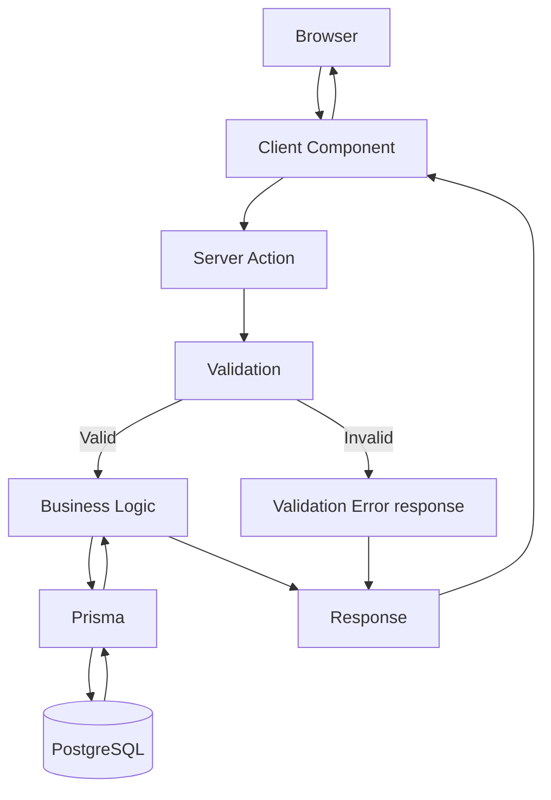
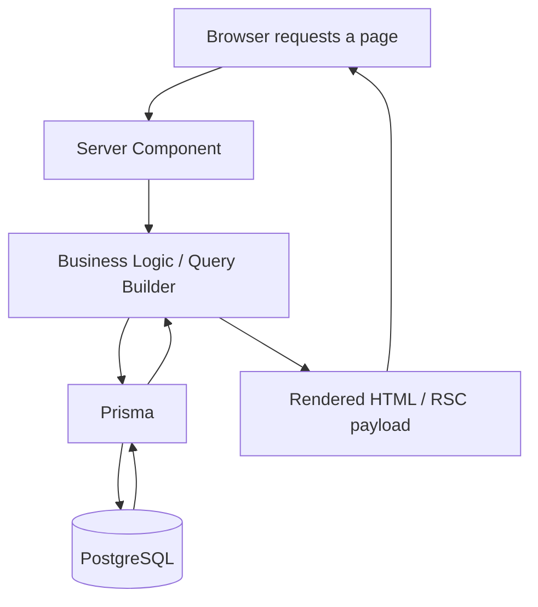

# Kandimillets — API & Backend Contract

> **Status:** Master contract document. Some contracts described here (Authentication) are **implemented**; most (Sales Register mutations/reads, Dashboard, Product/Retailer management, Future APIs) are **contract-first and not yet implemented** — see each section for its current status.
> **Scope:** Every Server Action and future API surface for the entire application — public site and Admin Portal alike.
> **Relationship to other documents:** This document does not replace [`ARCHITECTURE.md`](../ARCHITECTURE.md), [`docs/ADMIN_SYSTEM.md`](ADMIN_SYSTEM.md), or [`docs/SALES_REGISTER.md`](SALES_REGISTER.md) — it sits above them as the cross-cutting backend contract, and cross-references each rather than re-explaining what they already cover in full. Where a contract's full field-level rationale already exists elsewhere, this document links to it instead of duplicating it.
> **This document is implementation-agnostic.** It describes behavior, inputs, outputs, validation, and business rules — never code, never Prisma syntax, never literal JSON schemas.

---

## Table of Contents

1. [Purpose](#1-purpose)
2. [General Principles](#2-general-principles)
3. [Standard Request Flow](#3-standard-request-flow)
4. [Standard Response Format](#4-standard-response-format)
5. [Sales Register API Contracts](#5-sales-register-api-contracts)
6. [Dashboard Contracts](#6-dashboard-contracts)
7. [Product Contracts](#7-product-contracts)
8. [Retailer Contracts](#8-retailer-contracts)
9. [Authentication Contracts](#9-authentication-contracts)
10. [Validation Rules](#10-validation-rules)
11. [Error Handling](#11-error-handling)
12. [Security](#12-security)
13. [Idempotency](#13-idempotency)
14. [Transactions](#14-transactions)
15. [Future APIs](#15-future-apis)
16. [Versioning Strategy](#16-versioning-strategy)
17. [Design Philosophy](#17-design-philosophy)

---

## 1. Purpose

### Why API contracts exist

Every piece of backend behavior in this application — every Server Action, every data read, every future API route — has a caller on one side and a business rule on the other. A contract is the explicit, written agreement between them: what inputs are accepted, what happens to them, what comes back, and what can go wrong. Without that agreement written down, "what the backend does" only exists as tribal knowledge inside whoever last touched the code — which does not scale past the three-person admin team this system was built for, and actively works against the goal (stated throughout [`ARCHITECTURE.md`](../ARCHITECTURE.md) and [`docs/ADMIN_SYSTEM.md`](ADMIN_SYSTEM.md)) of a system maintainable for the next decade.

### Why implementation follows documentation

This project has, without exception, designed before building: the authentication foundation was architecture-reviewed before Phase 1 was implemented ([`docs/ADMIN_SYSTEM.md`](ADMIN_SYSTEM.md)), and the Sales Register was fully designed — including two rounds of business-driven revision — before its Phase 2A (data foundation) and Phase 2B (interface) were built ([`docs/SALES_REGISTER.md`](SALES_REGISTER.md)). This document continues that discipline at the level of the backend contract itself: a Server Action's behavior should be reviewable and correctable on paper, where a mistake costs a sentence to fix, rather than discovered after it is already handling real financial data. See [§17](#17-design-philosophy) ("Documentation precedes implementation") for the underlying principle.

### This document is the authoritative contract for all backend behavior

Where this document and a component's actual implementation disagree, that is a bug to fix — either the implementation drifted, or this document was not updated alongside a deliberate change. Every future backend feature (Sales Register mutations, Dashboard aggregates, Product/Retailer management, and everything listed in [§15](#15-future-apis)) should be specified here, reviewed, and only then implemented — mirroring exactly how [`docs/SALES_REGISTER.md`](SALES_REGISTER.md) was produced before any Sales Register code existed.

---

## 2. General Principles

These principles govern every backend action in this codebase, present and future — Sales Register, Dashboard, and anything in [§15](#15-future-apis) alike.

| Principle | Meaning |
|---|---|
| **Server Actions are preferred over REST where appropriate** | This codebase has never introduced a REST API layer for its own frontend to call — the public inquiry form uses a Server Action (`submitInquiry`, see [`ARCHITECTURE.md`](../ARCHITECTURE.md) §11), and the Sales Register's designed contract follows the identical pattern ([`docs/SALES_REGISTER.md`](SALES_REGISTER.md) §9). A REST/route-handler API is reserved for cases with a genuine external caller (Better Auth's own catch-all route is the one existing example — it must be a URL because the Better Auth client SDK calls it directly) or a future integration that isn't this app's own frontend (see [§15](#15-future-apis)). |
| **Validation always occurs server-side** | Client-side validation (HTML `required`, `type=email`, min-length hints) exists purely for immediate user feedback. It is never the source of truth. Every Server Action re-validates every input as though the client-side checks did not run — because a malicious or buggy client can always skip them. |
| **Never trust client-computed values** | Any value the server can compute itself — most importantly money — is computed server-side from its inputs, and any client-submitted version of that value is discarded, not merely double-checked. See [§10](#10-validation-rules) and [`docs/SALES_REGISTER.md`](SALES_REGISTER.md) §3/§9 for the concrete case of `totalAmount`/`outstandingAmount`. |
| **Money is always computed server-side** | The specific, financial-grade instance of the rule above: quantities and rates are accepted from the client; totals, discounts, and outstanding balances are always derived server-side from those inputs, never accepted directly. This is a correctness requirement, not a style preference — a financial ledger cannot tolerate a total that silently disagrees with its own quantity/rate. |
| **Authentication required for all admin actions** | Every Server Action and data read behind `/admin` requires a currently valid session, full stop — there is no "read-only, no login needed" admin endpoint anywhere in this system's design. This is enforced today by `src/proxy.ts` plus a page-level `auth.api.getSession()` re-check (see [`docs/ADMIN_SYSTEM.md`](ADMIN_SYSTEM.md) §4), and every future admin Server Action must repeat that page-level re-check independently rather than assuming the proxy already handled it — see [§12](#12-security). |
| **Authorization checked before execution** | Once role-based permissions exist (reserved but not yet enforced — [`docs/ADMIN_SYSTEM.md`](ADMIN_SYSTEM.md) §5), every action that should be restricted to a role must check that permission **before** touching any data, not after a tentative write. Authentication answers "who are you"; authorization answers "are you allowed to do this specific thing" — the two checks are sequential and neither substitutes for the other. |
| **Every mutation should be deterministic** | Given the same inputs and the same starting database state, a mutation should produce the same result every time — no silent randomness, no hidden dependency on wall-clock time beyond an explicit, documented field (e.g. `createdAt`). This is what makes a mutation reasonable to test, to reason about, and to audit. See [§13](#13-idempotency) for how this relates to (but is distinct from) idempotency. |

---

## 3. Standard Request Flow

### Write path (Server Action)

This is the standard shape for every mutation in this system — the exact chain a Create/Update/Void Sale action follows, and the chain every future mutation should follow unless there is a specific reason not to.

- **Browser → Client Component:** a user action (form submit, button click) in a `'use client'` component — e.g. `InquiryForm` today, `AddSaleModal` in the Sales Register design ([`docs/SALES_REGISTER.md`](SALES_REGISTER.md) §6).
- **Client Component → Server Action:** the component invokes a Server Action directly (React's `useActionState`/form `action` binding, or a plain async call) — no client-side `fetch` to a hand-built API route.
- **Server Action → Validation:** sanitize, then validate, before anything else runs — this is the exact order already established in `app/actions.ts`'s `submitInquiry` (sanitize → validate) and carried into the Sales Register design ([`docs/SALES_REGISTER.md`](SALES_REGISTER.md) §9/§10).
- **Validation → Business Logic:** only valid input reaches business logic. An invalid input short-circuits directly to a Validation Error response (see [§4](#4-standard-response-format)) without touching Prisma at all.
- **Business Logic → Prisma → PostgreSQL:** business logic (computing totals, resolving the acting user from the session, deciding a resulting status) calls Prisma, which is the only thing in this codebase that talks to PostgreSQL directly — see [`docs/ADMIN_SYSTEM.md`](ADMIN_SYSTEM.md) §3 for why Prisma was chosen.
- **Response:** a single, typed result travels back up the same chain to the Client Component, which updates the UI — see [§4](#4-standard-response-format) for the shape of that result.

### Read path (Server Component)

Reads do **not** follow the same chain — this codebase's established convention (every existing page, and the Sales Register's designed [§9 API Contract](SALES_REGISTER.md)) is that reads happen via direct server-side data-fetching inside a Server Component, with no client round-trip and no Server Action involved at all:

A page like `/admin/dashboard` or the future data-backed `/admin/sales` fetches its own data on the server before rendering — there is no separate "API call" step a client makes to populate the page. Client-side re-fetching (e.g., after applying a filter) still ultimately re-runs this same server-side path, either via a full navigation/re-render or a dedicated read-only Server Action — never a hand-built REST route for this app's own frontend, per [§2](#2-general-principles).

---

## 4. Standard Response Format

Every Server Action in this system communicates its outcome through one of the categories below — mirroring the discriminated-status pattern already established by `submitInquiry`'s `FormState` (`idle | success | error | validation_error`, see [`ARCHITECTURE.md`](../ARCHITECTURE.md) §11) and by the Sales Register's designed contract (`docs/SALES_REGISTER.md` §9). This section describes the **behavior** of each category — not a JSON shape.

| Category | When it occurs | What the caller learns | Safe to retry? |
|---|---|---|---|
| **Success** | The action completed and any resulting data (a created row's identifier, an updated record) is available. | The outcome, plus whatever the caller needs next (e.g. a newly assigned Sale Number). | N/A — already succeeded. |
| **Failure** | A general term covering any of the specific failure categories below. Not a distinct category on its own — every real failure is one of Validation, Authentication, Authorization, Business Rule, or Unexpected. | — | Depends on the specific category. |
| **Validation Error** | One or more submitted fields fail a rule described in [§10](#10-validation-rules) (missing required field, wrong type, out-of-range value). | Which field(s) failed and why, in language a person entering data can act on — mirroring `submitInquiry`'s per-field `ValidationError[]`. | Yes, after correcting the input — this is the expected, everyday retry path. |
| **Authentication Error** | The caller has no valid session, or the session has expired/been revoked, at the moment the action runs. | That they need to sign in again — never a hint about *why* (see [`docs/ADMIN_SYSTEM.md`](ADMIN_SYSTEM.md) §4's generic-error-message principle, extended here to every action, not just login). | Yes, after re-authenticating. |
| **Authorization Error** | The caller has a valid session but lacks the permission this specific action requires (a future state, once role enforcement per [`docs/ADMIN_SYSTEM.md`](ADMIN_SYSTEM.md) §5 exists). | That the action is not permitted for their account — not a description of what permission would have allowed it, to avoid leaking the permission model unnecessarily. | No — retrying with the same session will not succeed; a different, permitted account is required. |
| **Business Rule Error** | The input is well-formed and the caller is authenticated and authorized, but the action violates a rule about the *state of the data* rather than the shape of the input (e.g. voiding an already-voided sale — see [§13](#13-idempotency)). | A description of the conflicting business state, specific enough to explain why the action can't proceed right now. | Sometimes — depends on whether the underlying state changes (e.g. retry after refreshing to see the current state). |
| **Unexpected Error** | Anything not anticipated by the categories above — a database connectivity failure, an unhandled exception, an infrastructure fault. | A generic, non-technical message. Internal details (stack traces, raw database errors) are logged server-side, never surfaced to the caller — this avoids leaking implementation details and matches how `submitInquiry` already handles thrown errors (log and return a generic error state, see [`ARCHITECTURE.md`](../ARCHITECTURE.md) §11). | Sometimes — many causes (transient network/database issues) are safe to retry as-is; others (a genuine bug) will fail identically on retry. |

Every category is a **known, named outcome** — a Server Action should never let an unanticipated exception escape uncaught to the client. This is why "Unexpected Error" exists as a category at all: it is the deliberate catch-all, not a gap in the contract.

---

## 5. Sales Register API Contracts

> **Status:** Designed, not yet implemented as Server Actions. This section formalizes the contracts already established in [`docs/SALES_REGISTER.md`](SALES_REGISTER.md) §9 (mutations) and §7 (read/search/filter/sort/pagination strategy), decomposing the search/filter/pagination facets into individually named contracts as requested here. It does not redefine anything — where this section and `docs/SALES_REGISTER.md` could be read as disagreeing, `docs/SALES_REGISTER.md` is authoritative for the Sales Register's data model and business rules; this section exists to give each operation its own explicit contract entry.
>
> Phase 2B (implemented) currently runs these operations against an in-memory mock dataset inside the client component itself (see `docs/SALES_REGISTER.md` §14, Phase 2B) — none of the contracts below are wired to Prisma/PostgreSQL yet. That wiring is Phase 2C.

### Create Sale

| Aspect | Contract |
|---|---|
| **Inputs** | Invoice Number (optional), Invoice Date, Due Date (optional, defaults to Invoice Date), Retailer, Product, Quantity (decimal), Unit, Rate, GST Included, Payment Status, Payment Method + Payment Date (only if recording a payment immediately), External Invoice Ref (optional), Remarks (optional). See [`docs/SALES_REGISTER.md`](SALES_REGISTER.md) §9. |
| **Outputs** | Success/Validation Error result; on success, the new row's identifier and its system-generated, unique, immutable Sale Number. |
| **Validation** | Full rule set in [§10](#10-validation-rules) and [`docs/SALES_REGISTER.md`](SALES_REGISTER.md) §10. |
| **Business Rules** | Total Amount and Outstanding Amount are always computed server-side, never accepted as input. Sale Number is always server-assigned, never accepted as input. Amount Paid follows the Payment Status rule in [§10](#10-validation-rules). |
| **Side Effects** | One `Sale` row is created. Once `SaleAuditLog` exists (Phase 2E, [`docs/SALES_REGISTER.md`](SALES_REGISTER.md) §14), a `CREATE` entry is written in the same operation — see [§14](#14-transactions) for why this must be atomic with the row creation. |
| **Authorization** | Requires a valid admin session (re-verified server-side, not just the proxy's cookie check). No role restriction today; see [§2](#2-general-principles) and [`docs/SALES_REGISTER.md`](SALES_REGISTER.md) §13 for how a future restriction would be added without redesigning this contract. |
| **Future compatibility** | Designed to accept a fuller payment-history entry once that model exists, rather than the current single Payment Date/Method pair ([`docs/SALES_REGISTER.md`](SALES_REGISTER.md) §3). Tax fields (`discountAmount`, `taxRate`, `taxAmount`) are already accepted-but-defaulted so a future GST module needs no new input field, only new business logic. |

### Update Sale

| Aspect | Contract |
|---|---|
| **Inputs** | The Sale's identifier, plus whichever fields changed (same shape as Create Sale). |
| **Outputs** | Success/Validation Error result. |
| **Validation** | Same field-level rules as Create Sale, applied to whichever fields are present in the update. |
| **Business Rules** | Total Amount and Outstanding Amount are recomputed server-side whenever Quantity, Rate, or Amount Paid change — never merely patched. Sale Number can never appear as a target of an update, under any circumstance ([`docs/SALES_REGISTER.md`](SALES_REGISTER.md) §10). |
| **Side Effects** | The `Sale` row is modified. `updatedByUserId` is set to the acting admin (from the server-verified session, never from client input). Once `SaleAuditLog` exists, an `UPDATE` entry recording the specific old→new field values is written atomically with the update ([§14](#14-transactions)). |
| **Authorization** | Same as Create Sale. |
| **Future compatibility** | The design's split between a low-friction "quick edit" path (Payment Status, Invoice Number, Remarks) and a deliberate modal path (any field affecting the computed total) — [`docs/SALES_REGISTER.md`](SALES_REGISTER.md) §6 — implies **two** Update Sale call shapes may eventually exist (a narrow quick-edit variant and a full variant), both converging on this same contract's validation/business rules. |

### Void Sale

| Aspect | Contract |
|---|---|
| **Inputs** | The Sale's identifier, and a non-empty void reason. |
| **Outputs** | Success/Business Rule Error result. Never removes the row. |
| **Validation** | Void reason is required and non-empty ([`docs/SALES_REGISTER.md`](SALES_REGISTER.md) §10). |
| **Business Rules** | Sets `isVoided = true` and stores the reason — never a hard delete ([`docs/SALES_REGISTER.md`](SALES_REGISTER.md) §3/§6). Voiding an already-voided sale is a Business Rule Error, not a silent success — see [§13](#13-idempotency). |
| **Side Effects** | The row is hidden from the default list view (still recoverable via the "show voided" filter). Once `SaleAuditLog` exists, a `VOID` entry is written atomically with the update. |
| **Authorization** | Same as Create Sale; a natural candidate for a future role restriction ("who may void a sale") per [`docs/SALES_REGISTER.md`](SALES_REGISTER.md) §13. |
| **Future compatibility** | Kept as its own contract (rather than folded into Update Sale) specifically so a future permission check can be attached to voiding without touching ordinary edits — this separation was a deliberate design decision, not an accident ([`docs/SALES_REGISTER.md`](SALES_REGISTER.md) §13). |

### Get Sales

The umbrella read contract underlying Search Sales, Filter Sales, and Paginated Sales below — in the finished design, these are not four separate operations but **one operation accepting several optional parameter groups**, exactly as `docs/SALES_REGISTER.md` §7 specifies ("All four are server-side, driven by one combined query per table view"). This document names each parameter group separately only because it was asked to — the underlying contract is singular.

| Aspect | Contract |
|---|---|
| **Inputs** | Any combination of: free-text search, date range (or a month/year selector, or a quick preset — all resolving to the same `{from, to}` shape), Retailer filter, Product filter, Payment Status filter, "include voided" flag, sort column + direction, page number, page size. |
| **Outputs** | The matching rows for the requested page, plus the total matching count (for pagination controls). |
| **Validation** | Page number/size within sane bounds; sort column restricted to an allow-listed set (Sale Number, Invoice Date, Retailer, Total, Payment Status — [`docs/SALES_REGISTER.md`](SALES_REGISTER.md) §7); date range `from` ≤ `to`. |
| **Business Rules** | Voided rows are excluded by default; included only when the caller explicitly sets "include voided." Default sort is Invoice Date descending. |
| **Side Effects** | None — pure read. |
| **Authorization** | Requires a valid admin session. |
| **Future compatibility** | At the stated growth scale (500 retailers, 50,000 sales — [`docs/SALES_REGISTER.md`](SALES_REGISTER.md) §4), this must remain a database-level query (indexed, paginated) and never become a "fetch everything, filter in memory" operation — the mock-data implementation in Phase 2B does exactly that today, deliberately, and must be replaced (not extended) when Phase 2C wires this to Prisma. |

### Get Sale By ID

Not separately named in `docs/SALES_REGISTER.md`, but implied by its Edit flow ("opens the same modal used for Add, pre-filled with the row's current values" — [`docs/SALES_REGISTER.md`](SALES_REGISTER.md) §6), which requires fetching one specific row. Formalized here for completeness.

| Aspect | Contract |
|---|---|
| **Inputs** | The Sale's identifier (or its Sale Number, as an equally valid lookup key given its guaranteed uniqueness — [`docs/SALES_REGISTER.md`](SALES_REGISTER.md) §3). |
| **Outputs** | The full row, or a not-found outcome if no such Sale exists. |
| **Validation** | The identifier must be well-formed; a syntactically invalid identifier is a Validation Error, while a well-formed but non-existent identifier is a not-found outcome, not treated as a system failure. |
| **Business Rules** | A voided row is still returned by this contract (it is a valid, existing record) — voided-ness is a display/filter concern for list views, not a reason to hide a specific record from a direct lookup by identifier. |
| **Side Effects** | None. |
| **Authorization** | Requires a valid admin session. |
| **Future compatibility** | This is the natural entry point for a future dedicated Sale detail view or a printable record, should either become necessary. |

### Search Sales

A parameter facet of **Get Sales**, not a separate operation.

| Aspect | Contract |
|---|---|
| **Inputs** | Free-text search string. |
| **Outputs** | Rows whose Sale Number, Retailer name, Invoice Number, External Invoice Ref, or Remarks match. |
| **Validation** | Length-capped, sanitized before use, consistent with the general sanitization principle in [§12](#12-security). |
| **Business Rules** | Matches against the normalized `Retailer` name and the immutable Sale Number, which is precisely what keeps search results reliable as data grows — see [`docs/SALES_REGISTER.md`](SALES_REGISTER.md) §7. |
| **Side Effects** | None. |
| **Authorization** | Same as Get Sales. |
| **Future compatibility** | None beyond what Get Sales already provides. |

### Filter Sales

A parameter facet of **Get Sales**, not a separate operation.

| Aspect | Contract |
|---|---|
| **Inputs** | Date range (via quick preset, custom range, or month/year selector), Retailer, Product, Payment Status (potentially multiple values at once), "include voided." |
| **Outputs** | Rows matching all applied filters (a logical AND across filter groups). |
| **Validation** | Each filter value must reference a real, existing option (a Retailer/Product id that exists; a Payment Status value from the fixed enum). |
| **Business Rules** | See [`docs/SALES_REGISTER.md`](SALES_REGISTER.md) §7 for the full filter set and its rationale, including the Monthly Archive's relationship to the date-range filter (below). |
| **Side Effects** | None. |
| **Authorization** | Same as Get Sales. |
| **Future compatibility** | None beyond what Get Sales already provides. |

### Paginated Sales

A parameter facet of **Get Sales**, not a separate operation.

| Aspect | Contract |
|---|---|
| **Inputs** | Page number, page size (25/50/100 per [`docs/SALES_REGISTER.md`](SALES_REGISTER.md) §7). |
| **Outputs** | The rows for that page, plus the total matching count so the caller can render page controls. |
| **Validation** | Page number ≥ 1; page size within the allow-listed set. |
| **Business Rules** | Classic numbered pagination, deliberately not infinite scroll — a financial ledger benefits from a stable, referenceable page position ([`docs/SALES_REGISTER.md`](SALES_REGISTER.md) §7). |
| **Side Effects** | None. |
| **Authorization** | Same as Get Sales. |
| **Future compatibility** | None beyond what Get Sales already provides. |

### Monthly Archive

A distinct aggregate-count contract, not a facet of Get Sales — it answers "how many sales exist per month," independent of any currently active filter, so an admin can always see the full archive regardless of what they're currently viewing ([`docs/SALES_REGISTER.md`](SALES_REGISTER.md) §7).

| Aspect | Contract |
|---|---|
| **Inputs** | None (always computed over the full, non-voided dataset). |
| **Outputs** | A Year → Month → count structure (e.g. `2026 → January (12), February (18), March (22), April (31)`). |
| **Validation** | N/A — no inputs. |
| **Business Rules** | Always reflects the complete dataset, not the currently filtered view — this is a browsing affordance layered on top of, not gated by, the active filters. Voided sales are excluded from counts, consistent with every other summary in this system. |
| **Side Effects** | None. |
| **Authorization** | Requires a valid admin session. |
| **Future compatibility** | The counts this contract produces are exactly the kind of aggregate that benefits from a materialized view or scheduled job once data volume grows past what a live `GROUP BY` comfortably serves ([`docs/SALES_REGISTER.md`](SALES_REGISTER.md) §4) — not a schema change, just a query-strategy change behind the same contract. |

### Recent Sales

Feeds the Dashboard's "Recent Activity" tile ([`docs/SALES_REGISTER.md`](SALES_REGISTER.md) §8) — see also [§6](#6-dashboard-contracts).

| Aspect | Contract |
|---|---|
| **Inputs** | A count limit (how many recent entries to return). |
| **Outputs** | The N most recently created (or most recently mutated, once `SaleAuditLog` exists) sales, with enough detail to show what was entered and by whom. |
| **Validation** | Count limit bounded to a sane maximum (this is a summary tile, not a paginated list). |
| **Business Rules** | Ordered most-recent-first by creation time (or mutation time, once audit logging exists) — not by Invoice Date, since the point of this tile is "what just happened," not "what's the newest transaction by business date." |
| **Side Effects** | None. |
| **Authorization** | Requires a valid admin session. |
| **Future compatibility** | Once `SaleAuditLog` exists (Phase 2E), this contract's output naturally extends to include edits and voids, not just creations, without changing its shape. |

---

## 6. Dashboard Contracts

> **Status:** Designed in [`docs/SALES_REGISTER.md`](SALES_REGISTER.md) §8; not implemented. `/admin/dashboard` remains the Phase 1 placeholder described in [`docs/ADMIN_SYSTEM.md`](ADMIN_SYSTEM.md) §10.

| Contract | Purpose | Source |
|---|---|---|
| **Revenue Summary** | Today's sales total and count, plus this-month-vs-last-month totals with a trend indicator — the headline numbers an admin checks first each morning. | [`docs/SALES_REGISTER.md`](SALES_REGISTER.md) §8's "Today's Sales" and "This Month vs. Last Month" tiles. |
| **Monthly Summary** | The fuller month-by-month trend view, beyond the dashboard's single this-month/last-month comparison — a full history, not just the latest two periods. | [`docs/SALES_REGISTER.md`](SALES_REGISTER.md) §11's "Monthly Sales Summary" (future analytics), distinguished from the dashboard's lighter-weight Revenue Summary above. |
| **Product Summary** | Top products this month by revenue or volume, as a small ranked list — not a chart, kept light enough for a dashboard tile. | [`docs/SALES_REGISTER.md`](SALES_REGISTER.md) §8's "Top Products this month" tile; extends into [§11](SALES_REGISTER.md)'s "Product Analytics" for the fuller future version. |
| **Retailer Summary** | Top retailers this month by revenue, same treatment as Product Summary. | [`docs/SALES_REGISTER.md`](SALES_REGISTER.md) §8's "Top Retailers this month" tile; extends into §11's "Retailer Analytics." |
| **Pending Payments** | Total outstanding amount across all non-voided sales with status Pending or Partial (deliberately excluding Cancelled, whose outstanding amount was written off, not owed), plus a count of affected retailers and a visual split for how many are overdue. Identified as likely the single most operationally useful tile for a small distributor watching cash flow. | [`docs/SALES_REGISTER.md`](SALES_REGISTER.md) §8, directly. |
| **Recent Activity** | See [Recent Sales](#5-sales-register-api-contracts) above — the same contract, presented on the dashboard. | [`docs/SALES_REGISTER.md`](SALES_REGISTER.md) §8. |

**Explicitly out of scope for any Dashboard contract:** a "Website Traffic" widget — that is marketing analytics from an entirely different data source, already flagged in [`docs/SALES_REGISTER.md`](SALES_REGISTER.md) §8 as scope creep that should not influence the dashboard's data dependencies.

**Query strategy for all six contracts:** direct aggregate queries (`SUM`, `COUNT`, `GROUP BY`) against the indexed columns named in [`docs/SALES_REGISTER.md`](SALES_REGISTER.md) §3 are the correct starting implementation at this system's initial scale — a materialized view or scheduled aggregation job is the documented next step only if real usage later shows live aggregation is too slow, never the starting point ([`docs/SALES_REGISTER.md`](SALES_REGISTER.md) §4/§8).

---

## 7. Product Contracts

### Current scope

`Product` exists today only as a normalized database entity (Phase 2A, [`docs/SALES_REGISTER.md`](SALES_REGISTER.md) §3), seeded with sample data for development and consumed as read-only reference data by the Sales Register's Create/Update Sale contracts (a Retailer/Product selector, not a management screen). There is **no** create, update, or delete contract for `Product` today, and none was implemented in Phase 2B — product management pages were explicitly excluded from that phase's scope. The distinction between this admin-side `Product` record (SKU/category/default-unit, used for data entry and reporting) and the public marketing catalog (`src/data/products.ts`, descriptions/images for the website) is architectural, not incidental — see [`docs/SALES_REGISTER.md`](SALES_REGISTER.md) §3 for why the two must never be merged into one model.

### Future scope

A "Product Management" screen (create/edit/deactivate products, manage default units and categories) is a natural, low-risk future addition — the `Sale.productId` foreign key is already the hook such a screen would need, exactly as [`docs/SALES_REGISTER.md`](SALES_REGISTER.md) §12 describes for the analogous Retailer case. Whether a dedicated screen is ever built should follow the same conditional logic already established for Retailer Management: fully adequate via the Sales Register's own selector at low product counts (today: six products), and worth a dedicated screen only if the catalog grows enough to need self-service management. Beyond a management screen, `Product` is also the anchor for the future **Inventory** stage named in [`ARCHITECTURE.md`](../ARCHITECTURE.md) Part VI's roadmap (stock tracking keyed to the same product identity) — see [§15](#15-future-apis).

---

## 8. Retailer Contracts

### Current scope

Identical in shape to Product's current scope: `Retailer` exists as a normalized database entity (Phase 2A), seeded with sample data, consumed as read-only reference data by the Sales Register's Create/Update Sale contracts. No create, update, or delete contract exists today, and retailer management pages were explicitly excluded from Phase 2B's scope.

### Future scope

Already fully documented — see [`docs/SALES_REGISTER.md`](SALES_REGISTER.md) §12 ("Future Retailer Management Compatibility") for the complete reasoning, not repeated here per this document's own instruction not to duplicate unnecessarily. In summary: the data model already supports a future Retailer Management screen without any schema change; whether that screen is ever built is conditional on retailer-list growth, not a foregone conclusion; and `Retailer` must never be merged into a shared "Party" table with a future Supplier/Distributor concept ahead of a second real use case.

---

## 9. Authentication Contracts

> **Status:** Login, Logout, and Get Session are **implemented** (Phase 1, [`docs/ADMIN_SYSTEM.md`](ADMIN_SYSTEM.md) §4). Forgot Password and Reset Password are placeholder pages only — not implemented.
>
> This section is a contract-level summary; [`docs/ADMIN_SYSTEM.md`](ADMIN_SYSTEM.md) §4 is authoritative for the full narrative, sequence diagram, and reasoning (why scrypt over bcrypt, why signup is permanently disabled, etc.) — read it for anything beyond the contract shape below.

### Login

| Aspect | Contract |
|---|---|
| **Inputs** | Email, password. |
| **Outputs** | Success (an httpOnly session cookie is set) or Authentication Error (generic "Invalid email or password" — never reveals whether the email exists). |
| **Validation** | Both fields required; no further client-facing validation beyond presence, since the real check is the credential lookup itself. |
| **Business Rules** | Public self-registration does not exist anywhere in this system, enforced at the API layer (`disableSignUp: true`) — Login can never create an account, only authenticate an existing one ([`docs/ADMIN_SYSTEM.md`](ADMIN_SYSTEM.md) §4). |
| **Side Effects** | A `Session` row is created; an httpOnly cookie referencing it is set on the response. |
| **Authorization** | None required to call Login itself (it is how authorization becomes possible for everything else). |
| **Future compatibility** | `isActive` enforcement (rejecting login for a deactivated admin) and `lastLoginAt` tracking are both reserved fields not yet wired into this contract — see [`docs/ADMIN_SYSTEM.md`](ADMIN_SYSTEM.md) §6/§7 and [§11](#11-error-handling) below. |

### Logout

| Aspect | Contract |
|---|---|
| **Inputs** | None beyond the current session (read from the request). |
| **Outputs** | Success. |
| **Validation** | N/A. |
| **Business Rules** | Revocation is immediate and server-side — the `Session` row is deleted, not merely the cookie cleared client-side ([`docs/ADMIN_SYSTEM.md`](ADMIN_SYSTEM.md) §4). |
| **Side Effects** | The `Session` row is deleted; the cookie is cleared. |
| **Authorization** | Requires a currently valid session (there is nothing to log out of otherwise). |
| **Future compatibility** | None anticipated — this is a stable, complete contract. |

### Get Session

| Aspect | Contract |
|---|---|
| **Inputs** | The request's cookies/headers (no explicit caller-supplied input). |
| **Outputs** | The current session and associated user if valid, or a null/empty result if not. |
| **Validation** | N/A. |
| **Business Rules** | This is the **database-backed** check — distinct from the faster, cookie-presence-only check `src/proxy.ts` performs before this ever runs. See [`docs/ADMIN_SYSTEM.md`](ADMIN_SYSTEM.md) §4's two-layer defense-in-depth explanation. Every protected page and every future Server Action should call this independently rather than trusting the proxy alone. |
| **Side Effects** | None (a read). |
| **Authorization** | N/A — this contract *is* the authorization primitive other contracts build on. |
| **Future compatibility** | Once role/`isActive` enforcement exists, this is the natural place that enforcement is checked — a session can be "valid" (the row exists, isn't expired) while the associated user is deactivated, and this contract is what would catch that. |

### Forgot Password (future)

| Aspect | Contract |
|---|---|
| **Inputs** | Email. |
| **Outputs** | A generic success message regardless of whether the email exists (no enumeration) — an OTP is sent only if it does. |
| **Validation** | Email format only. |
| **Business Rules** | Any prior unconsumed OTP for the same account is invalidated when a new one is requested; the OTP has a short expiry and a limited number of verification attempts. |
| **Side Effects** | A `Verification` row is created (the table already exists in the schema, unused — [`docs/ADMIN_SYSTEM.md`](ADMIN_SYSTEM.md) §6); an email is sent. |
| **Authorization** | None required (this is how a locked-out admin regains access). |
| **Future compatibility** | Not yet implemented at all — see [`docs/ADMIN_SYSTEM.md`](ADMIN_SYSTEM.md) §10/§11 for the intended flow this contract will follow once built. |

### Reset Password (future)

| Aspect | Contract |
|---|---|
| **Inputs** | The OTP, and a new password. |
| **Outputs** | Success (password updated, existing sessions invalidated) or Validation/Business Rule Error (OTP invalid, expired, or attempts exhausted). |
| **Validation** | New password meets the same minimum requirements as any credential; OTP must match, be unexpired, and not already consumed. |
| **Business Rules** | On success, all of that user's existing sessions should be invalidated — a password reset should force re-authentication everywhere, not just where the reset happened. |
| **Side Effects** | `Account.password` is updated (hashed, never plaintext); the `Verification` row is marked consumed; existing `Session` rows for that user are deleted. |
| **Authorization** | Possession of a valid OTP substitutes for a session (this is explicitly the recovery path for someone who cannot currently authenticate). |
| **Future compatibility** | Not yet implemented — see [`docs/ADMIN_SYSTEM.md`](ADMIN_SYSTEM.md) §10/§11. |

---

## 10. Validation Rules

The full prose rationale for each rule lives in [`docs/SALES_REGISTER.md`](SALES_REGISTER.md) §10 — this table is a quick-reference summary, not a replacement for it.

| Field | Rule | Source |
|---|---|---|
| **Sale Number** | Never accepted as client input, on create or update. Always server-generated, always unique, enforced at the database level. | [`docs/SALES_REGISTER.md`](SALES_REGISTER.md) §3/§10 |
| **Invoice Number** | Optional, user-editable, free text, length-capped, sanitized. Not database-unique — duplicates are a business convention to encourage, not a system constraint to enforce. | [`docs/SALES_REGISTER.md`](SALES_REGISTER.md) §3/§10 |
| **Quantity** | Required, decimal (not integer-only — e.g. `10.5`, `2.75`, `0.5`), must be greater than zero. | [`docs/SALES_REGISTER.md`](SALES_REGISTER.md) §3/§10 |
| **Rate** | Required, numeric, must be greater than zero. A soft (non-blocking) warning is appropriate if it deviates sharply from a product's recent average rate. | [`docs/SALES_REGISTER.md`](SALES_REGISTER.md) §10 |
| **Outstanding Amount** | Never accepted as client input. Always computed server-side as Total Amount minus Amount Paid; must correctly support future partial payments (non-zero after a partial payment). | [`docs/SALES_REGISTER.md`](SALES_REGISTER.md) §3/§10 |
| **Payment Status** | Required; one of `PENDING`, `PARTIAL`, `PAID`, `CANCELLED`. "Overdue" is never submitted or stored — it is a UI-computed display state derived from Due Date. | [`docs/SALES_REGISTER.md`](SALES_REGISTER.md) §3/§10 |
| **Retailer** | Required; must reference an existing `Retailer` record. No free-text fallback. | [`docs/SALES_REGISTER.md`](SALES_REGISTER.md) §10 |
| **Product** | Required; must reference an existing `Product` record. | [`docs/SALES_REGISTER.md`](SALES_REGISTER.md) §10 |
| **Invoice Date** | Required; not more than ~1 day in the future; not before a sane earliest bound. | [`docs/SALES_REGISTER.md`](SALES_REGISTER.md) §10 |
| **Due Date** | Defaults to Invoice Date if not supplied; must never be earlier than Invoice Date. | [`docs/SALES_REGISTER.md`](SALES_REGISTER.md) §10 |
| **Remarks** | Optional, length-capped (~500 characters), sanitized. Not a substitute for a missing structured field — a recurring pattern in Remarks is a signal a real field is needed. | [`docs/SALES_REGISTER.md`](SALES_REGISTER.md) §10 |

**Business rules that span multiple fields** (not single-field validation, but cross-field consistency the server must enforce):
- Amount Paid must be strictly between 0 and the total when status is `PARTIAL`; must equal 0 when status is `PENDING` or `CANCELLED`; must equal the total when status is `PAID`.
- Payment Method is required whenever a Payment Date is set, and left null otherwise — a payment cannot be recorded without stating how it was made.
- Void Reason is required, non-empty, whenever a sale is voided.
- Created By / Updated By are never accepted as client input — always derived from the authenticated session, server-side, at the moment of the write.

---

## 11. Error Handling

Concrete scenarios, mapped to the abstract categories in [§4](#4-standard-response-format):

| Scenario | Category | Notes |
|---|---|---|
| **Validation errors** (missing field, wrong type, out-of-range value) | Validation Error | Field-level, actionable, expected to happen routinely as part of normal data entry. |
| **Database failures** (connection lost, query timeout, constraint violation not otherwise anticipated) | Unexpected Error | Logged server-side with full detail; the caller receives a generic message only. |
| **Duplicate invoice number** | **Not an error at all**, by design. | Invoice Number carries no uniqueness constraint — see [`docs/SALES_REGISTER.md`](SALES_REGISTER.md) §3. If duplicate awareness is ever wanted for the person entering data, that would be a non-blocking, informational note shown client-side ("another sale already uses this invoice number") — never a Validation Error or a blocked save. This is called out explicitly here because "duplicate invoice" reads like an obvious hard-error case, and it deliberately is not one in this system's finalized design. |
| **Missing retailer** (a Create/Update Sale references a Retailer id that doesn't exist, or references a `Retailer` with `isActive = false`) | Validation Error | Retailer is a required reference field ([§10](#10-validation-rules)); a non-existent or inactive retailer should be treated the same as a missing one for the purpose of accepting a new sale against it. |
| **Inactive user** (a session belongs to a `User` with `isActive = false`) | Authentication Error, once implemented | Not enforced anywhere today — `isActive` is a reserved field with no code path checking it yet ([`docs/ADMIN_SYSTEM.md`](ADMIN_SYSTEM.md) §7). Documented here as the intended future behavior: an otherwise-valid session belonging to a deactivated user should be rejected at the [Get Session](#9-authentication-contracts) check, not treated as a general failure. |
| **Permission denied** (a caller is authenticated but lacks the role/permission a specific action requires) | Authorization Error, once implemented | Not enforced anywhere today — the `role` field exists but no code path checks it yet ([`docs/ADMIN_SYSTEM.md`](ADMIN_SYSTEM.md) §5). Every Sales Register contract in [§5](#5-sales-register-api-contracts) is deliberately structured so this check can be inserted without a redesign, per [`docs/SALES_REGISTER.md`](SALES_REGISTER.md) §13. |
| **Unexpected server failure** (anything not anticipated above — an unhandled exception, an infrastructure fault) | Unexpected Error | The deliberate catch-all category from [§4](#4-standard-response-format) — no exception should ever escape a Server Action uncaught. |

---

## 12. Security

This section is a cross-cutting synthesis; [`docs/ADMIN_SYSTEM.md`](ADMIN_SYSTEM.md) §7 and [`docs/SALES_REGISTER.md`](SALES_REGISTER.md) §13 are authoritative for the full detail behind each point.

| Concern | Current state | Notes |
|---|---|---|
| **Authentication** | ✅ Implemented — Better Auth, database-backed sessions, httpOnly cookies. | [`docs/ADMIN_SYSTEM.md`](ADMIN_SYSTEM.md) §4/§7. Applies to every contract in this document without exception — there is no unauthenticated admin action anywhere in this system's design. |
| **Authorization** | ❌ Not yet implemented — `role`/`isActive` reserved, unenforced. | [`docs/ADMIN_SYSTEM.md`](ADMIN_SYSTEM.md) §5. Every contract in [§5](#5-sales-register-api-contracts) is structured to accept this check being inserted later without redesign. |
| **Input validation** | ✅ Established pattern (sanitize → validate), applied consistently. | [`ARCHITECTURE.md`](../ARCHITECTURE.md) §11 (`submitInquiry`), [`docs/SALES_REGISTER.md`](SALES_REGISTER.md) §10. Every Server Action in this document follows the same order. |
| **Output sanitization** | ✅ Free-text fields (Remarks, Invoice Number, External Invoice Ref, Void Reason) are stripped of HTML/dangerous characters before storage, so nothing unescaped ever reaches a future rendered or exported document. | [`docs/SALES_REGISTER.md`](SALES_REGISTER.md) §13. |
| **Session validation** | ✅ Two-layer defense-in-depth: fast cookie check (`src/proxy.ts`) plus a full database check inside every protected page/action. | [`docs/ADMIN_SYSTEM.md`](ADMIN_SYSTEM.md) §4. Every future Server Action must repeat the database-backed check itself — the proxy's fast check is not sufficient authorization on its own. |
| **CSRF considerations** | ✅ Handled by the platform, not custom code. Better Auth validates the request `Origin` header by default (a request with a missing/mismatched origin is rejected outright — observed directly during Phase 1 verification). Next.js Server Actions carry their own built-in origin/same-site protections as a framework feature. No custom CSRF token scheme exists or is needed on top of these. | Framework-level guarantee, not a project-specific mechanism — worth stating explicitly here since no other document calls it out by name. |
| **Future audit logs** | ❌ Not yet implemented (`SaleAuditLog`, Phase 2E). Today, only login/logout events are implicitly tracked via `Session` row creation/deletion. | [`docs/SALES_REGISTER.md`](SALES_REGISTER.md) §3/§13, [`docs/ADMIN_SYSTEM.md`](ADMIN_SYSTEM.md) §6. Considered a near-mandatory requirement before multiple non-founding staff are trusted to edit shared financial records. |
| **Rate limiting** | ❌ Not durably implemented anywhere. A weak in-memory approach exists only for the public inquiry form and is explicitly documented as insufficient. | [`ARCHITECTURE.md`](../ARCHITECTURE.md) §11, [`docs/ADMIN_SYSTEM.md`](ADMIN_SYSTEM.md) §7, [`docs/SALES_REGISTER.md`](SALES_REGISTER.md) §13. Flagged as a blocking requirement before real production go-live for authentication specifically; a shared platform concern once addressed, not something to solve per-contract. |

---

## 13. Idempotency

| Operation | Idempotent? | Explanation |
|---|---|---|
| Get Sales / Get Sale By ID / Search / Filter / Paginated Sales / Monthly Archive / Recent Sales / Get Session | **Yes** | All reads. Calling any of them any number of times with the same inputs, against the same underlying data, produces the same result and changes nothing. |
| **Create Sale** | **No** | Each successful call creates a new row with a new, unique Sale Number. Calling it twice with identical input creates two distinct sales, not one — there is no natural key in the input that would let the server recognize "this is the same request as before." |
| **Update Sale** | **Partially** | Applying the same update payload twice leaves the `Sale` row in the same end state either time (idempotent *on the row itself*) — but each call still writes its own `SaleAuditLog` entry once that model exists, so the operation is **not** idempotent in its side effects, even though it is in its primary effect. |
| **Void Sale** | **No** | Voiding an already-voided sale is a Business Rule Error (see [§11](#11-error-handling)), not a silent no-op success — the second call does not "do nothing safely," it is rejected. |
| **Login** | **No** (by design) | Each successful call creates a new `Session` row — logging in twice from two devices correctly produces two sessions, not one reused session. This is intentional, not an oversight. |
| **Logout** | **Yes, in effect** | Logging out twice leaves the caller logged out either time; the second call may report "already logged out" rather than a fresh success, but no harmful double-effect occurs. |

**Retry behavior:** reads are always safe to retry automatically. Create Sale must **not** be retried automatically/silently on failure — an automatic retry after a timeout, for instance, risks creating a duplicate sale if the original request actually succeeded server-side but the response was lost in transit. The correct behavior today is to surface the failure and let the admin decide whether to resubmit, looking at the table to confirm whether their entry already appears. A future idempotency-key mechanism (the client generates a unique token per submission attempt, and the server recognizes a repeated token as "this exact submission already happened") would close this gap properly, but is explicitly **not** being built now — introducing one preemptively, before it's a real observed problem, would be over-engineering relative to this system's actual scale and traffic (see [§17](#17-design-philosophy)).

---

## 14. Transactions

No database transactions exist yet in this codebase (there is, as of this document, no multi-statement write anywhere that needs one). This section documents where they will become necessary as the design already approved in [`docs/SALES_REGISTER.md`](SALES_REGISTER.md) is implemented.

| Where a transaction is needed | Why |
|---|---|
| **Create Sale + its `SaleAuditLog` CREATE entry** | Once audit logging exists (Phase 2E), a Sale must never be successfully created without a corresponding audit entry — a partial success (row created, log write failed) would silently violate the "every mutation is auditable" guarantee that is the entire reason `SaleAuditLog` exists ([`docs/SALES_REGISTER.md`](SALES_REGISTER.md) §13). Both writes must succeed together or neither should. |
| **Update Sale + its `SaleAuditLog` UPDATE entry** | Same reasoning — an update that "succeeded" with no matching audit trail is exactly the failure mode audit logging exists to prevent. |
| **Void Sale + its `SaleAuditLog` VOID entry** | Same reasoning again. Voiding is the most sensitive of the three mutations (it's the closest thing to a "delete"), making an untracked void especially unacceptable. |
| **Future: Sale + Payment History entries** | Once a full multi-installment payment history model exists (superseding today's single Payment Date/Method pair — [`docs/SALES_REGISTER.md`](SALES_REGISTER.md) §14, Phase 3), recording a payment will mean writing both a payment-history row and updating the Sale's Amount Paid/Outstanding Amount/Payment Status together — the same atomicity requirement applies. |

**Why these specifically, and nothing else yet:** every case above is a write to more than one table where the two writes represent a single logical event — "a sale was created," "a sale was edited," "a payment was recorded" — and where the system's own stated guarantees (auditability, correct outstanding balances) depend on both halves landing or neither doing so. Prisma's transaction API is the natural mechanism for this once it becomes relevant; it is not needed today because the only writes that currently exist (Phase 2A's schema, Phase 2B's mock in-memory state) are single-table or not persisted at all. Introducing transaction-wrapped multi-table writes before there is a second table to write to would be premature — consistent with [§17](#17-design-philosophy)'s "do not over-engineer."

---

## 15. Future APIs

None of the following have a schema, a contract, or code today. Each is named here only to record *where* it fits relative to what already exists — see the cited source for anything beyond that.

| Future API surface | Relationship to what exists today |
|---|---|
| **Inventory** | Named in [`ARCHITECTURE.md`](../ARCHITECTURE.md) Part VI's roadmap, downstream of the Sales Register. Would key off the same `Product` entity documented in [§7](#7-product-contracts) — stock levels tracked per product, consumed/decremented by Sale creation once that dependency is deliberately wired up (not automatic today). |
| **Reports** | Named in [`ARCHITECTURE.md`](../ARCHITECTURE.md) Part VI's roadmap and [`docs/SALES_REGISTER.md`](SALES_REGISTER.md) §11 ("Future Analytics") — GST-ready reporting specifically depends on the `taxRate`/`taxAmount`/`gstIncluded` fields already reserved on `Sale` ([`docs/SALES_REGISTER.md`](SALES_REGISTER.md) §3), precisely so this future API doesn't require a data-migration gap when it arrives. |
| **Exports** | Not named in any source document yet — a reasonable future extension of [Get Sales](#5-sales-register-api-contracts) (the same filtered/sorted rows, rendered to a downloadable format instead of a table). Would inherit that contract's authorization and filtering rules rather than defining new ones. |
| **Invoices** | Named in [`ARCHITECTURE.md`](../ARCHITECTURE.md) Part VI's roadmap and [`docs/SALES_REGISTER.md`](SALES_REGISTER.md) §14 (Phase 3) — a formal invoice-generation/numbering system, distinct from today's simple user-editable Invoice Number field ([§10](#10-validation-rules)). Would likely introduce its own numbering scheme rather than repurposing Sale Number or Invoice Number. |
| **Analytics** | See [§6](#6-dashboard-contracts)'s Monthly/Product/Retailer Summary contracts and [`docs/SALES_REGISTER.md`](SALES_REGISTER.md) §11 for the deeper, dedicated version of these dashboard tiles. |
| **Admin Management** | Named in [`docs/ADMIN_SYSTEM.md`](ADMIN_SYSTEM.md) §4/§5 as "admin creates admin" — the mechanism by which a `SUPER_ADMIN` provisions a new admin account without the seed script. Directly depends on [§12](#12-security)'s authorization enforcement landing first. |
| **Audit Logs** | `SaleAuditLog`, Phase 2E per [`docs/SALES_REGISTER.md`](SALES_REGISTER.md) §14 — see [§14](#14-transactions) above for the transactional requirement it introduces, and [§13](#13-idempotency) for how it changes Update Sale's idempotency characteristics once it exists. |

---

## 16. Versioning Strategy

This application has no externally-versioned API today, and that is a deliberate consequence of [§2](#2-general-principles)'s "Server Actions are preferred over REST" — a Server Action ships in the same deployment as the client component that calls it, so there is no "old client talking to a new server" problem the way a public REST API or a mobile app backend has. Versioning strategy, as it applies here, is really about **schema and contract evolution over time**, not URL version prefixes:

- **Additive changes are always preferred.** New fields are added as nullable or with a sensible default, exactly as [`docs/ADMIN_SYSTEM.md`](ADMIN_SYSTEM.md) §11 already establishes for the `User` model and [`docs/SALES_REGISTER.md`](SALES_REGISTER.md) §3 establishes for `Sale` (`discountAmount`, `taxRate`, `taxAmount`, `gstIncluded` were all added ahead of the feature that needs them, defaulted to inert values). This means existing callers of a contract never break when it gains new optional capability.
- **A field's meaning is never silently repurposed.** If a field's semantics need to change (the Sales Register's own history is the concrete example — `saleDate` became `invoiceDate`, `amountDue` became `outstandingAmount`, `invoiceRef`'s uniqueness moved to a new `saleNumber` field — [`docs/SALES_REGISTER.md`](SALES_REGISTER.md) revision notes), that is treated as a **breaking change to the contract**, documented explicitly (as those revisions were, with a stated reason and a stated migration path), not a quiet in-place edit.
- **Breaking changes are introduced via a new migration plus an explicit documentation revision, never by mutating history.** [`docs/ADMIN_SYSTEM.md`](ADMIN_SYSTEM.md) §11 ("How Migrations Should Be Handled") already establishes that migrations are append-only; the same discipline applies to this document — a breaking contract change gets a new dated revision note (as seen at the top of [`docs/SALES_REGISTER.md`](SALES_REGISTER.md)) rather than a silent rewrite of what the contract "always" said.
- **If a genuine external API is ever built** (an integration a future partner or service calls, as opposed to this app's own frontend calling its own backend), that is the point at which real versioning (a URL path segment or a header) should be introduced — not before. Building that machinery speculatively, for contracts that only this app's own frontend will ever call, would be over-engineering relative to the actual need (see [§17](#17-design-philosophy)).

---

## 17. Design Philosophy

The principles below are not new — they are the consolidated, explicit statement of what every prior design document in this project has already practiced. Where a principle was established or demonstrated somewhere specific, that is cited.

- **Business logic belongs on the server.** Every rule that determines what a value *should* be (a computed total, a resolved status) lives in server-side business logic, never in the client — see [§2](#2-general-principles) and [`docs/SALES_REGISTER.md`](SALES_REGISTER.md) §9's "client-side preview is never trusted as the source of truth."
- **The database is the source of truth.** Not the client's local state, not a cached value, not what a form last displayed. Every contract in this document is written from that assumption.
- **Documentation precedes implementation.** Demonstrated three times over in this project already: the authentication architecture was reviewed before Phase 1 was built ([`docs/ADMIN_SYSTEM.md`](ADMIN_SYSTEM.md)), the Sales Register was designed and twice revised before Phase 2A/2B were built ([`docs/SALES_REGISTER.md`](SALES_REGISTER.md)), and this document itself exists to specify every backend contract before its implementation, per [§1](#1-purpose).
- **Authentication before authorization.** The two are sequential, not interchangeable — see [§2](#2-general-principles) and [§4](#4-standard-response-format)'s distinct Authentication Error and Authorization Error categories. A system must know *who* is calling before it can decide *what* they're allowed to do.
- **Small, composable Server Actions.** Create, Update, and Void Sale are three separate contracts, not one "saveSale" action with a mode flag — this is why a future permission check (e.g. "who may void") can be attached to exactly one of them without touching the others ([`docs/SALES_REGISTER.md`](SALES_REGISTER.md) §13).
- **Readable code over clever code.** Every design document in this project favors an explicit, named field or a plain conditional over a compact but opaque abstraction — the deliberate rejection of a generic "Party" table merging Retailer and future Supplier concepts ([`docs/SALES_REGISTER.md`](SALES_REGISTER.md) §4/§12) is the clearest example: the "clever" unification was considered and explicitly rejected in favor of two plain, separately-understandable entities.
- **Consistency over premature optimization.** The Sales Register's read contracts ([§5](#5-sales-register-api-contracts)) are designed as one consistent server-side query pattern from the start — not because it's the fastest possible approach today (a naive in-memory filter over six seeded rows would be plenty fast right now), but because building the consistent, scalable shape from day one avoids a costly rewrite later ([`docs/SALES_REGISTER.md`](SALES_REGISTER.md) §4).
- **Do not over-engineer.** Repeatedly explicit throughout this project: no multi-currency support, no multi-tenancy, no speculative "Party" abstraction, no idempotency-key mechanism before it's a real observed problem ([§13](#13-idempotency)), no external API versioning scheme before an external API exists ([§16](#16-versioning-strategy)). Every one of these was a deliberate choice to *not* build something plausible-sounding that the system doesn't yet need.
- **Build for maintainability.** The entire reason Better Auth was chosen over hand-rolled authentication ([`docs/ADMIN_SYSTEM.md`](ADMIN_SYSTEM.md) §3) was long-term maintainability by a small team without dedicated security staff — the same lens applies to every contract in this document: prefer the boring, well-understood, well-documented shape over the clever one, because this system is expected to be maintained for years by people who were not in the room when it was designed.

---

*This document is the master backend contract for the Kandimillets application. It is documentation only — no source files, Prisma schema, authentication logic, or UI were created or modified to produce it. It should be updated whenever a new Server Action or API surface is designed, before that surface is implemented, per [§1](#1-purpose).*
