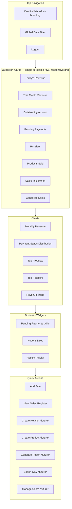
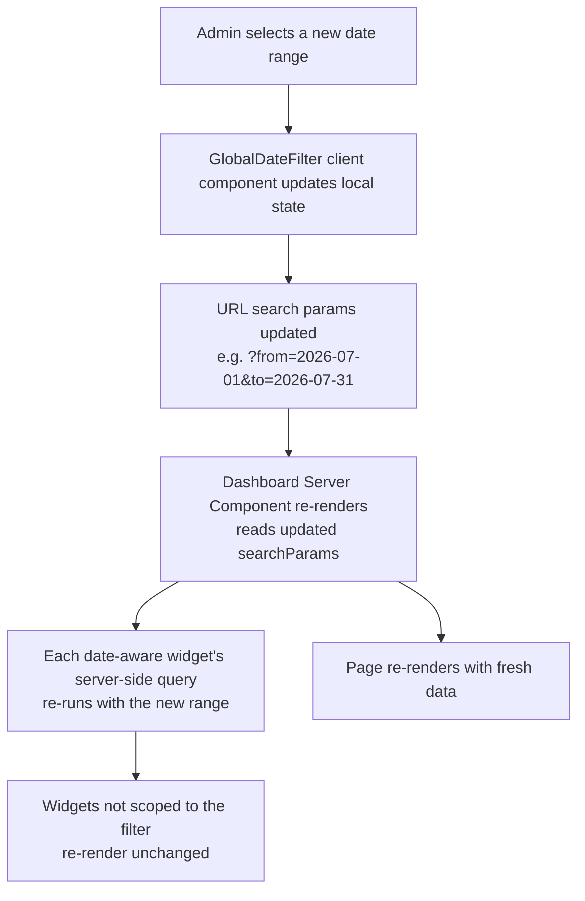
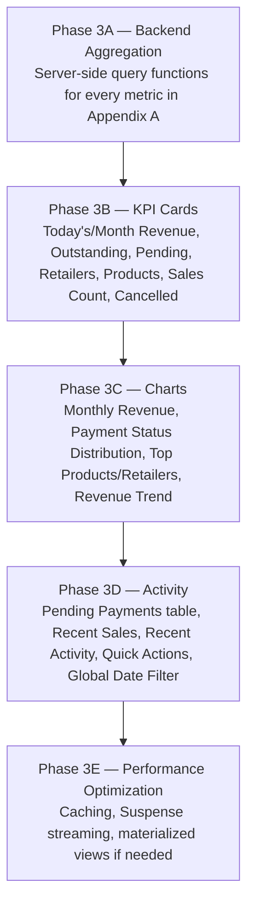

# Kandimillets Admin Dashboard — Module Design

> **Status:** Design only. Nothing in this document is implemented. The live `/admin/dashboard` route remains the Phase 1 placeholder described in [`docs/ADMIN_SYSTEM.md`](ADMIN_SYSTEM.md) §10 — a single page every authenticated admin sees, with no KPIs, charts, or widgets yet.
> **Depends on:** the Sales Register module ([`docs/SALES_REGISTER.md`](SALES_REGISTER.md)), which is the dashboard's only data source, and the authentication/authorization foundation ([`docs/ADMIN_SYSTEM.md`](ADMIN_SYSTEM.md)). This document introduces no new database tables, no new authentication mechanism, and no new Server Action patterns beyond what those two documents and [`docs/API.md`](API.md) already establish.
> **Relationship to other documents:** This is the detailed design for the "Dashboard Analytics" stage named in [`ARCHITECTURE.md`](../ARCHITECTURE.md) Part VI's roadmap and [`docs/ADMIN_SYSTEM.md`](ADMIN_SYSTEM.md) §10, and it expands — without contradicting — the dashboard integration already sketched in [`docs/SALES_REGISTER.md`](SALES_REGISTER.md) §8 (KPI tiles), §11 (future analytics), and §14 (Phase 2F). It also formalizes the Dashboard Contracts already named in [`docs/API.md`](API.md) §6. Where this document and those already-approved sources could be read as disagreeing, the earlier document is authoritative; this one exists to give the Dashboard its own complete, implementation-ready specification.

---

## Table of Contents

1. [Purpose](#1-purpose)
2. [Design Goals](#2-design-goals)
3. [Dashboard Layout](#3-dashboard-layout)
4. [KPI Cards](#4-kpi-cards)
5. [Charts](#5-charts)
6. [Dashboard Date Filtering](#6-dashboard-date-filtering)
7. [Pending Payments Widget](#7-pending-payments-widget)
8. [Recent Sales Widget](#8-recent-sales-widget)
9. [Recent Activity Widget](#9-recent-activity-widget)
10. [Quick Actions](#10-quick-actions)
11. [Empty States](#11-empty-states)
12. [Loading States](#12-loading-states)
13. [Error States](#13-error-states)
14. [Responsive Behaviour](#14-responsive-behaviour)
15. [Performance Strategy](#15-performance-strategy)
16. [Security](#16-security)
17. [Future Expansion](#17-future-expansion)
18. [Dashboard Roadmap](#18-dashboard-roadmap)
19. [Design Philosophy](#19-design-philosophy)

**Appendices**
- [A. Dashboard Queries](#appendix-a-dashboard-queries)
- [B. Future Optimization Notes](#appendix-b-future-optimization-notes)
- [C. Component Mapping](#appendix-c-component-mapping)
- [D. Data Ownership](#appendix-d-data-ownership)

---

## 1. Purpose

### Why the dashboard exists

Kandimillets is a small business run by three named individuals ([`docs/ADMIN_SYSTEM.md`](ADMIN_SYSTEM.md) §1). None of them wants to open the Sales Register table and mentally total up "how did we do today" — that is exactly the kind of repetitive aggregation a computer should do once, correctly, and show back in a few seconds each morning. The dashboard's purpose is narrow and specific: **turn the raw rows already captured by the Sales Register into the handful of numbers and trends a business owner actually needs to make a decision**, without requiring them to open the register itself.

### Its role within the Admin Portal

The dashboard is the **landing page** of the Admin Portal (`/admin/dashboard` — unchanged from [`docs/SALES_REGISTER.md`](SALES_REGISTER.md) §2's user-workflow conclusion that "an admin logging in wants the pulse of the business first"). It sits between login and every other module:

```mermaid
flowchart LR
    A[Login] --> B[/admin/dashboard<br/>Business control center]
    B --> C[/admin/sales<br/>Sales Register]
    B -.future.-> D[Retailer Management]
    B -.future.-> E[Product Management]
    B -.future.-> F[Reports / GST]
    B -.future.-> G[Inventory]
```

The dashboard **reads** Sales Register data; it never becomes a second place that *writes* it. Every mutation (creating, editing, voiding a sale) continues to happen through the Sales Register's own Server Actions ([`docs/API.md`](API.md) §5) — the dashboard's only write surface is its Quick Actions panel ([§10](#10-quick-actions)), which are shortcuts *into* those existing flows, not new ones.

### Design philosophy (summary — full treatment in [§19](#19-design-philosophy))

Business-first, not technical. This dashboard exists for someone who does not care about database schemas, query performance, or component architecture — it must answer "is the business doing okay, and does anything need my attention today?" in the time it takes to glance at a phone screen. Every decision in this document — which KPI comes first, which chart exists at all, what counts as an empty state versus an error — is made in service of that reader, not of the engineer building it.

---

## 2. Design Goals

| Goal | What it means in practice |
|---|---|
| **Fast overview** | The most important numbers (today's revenue, what's still owed) are visible without scrolling, on first paint, on a phone. |
| **Minimal clicks** | Common next actions (add a sale, open the register, drill into a widget) are one click from the dashboard — never buried in a menu. |
| **Actionable information** | Every widget answers "so what should I do about this?" — not just "here is a number." A KPI or chart that can't inform a decision doesn't belong here (see [§17](#17-future-expansion) for the line between "dashboard" and "analytics"). |
| **Business-first** | Ranked by what a shop owner cares about (money in, money owed, what's selling) — never by what's easiest to query or what a developer finds interesting. |
| **Readable by non-technical users** | Plain business language ("Pending Payments", "Today's Revenue"), ₹ formatting, no jargon, no raw enum values or internal IDs surfaced anywhere. |
| **Responsive** | Equally usable checking from a phone in the morning or a laptop at a desk — see [§14](#14-responsive-behaviour). |

---

## 3. Dashboard Layout

### Full-page structure



### Section order and rationale

1. **Top Navigation** — brand, the [Global Date Filter](#6-dashboard-date-filtering) (applies to everything below it), and the existing `LogoutButton` (unchanged from [`docs/ADMIN_SYSTEM.md`](ADMIN_SYSTEM.md) §4). No public Navbar/Footer — this page lives entirely inside the existing `admin/layout.tsx` shell.
2. **Quick KPI Cards** come first because they are the fastest possible answer to "how are we doing" — a business owner should be able to stop reading after this row and already know the essentials.
3. **Charts** come second — for the reader who wants *why*, not just *what*, after the headline numbers.
4. **Pending Payments / Recent Sales / Recent Activity** come third — these are the "what needs my attention, and what just happened" tables, naturally below the summary-level content above them.
5. **Quick Actions** sit last on desktop (a calm dashboard, not a toolbar) but are **duplicated at the top on mobile** — see [§14](#14-responsive-behaviour) — because on a small screen "add a sale" is often the entire reason someone opened the page.

### Visual language

No new design system. Every surface reuses `premium-card` (`rounded-2xl`, `border-warm-200`, `shadow-sm`), the existing `green-*`/`brown-*`/`gold-*`/`warm-*` tokens, `font-heading` (Outfit) titles, and the `PaymentStatusBadge` pill convention already established in [`docs/SALES_REGISTER.md`](SALES_REGISTER.md) §15. The dashboard must read as an **internal business application** — dense with real numbers, calm in tone, no marketing copy, no decorative hero banners, no `PageHero`/`CTASection` (those are public-site primitives; see [`ARCHITECTURE.md`](../ARCHITECTURE.md) §6 — they do not belong here).

---

## 4. KPI Cards

Every card shares the same visual shape: a `premium-card` tile with a label, a large business-formatted value, and (where meaningful) a small trend/comparison indicator. All values are always **server-computed** — never a client-side sum over data already on the page — per [`docs/API.md`](API.md) §2's "never trust client-computed values" principle, which applies to reads as much as writes.

### Today's Revenue

| Aspect | Detail |
|---|---|
| **Purpose** | The single number a business owner checks first each morning: money in, today. |
| **Calculation** | Sum of `totalAmount` across all `Sale` rows where `invoiceDate` = today and `isVoided = false`. `CANCELLED` sales are **excluded** — a cancelled sale never happened in the revenue sense, consistent with [`docs/SALES_REGISTER.md`](SALES_REGISTER.md) §8's exclusion of `CANCELLED` from Pending Payments for the same reason. |
| **Refresh behaviour** | Reflects the server's current date at request time; re-fetched on every dashboard navigation/reload (see [§15](#15-performance-strategy) — no client polling). |
| **Data source** | `Sale` table, filtered by `invoiceDate`, aggregated server-side. |
| **Empty state** | ₹0 with a neutral "No sales recorded today yet" caption — not styled as an error or a warning. |
| **Future expansion** | A small "vs. yesterday" delta indicator, once the underlying Monthly Revenue chart data ([§5](#5-charts)) makes day-over-day comparison cheap to compute from the same query. |

### This Month Revenue

| Aspect | Detail |
|---|---|
| **Purpose** | The month-to-date figure — the number that answers "are we on pace this month," directly named in [`docs/SALES_REGISTER.md`](SALES_REGISTER.md) §8 ("This Month vs. Last Month"). |
| **Calculation** | Sum of `totalAmount` for non-voided, non-`CANCELLED` sales where `invoiceDate` falls within the current calendar month (or the active [Global Date Filter](#6-dashboard-date-filtering)'s month, if one is selected). |
| **Refresh behaviour** | Re-fetched per request; the comparison figure ("vs. last month") is computed in the same query pass, not a second round-trip. |
| **Data source** | `Sale` table, aggregated server-side. |
| **Empty state** | ₹0, "No sales recorded this month yet" — expected and unremarkable early in a month. |
| **Future expansion** | The trend indicator (↑/↓ vs. last month, per [`docs/SALES_REGISTER.md`](SALES_REGISTER.md) §8) belongs here; the fuller multi-month history is a separate chart ([§5](#5-charts), Monthly Revenue), not this card. |

### Outstanding Amount

| Aspect | Detail |
|---|---|
| **Purpose** | "How much money is still owed to us, right now, across everyone" — the headline ₹ figure for cash-flow awareness. |
| **Calculation** | Sum of `outstandingAmount` across all non-voided sales with `paymentStatus` in `{PENDING, PARTIAL}`. `CANCELLED` is excluded (its outstanding balance was written off, not owed — see [`docs/SALES_REGISTER.md`](SALES_REGISTER.md) §3's distinction between `CANCELLED` and `isVoided`). This is the same underlying figure [`docs/SALES_REGISTER.md`](SALES_REGISTER.md) §8 calls "Pending Payments total" — see the [Pending Payments](#pending-payments) card below for how the two differ. |
| **Refresh behaviour** | Re-fetched per request; not date-range-scoped by default (it is a live snapshot of money owed *as of now*, not "owed this month") — the [Global Date Filter](#6-dashboard-date-filtering) does not apply to this card by default, see [§6](#6-dashboard-date-filtering). |
| **Data source** | `Sale` table, aggregated server-side. |
| **Empty state** | ₹0, framed positively — "Nothing outstanding — fully collected" — this is a *good* empty state, not a gap in data. |
| **Future expansion** | Pending Payments Aging (grouped by how overdue, per [`docs/SALES_REGISTER.md`](SALES_REGISTER.md) §11) is a deeper future view this card summarizes today. |

### Pending Payments

| Aspect | Detail |
|---|---|
| **Purpose** | The *urgency* companion to Outstanding Amount above — "how many things need chasing, and how many are already overdue" — a count/urgency lens on the same underlying data, not a duplicate of the ₹ figure. |
| **Calculation** | Count of non-voided sales with `paymentStatus` in `{PENDING, PARTIAL}`, plus a sub-count of how many of those have a `dueDate` in the past (the UI-computed "overdue" state already defined in [`docs/SALES_REGISTER.md`](SALES_REGISTER.md) §3/§5 — never a stored value). |
| **Refresh behaviour** | Same live-snapshot behaviour as Outstanding Amount. |
| **Data source** | `Sale` table (same query pass as Outstanding Amount is a reasonable implementation — see [Appendix A](#appendix-a-dashboard-queries)). |
| **Empty state** | "0 pending — nothing to chase today." |
| **Future expansion** | Clicking this card is the natural entry point into the [Pending Payments Widget](#7-pending-payments-widget) below. |

### Retailers

| Aspect | Detail |
|---|---|
| **Purpose** | A breadth-of-business signal — "how many distinct shops bought from us this month." |
| **Calculation** | Count of distinct `retailerId` values among non-voided sales within the active date range (default: this month). This is an **activity** count, not the total size of the `Retailer` catalog — a business owner cares more about "who's actually buying" than "how many retailers exist in the system." |
| **Refresh behaviour** | Re-fetched per request; follows the [Global Date Filter](#6-dashboard-date-filtering). |
| **Data source** | `Sale` table (distinct `retailerId`), joined against `Retailer` only if the catalog's active/inactive flag needs to be respected. |
| **Empty state** | "0 retailers this period" — expected for a brand-new period. |
| **Future expansion** | A secondary, catalog-size variant ("X retailers on file") becomes relevant once a Retailer Management screen exists ([`docs/SALES_REGISTER.md`](SALES_REGISTER.md) §12) — not built here to avoid conflating "who's active" with "who's on record." |

### Products Sold

| Aspect | Detail |
|---|---|
| **Purpose** | The product-catalog equivalent of the Retailers card — "how many of our products actually moved this period." |
| **Calculation** | Count of distinct `productId` values among non-voided sales within the active date range. |
| **Refresh behaviour** | Re-fetched per request; follows the [Global Date Filter](#6-dashboard-date-filtering). |
| **Data source** | `Sale` table (distinct `productId`). |
| **Empty state** | "0 products sold this period." |
| **Future expansion** | The [Top Products chart](#5-charts) is the natural drill-down once this count alone isn't enough context. |

### Sales This Month

| Aspect | Detail |
|---|---|
| **Purpose** | A transaction-count companion to This Month Revenue — "how many sales, not just how much money," useful for spotting a month with fewer but larger transactions vs. many small ones. |
| **Calculation** | Count of non-voided sales where `invoiceDate` falls within the current month (or active filter range). `CANCELLED` sales are included in this count (they are still real transactions that occurred, just ones that didn't ultimately collect payment) — deliberately different from the Today's/This Month **Revenue** cards, which exclude `CANCELLED` because those are ₹ figures. |
| **Refresh behaviour** | Re-fetched per request; follows the [Global Date Filter](#6-dashboard-date-filtering). |
| **Data source** | `Sale` table, `COUNT`. |
| **Empty state** | "0 sales this period." |
| **Future expansion** | None anticipated beyond the trend chart. |

### Cancelled Sales

| Aspect | Detail |
|---|---|
| **Purpose** | A data-quality / business-health signal, not a KPI to celebrate lowering artificially — "how many transactions this period didn't work out," which is useful context an owner should see rather than have hidden. |
| **Calculation** | Count of non-voided sales with `paymentStatus = CANCELLED` within the active date range. |
| **Refresh behaviour** | Re-fetched per request; follows the [Global Date Filter](#6-dashboard-date-filtering). |
| **Data source** | `Sale` table, `COUNT` filtered by `paymentStatus`. |
| **Empty state** | "0 cancelled — clean month," styled neutrally-positive (fewer cancellations is good, but absence of the *card itself* would hide a real signal, so it always renders, even at zero). |
| **Future expansion** | A cancellation-rate percentage (cancelled ÷ total sales this period) once there's enough volume for a percentage to be meaningful rather than noisy. |

---

## 5. Charts

Charts exist to answer "why," not to duplicate a KPI card in picture form. Each one below is deliberately scoped to a single business question.

### Monthly Revenue

| Aspect | Detail |
|---|---|
| **Chart type** | Vertical bar chart, one bar per month. |
| **Data source** | `Sale.totalAmount`, summed and grouped by month, non-voided and non-`CANCELLED`. |
| **Business purpose** | "Which months were strong, which were weak, within the current year" — the same underlying figure as This Month Revenue, extended across the year for context. Directly implements the "Monthly Sales Summary" named in [`docs/ADMIN_SYSTEM.md`](ADMIN_SYSTEM.md) §10's roadmap and [`docs/SALES_REGISTER.md`](SALES_REGISTER.md) §8. |
| **Default date range** | Current calendar year, January through the current month. |
| **Future filters** | Year selector to look back at a prior year's monthly shape (distinct from the full multi-year line in [Revenue Trend](#revenue-trend) below). |

### Payment Status Distribution

| Aspect | Detail |
|---|---|
| **Chart type** | Donut chart, one segment per `paymentStatus` value (`PENDING`, `PARTIAL`, `PAID`, `CANCELLED`), using the exact colors already defined for the `PaymentStatusBadge` pill ([`docs/SALES_REGISTER.md`](SALES_REGISTER.md) §5) so the chart and the table badges read as the same visual language. |
| **Data source** | `Sale.paymentStatus`, counted (or summed by `totalAmount` — see the note below), non-voided, within the active date range. |
| **Business purpose** | "At a glance, is most of our money collected, or is a worrying share still pending/partial" — a health check on collections, not a ranking. |
| **Default date range** | Current month. |
| **Future filters** | A toggle between "by count" and "by ₹ amount" — a month could have mostly-paid transaction *counts* but a large minority of ₹ value still partial; both views are legitimate and inexpensive to compute from the same grouped query. |

### Top Products

| Aspect | Detail |
|---|---|
| **Chart type** | Horizontal ranked bar list (top 5–10), not a full chart-library pie/bar — matches [`docs/SALES_REGISTER.md`](SALES_REGISTER.md) §8's explicit "a small ranked list, not a chart" framing for this exact widget. |
| **Data source** | `Sale.productId` joined to `Product.name`, grouped and summed by `totalAmount` (revenue) or `quantity` (volume — see toggle below), non-voided, non-`CANCELLED`, within the active date range. |
| **Business purpose** | "What's actually selling" — directly informs restocking/production conversations even before a formal Inventory module exists. |
| **Default date range** | Current month, ranked by revenue. |
| **Future filters** | Toggle between ranking by revenue vs. by quantity (a low-price, high-volume product like Ragi Semiya can rank very differently on each); category filter (makhana / sattu / millet). |

### Top Retailers

| Aspect | Detail |
|---|---|
| **Chart type** | Horizontal ranked bar list (top 5–10), same treatment as Top Products. |
| **Data source** | `Sale.retailerId` joined to `Retailer.name`, grouped and summed by `totalAmount`, non-voided, non-`CANCELLED`, within the active date range. |
| **Business purpose** | "Who are our best customers right now" — informs relationship prioritization and is the natural seed data for a future Retailer Management screen's per-retailer view ([`docs/SALES_REGISTER.md`](SALES_REGISTER.md) §12). |
| **Default date range** | Current month. |
| **Future filters** | Toggle to "new vs. repeat" retailers this period (named in [`docs/SALES_REGISTER.md`](SALES_REGISTER.md) §11's Retailer Analytics), city/state filter. |

### Revenue Trend

| Aspect | Detail |
|---|---|
| **Chart type** | Line chart, one point per month, spanning the business's full recorded history — deliberately distinct from the current-year-only Monthly Revenue bar chart above. |
| **Data source** | Same aggregation as Monthly Revenue, but unbounded by year. |
| **Business purpose** | "Are we growing, flat, or shrinking, over the long run" — the full-history version of [`docs/SALES_REGISTER.md`](SALES_REGISTER.md) §11's "Monthly Sales Summary." This is the one chart on the dashboard that intentionally ignores the Global Date Filter's short presets (see [§6](#6-dashboard-date-filtering)) because a trend needs history, not a single window. |
| **Default date range** | All recorded history to date. |
| **Future filters** | Year-over-year overlay (this year's line plotted against last year's, month-aligned) once enough years of data exist for the comparison to be meaningful. |

---

## 6. Dashboard Date Filtering

### The Global Date Filter

A single selector in the [Top Navigation](#3-dashboard-layout) that controls every date-scoped widget on the page at once — an admin should never have to set the same date range five separate times on one screen.

| Preset | Meaning |
|---|---|
| **Today** | The current calendar day only. |
| **Yesterday** | The calendar day before today. |
| **Last 7 Days** | Rolling 7-day window ending today. |
| **This Month** | Calendar-month-to-date (the dashboard's default on load). |
| **Last Month** | The full previous calendar month. |
| **This Quarter** | Calendar-quarter-to-date. |
| **This Year** | Calendar-year-to-date. |
| **Custom Range** | Explicit from/to date pickers — the same pattern already established for Sales Register filtering ([`docs/SALES_REGISTER.md`](SALES_REGISTER.md) §7). |

### Which widgets respond, and which don't

Not every widget should follow the filter — some are deliberately always-current, per the reasoning already given in [§4](#4-kpi-cards)/[§5](#5-charts):

| Widget | Follows Global Date Filter? |
|---|---|
| This Month Revenue, Retailers, Products Sold, Sales This Month, Cancelled Sales KPIs | ✅ Yes |
| Today's Revenue KPI | ❌ No — always "today," by definition |
| Outstanding Amount, Pending Payments KPIs | ❌ No, by default — these are live snapshots of money currently owed, not scoped to a past window (a "This Month" filter shouldn't hide a debt from two months ago that's still unpaid) |
| Monthly Revenue, Payment Status Distribution, Top Products, Top Retailers charts | ✅ Yes |
| Revenue Trend chart | ❌ No — always full history, per [§5](#5-charts) |
| Pending Payments Widget, Recent Sales Widget | ❌ No — these have their own scoping (age/recency), see [§7](#7-pending-payments-widget)/[§8](#8-recent-sales-widget) |
| Recent Activity Widget | ❌ No — always "most recent N events," see [§9](#9-recent-activity-widget) |

### How a date change propagates



The filter's selected range lives in the **URL**, not in ephemeral client state — the same principle already used for Sales Register's filters conceptually ([`docs/SALES_REGISTER.md`](SALES_REGISTER.md) §7's server-driven filtering) extended here so a dashboard view is bookmarkable/shareable and survives a page refresh. This keeps the dashboard a Server Component that re-fetches on navigation, consistent with [`docs/API.md`](API.md) §3's read-path convention — no client-side re-fetch machinery, no separate loading spinner logic to hand-build beyond what Next.js's own navigation/Suspense lifecycle already provides (see [§15](#15-performance-strategy)).

---

## 7. Pending Payments Widget

### Purpose

The action-oriented companion to the Outstanding Amount/Pending Payments KPI cards — not just "how much," but "which specific sales, so I can follow up."

### Columns

| Column | Notes |
|---|---|
| Sale Number | The immutable identifier ([`docs/SALES_REGISTER.md`](SALES_REGISTER.md) §3), links to the sale. |
| Retailer | Name (from the normalized `Retailer` entity, never free text). |
| Invoice Date | The transaction date. |
| Due Date | Drives the overdue highlight below. |
| Total Amount | ₹, right-aligned. |
| Outstanding Amount | ₹, right-aligned, the figure this widget exists to surface. |
| Payment Status | The `PaymentStatusBadge` pill, `PENDING` or `PARTIAL` only — `PAID`/`CANCELLED` rows never appear here. |

### Sorting

Default sort: Due Date ascending (most urgent — soonest/most overdue — first), matching the "what needs my attention first" purpose of the widget. Sortable by Outstanding Amount (largest debts first) as a secondary, admin-selectable option.

### Highlighting overdue invoices

A row is visually flagged (the same `bg-red-50 text-red-700` "needs attention" treatment already defined for the Payment Status pill in [`docs/SALES_REGISTER.md`](SALES_REGISTER.md) §5) when its Due Date has passed and its status is still `PENDING`/`PARTIAL` — this is the same UI-computed "overdue" concept used throughout the Sales Register, never a stored value.

### Quick actions

Each row offers a direct "Record Payment" shortcut — conceptually a pre-filtered entry into the Sales Register's existing Edit Sale flow ([`docs/SALES_REGISTER.md`](SALES_REGISTER.md) §6), pre-scrolled/pre-focused on the Payment Status/Amount Paid fields. This is a **navigation shortcut**, not a new mutation path — it reuses the Update Sale contract ([`docs/API.md`](API.md) §5) exactly as-is.

### Scope

Shows the top N (e.g. 10) most urgent rows by default, with a "View All Pending" link into a full, paginated Sales Register view pre-filtered to `paymentStatus IN (PENDING, PARTIAL)` — the widget is a preview, the Sales Register itself (already implemented) remains the authoritative full list.

---

## 8. Recent Sales Widget

### Purpose

"What just got entered" — a lightweight activity feed of the newest transactions, useful for a quick sanity check ("did that sale I entered five minutes ago actually save") without navigating away from the dashboard.

### Latest sales

Shows the N most recently **created** sales (by `createdAt`, not `invoiceDate` — deliberately, per the same reasoning [`docs/API.md`](API.md) §5's Recent Sales contract already gives: "the point of this tile is 'what just happened,' not 'what's the newest transaction by business date'"). Includes voided sales' pre-void state is not shown here — a voided sale simply stops appearing in this feed once voided, consistent with the Sales Register's own default-view exclusion of voided rows.

### Clickable

Each row links directly to that sale's detail (or, until a dedicated detail view exists, opens the same Edit Sale modal used in the Sales Register — see [`docs/API.md`](API.md) §5's "Get Sale By ID" contract, which is exactly what this click would invoke).

### Pagination strategy

The widget itself does **not** paginate — it is a fixed-length preview (e.g. the 5–10 most recent), matching [`docs/API.md`](API.md) §5's Recent Sales contract ("a count limit... this is a summary tile, not a paginated list"). A "View All Sales" link is the escape hatch into the fully paginated Sales Register, which already implements real pagination ([`docs/SALES_REGISTER.md`](SALES_REGISTER.md) §7, implemented in Phase 2C).

### Future drill-down

Once `SaleAuditLog` exists ([`docs/SALES_REGISTER.md`](SALES_REGISTER.md) §14, Phase 2E), this widget's underlying query naturally extends to include recent **edits**, not just creations, without changing its shape ([`docs/API.md`](API.md) §5) — at which point its distinction from the [Recent Activity Widget](#9-recent-activity-widget) below sharpens: Recent Sales stays sales-only and transactional; Recent Activity becomes the broader cross-cutting feed (logins, edits, voids, future admin actions).

---

## 9. Recent Activity Widget

### Purpose

A single, chronological "what has been happening in this admin portal" feed — broader than Recent Sales, spanning both authentication events and (once it exists) data-mutation events.

### Current honest scope

**This widget cannot be fully built today.** Its two intended source events are at two different maturity levels:

| Event type | Available today? | Source |
|---|---|---|
| Login activity | Partially — `Session` row creation is the only implicit signal; there is no dedicated login-event log, only "a session currently exists" | [`docs/ADMIN_SYSTEM.md`](ADMIN_SYSTEM.md) §6 |
| Sales created | ✅ Yes — `Sale.createdAt` + `createdByUserId` | [`docs/SALES_REGISTER.md`](SALES_REGISTER.md) §3 (implemented, Phase 2C) |
| Sales edited | ✅ Yes, partially — `Sale.updatedAt` + `updatedByUserId` records *that* something changed and *by whom*, but not *what* changed (that detail requires `SaleAuditLog`) | [`docs/SALES_REGISTER.md`](SALES_REGISTER.md) §3 |
| Sales voided | ✅ Yes — `Sale.isVoided`/`voidReason`/`updatedByUserId` (implemented, Phase 2C) | [`docs/SALES_REGISTER.md`](SALES_REGISTER.md) §3 |
| Password resets | ❌ No — password reset is not implemented yet at all | [`docs/ADMIN_SYSTEM.md`](ADMIN_SYSTEM.md) §7/§10 |
| Future admin creation | ❌ No — "admin creates admin" is not implemented | [`docs/ADMIN_SYSTEM.md`](ADMIN_SYSTEM.md) §5/§10, [`docs/API.md`](API.md) §15 |

### Honest interim design

Until `SaleAuditLog` exists, this widget is effectively a **superset view of the Recent Sales widget** (creations + voids + "something was edited, by whom, when" — without the field-level detail a real audit log provides), with **no login-activity feed at all** yet, since no dedicated login-event table exists (only the current, non-historical `Session` table). This document does not invent a login-audit table here — none is proposed beyond what [`docs/ADMIN_SYSTEM.md`](ADMIN_SYSTEM.md) §6 already names as a future "Audit Logs" model.

### Future integration (once `SaleAuditLog` exists — Phase 2E)

Each entry becomes: *who* (admin name), *what* (`CREATE`/`UPDATE`/`VOID`, plus which fields changed for `UPDATE`), *when* (relative time, e.g. "12 minutes ago"), and *which sale* (Sale Number, linking into it). This is a direct consumer of the `SaleAuditLog` model already designed (not yet implemented) in [`docs/SALES_REGISTER.md`](SALES_REGISTER.md) §3.

### Future integration (login activity)

A durable login-event log (distinct from the current `Session` table, which only reflects *currently active* sessions, not history) is a prerequisite this document flags but does not design — it belongs to a future revision of [`docs/ADMIN_SYSTEM.md`](ADMIN_SYSTEM.md), not this one, since it is an authentication-layer concern.

---

## 10. Quick Actions

Buttons only — no forms live on the dashboard itself. Every Quick Action either navigates to an existing screen or opens an existing modal; none introduces a new Server Action beyond what its target module already defines.

| Action | Target | Available today? |
|---|---|---|
| **Add Sale** | Opens the Sales Register's existing Add Sale modal ([`docs/SALES_REGISTER.md`](SALES_REGISTER.md) §6, implemented Phase 2C) | ✅ Yes |
| **View Sales Register** | Navigates to `/admin/sales` (implemented) | ✅ Yes |
| **Create Retailer** | Would open a Retailer-creation form | ❌ Future — no Retailer management screen exists yet ([`docs/API.md`](API.md) §8 current scope is read-only); this button is documented as **hidden/disabled** until that screen exists, not shown as a dead link |
| **Create Product** | Would open a Product-creation form | ❌ Future — same reasoning, [`docs/API.md`](API.md) §7 |
| **Generate Report** | Would navigate to a future Reports module | ❌ Future — [`docs/API.md`](API.md) §15 |
| **Export CSV** | Would trigger a filtered export of the current Sales Register view | ❌ Future — [`docs/API.md`](API.md) §15 |
| **Manage Users** | Would navigate to a future "admin creates admin" screen | ❌ Future — depends on role enforcement landing first ([`docs/ADMIN_SYSTEM.md`](ADMIN_SYSTEM.md) §5, [`docs/API.md`](API.md) §15) |

### Visibility rules based on role

Today, `SUPER_ADMIN` and `ADMIN` are functionally identical ([`docs/ADMIN_SYSTEM.md`](ADMIN_SYSTEM.md) §5) — **every Quick Action visible today is visible to both roles**, because no enforcement code distinguishes them yet. This document does not invent role-gating logic ahead of that enforcement landing. The one forward-looking exception worth naming now, so the button's future placement is already decided: **Manage Users**, once built, is expected to be `SUPER_ADMIN`-only, matching the future permission direction already recorded in [`docs/ADMIN_SYSTEM.md`](ADMIN_SYSTEM.md) §5 ("`SUPER_ADMIN` — expected to gain the exclusive ability to create/deactivate other admin accounts"). Until that enforcement exists, this button simply doesn't exist for anyone (see table above), so no incorrect access is possible in the interim.

---

## 11. Empty States

Every empty state uses the same warm, plain-language tone already established for the Sales Register's empty state ([`docs/SALES_REGISTER.md`](SALES_REGISTER.md) §5/§15) — never a sterile "No data" message.

| Scenario | Treatment |
|---|---|
| **First-time setup** (today's actual state — Phase 1 complete, Sales Register exists, but the dashboard itself hasn't been built) | Not a "state" this document needs to design further — it is simply the current placeholder page described in [`docs/ADMIN_SYSTEM.md`](ADMIN_SYSTEM.md) §10, which this document eventually replaces. |
| **No sales at all** (Sales Register exists but zero non-voided `Sale` rows exist anywhere) | Every revenue/count KPI reads ₹0 / 0 with the neutral captions given per-card in [§4](#4-kpi-cards); charts render an on-brand "Nothing to show yet — record your first sale" placeholder instead of an empty/broken chart canvas; Pending Payments and Recent Sales widgets show a friendly message plus an "Add Sale" call-to-action, mirroring [`docs/SALES_REGISTER.md`](SALES_REGISTER.md)'s own `SalesEmptyState` component pattern. |
| **No retailers** (edge case — the `Retailer` catalog itself is empty, which would also make Sales impossible to enter, since Retailer is a required reference — [`docs/SALES_REGISTER.md`](SALES_REGISTER.md) §10) | Effectively unreachable in normal operation once seed data exists, but documented for completeness: the Retailers KPI and Top Retailers chart would show the same "nothing yet" treatment as the no-sales case. |
| **No pending payments** (sales exist, but nothing is currently owed) | This is a **positive** empty state, not a gap — "Nothing outstanding — fully collected 🎉"-style copy (no emoji requirement, just the tone), styled with the same calm/positive visual treatment as a `PAID` badge, never the red "needs attention" treatment used for genuinely overdue rows. |

---

## 12. Loading States

- **Skeletons, not spinners, for the initial page load** — each KPI card, chart, and table widget renders a `premium-card`-shaped grey skeleton block while its server-side data resolves, matching the shape of the real content so the layout doesn't jump once data arrives (a difference in kind from the small inline `animate-spin` spinner already used for the Sales Register's Add Sale submit button, which is a *submission* affordance, not a *page-load* one).
- **Progressive loading, in the same top-to-bottom order the page reads** ([§3](#3-dashboard-layout)): KPI cards resolve first (they are the cheapest, most important queries), then charts, then the Pending Payments/Recent Sales/Recent Activity widgets. Implemented as independent React Suspense boundaries per widget (once built) rather than one all-or-nothing page-level loading gate — a slow chart query should never delay the KPI cards a user already wants to read.
- **Date-filter changes** re-trigger loading only for the widgets that respond to the filter ([§6](#6-dashboard-date-filtering)) — the always-current cards (Today's Revenue, Outstanding Amount, etc.) never re-render just because the filter changed.
- **Future caching considerations:** because every widget here is a live aggregate query, not a static asset, standard Next.js static caching does not apply. The natural future optimization is a short server-side cache (seconds-to-minutes, via `unstable_cache` or an in-memory/Redis layer) on the heaviest aggregate queries once real usage shows repeated dashboard loads are re-computing the same numbers — not built now, per the same "don't optimize before it's a real problem" discipline already stated in [`docs/API.md`](API.md) §17. See [Appendix B](#appendix-b-future-optimization-notes) for the per-widget recommendation.

---

## 13. Error States

| Scenario | Category (per [`docs/API.md`](API.md) §4) | Behaviour |
|---|---|---|
| **Database unavailable** | Unexpected Error | The affected widget (not the whole page, where the Suspense-per-widget boundary from [§12](#12-loading-states) makes this possible) shows a generic "Couldn't load this right now" message with a retry action. The full error is logged server-side only, never shown to the admin, matching [`docs/API.md`](API.md) §4/§12's "internal details are logged server-side, never surfaced." |
| **Authentication expired** | Authentication Error | The page-level session re-check (see [§16](#16-security)) redirects to `/admin/login`, identical to the existing behaviour already implemented for `/admin/dashboard` and `/admin/sales` today ([`docs/ADMIN_SYSTEM.md`](ADMIN_SYSTEM.md) §4). No dashboard-specific handling is needed — this is the same mechanism, reused. |
| **Permission denied** | Authorization Error (future — not possible today, since no permission check exists yet, [`docs/ADMIN_SYSTEM.md`](ADMIN_SYSTEM.md) §5) | Documented for completeness ahead of role enforcement: a widget/action an admin's role doesn't permit would be hidden outright (per [§10](#10-quick-actions)'s visibility rules), not shown-then-rejected — consistent with [`docs/API.md`](API.md) §4's principle of not describing what permission would have allowed an action. |
| **Unexpected server error** | Unexpected Error | Same generic, per-widget treatment as "database unavailable" above — the dashboard never distinguishes the two to the admin, only in server-side logs. |

**Recovery behaviour:** every widget-level error includes a retry affordance that simply re-requests that widget's data (a Server Component re-render, not a full page reload) — a transient failure in one chart should never force reloading the entire dashboard to recover.

---

## 14. Responsive Behaviour

- **Desktop (`lg+`):** KPI cards in a dense multi-column grid (4–8 across depending on card count); charts in a 2-column row; Pending Payments/Recent Sales/Recent Activity as full-width tables stacked below; Quick Actions as a calm row at the page's end.
- **Tablet (`md`):** KPI cards in a 2–3 column grid; charts stack to one per row (still full-size, not shrunk illegibly); tables remain tables (tablet width is generally sufficient), following the same breakpoint conventions already established site-wide ([`ARCHITECTURE.md`](../ARCHITECTURE.md) §13).
- **Mobile:** KPI cards stack into a single scrollable row of compact tiles (horizontal scroll) or a single column, whichever reads better once built — either way, **Today's Revenue and Outstanding Amount always appear first**, since those are the two numbers most likely to be checked from a phone. Charts resize to full container width and may simplify (fewer visible data points/legend entries) rather than shrink illegibly. The Pending Payments/Recent Sales tables convert to the same **card-stack pattern** already implemented for the Sales Register's mobile view ([`docs/SALES_REGISTER.md`](SALES_REGISTER.md) §5) — one card per row, most important fields prominent — rather than a horizontally-scrolling table, consistent with this codebase's established "cards over dense tables" instinct on small screens ([`ARCHITECTURE.md`](../ARCHITECTURE.md) §13). **Quick Actions are duplicated near the top of the mobile layout** (in addition to their desktop position at the page's end), per [§3](#3-dashboard-layout)'s reasoning that "add a sale" is often the entire reason for a mobile visit.
- **Chart resizing:** all charts are responsive-width by construction (no fixed pixel dimensions); a chart that becomes too cramped to read at small widths degrades to a simplified variant (e.g. Top Products/Retailers dropping from 10 to 5 visible rows) rather than becoming unreadable.

---

## 15. Performance Strategy

- **Server Components for everything that reads data.** Every KPI card, chart, and widget is fetched via direct server-side data-fetching inside a Server Component, exactly matching the read-path convention already established in [`docs/API.md`](API.md) §3 and used throughout the Sales Register — no client-side `fetch`, no client-side data-fetching library, no REST layer built for this page's own frontend.
- **Server-side aggregation, always.** Every "sum," "count," or "group by" happens in the database query itself (`SUM`/`COUNT`/`GROUP BY` against the indexed columns already established in [`docs/SALES_REGISTER.md`](SALES_REGISTER.md) §3), never by fetching raw rows and reducing them in JavaScript — the same principle [`docs/SALES_REGISTER.md`](SALES_REGISTER.md) §4/§8 already states for the Sales Register itself, extended here to every dashboard widget without exception.
- **Minimal client state.** The only genuinely client-side state on this entire page is the [Global Date Filter](#6-dashboard-date-filtering)'s current selection (mirrored into the URL, not kept purely in memory) and any purely cosmetic chart-hover/tooltip interaction. No widget's *data* lives in client state — every re-render after a filter change is a fresh server read, per [§6](#6-dashboard-date-filtering)'s flowchart.
- **Future caching.** As real usage grows, the heaviest aggregate queries (particularly [Revenue Trend](#revenue-trend), which scans full history) are the first candidates for a short-lived server-side cache or, at real scale, a materialized view / scheduled nightly aggregation job — the same two-step escalation path ("live query first, materialized view only if it's ever actually too slow") already specified for the Sales Register in [`docs/SALES_REGISTER.md`](SALES_REGISTER.md) §4/§8. Not built now — see [Appendix B](#appendix-b-future-optimization-notes) for the per-widget recommendation.
- **Lazy loading.** Chart-rendering libraries (whichever is eventually chosen) are natural candidates for code-splitting/dynamic `import()`, so a text-only, JS-light dashboard is possible on a slow connection even before charts finish loading — the per-widget Suspense boundaries from [§12](#12-loading-states) make this a natural fit rather than a special case.

---

## 16. Security

- **What should never appear on this page:** any other admin's password or session token (trivial — never stored anywhere retrievable); raw database error text or stack traces (per [§13](#13-error-states) and [`docs/API.md`](API.md) §4/§12 — errors are always generic to the viewer, detailed only in server logs); internal database IDs where a business-facing identifier (Sale Number, retailer/product name) already exists and suffices; anything from outside the Sales Register's own data (a "Website Traffic" widget or any other marketing-analytics data source is explicitly out of scope for this page, restated from [`docs/SALES_REGISTER.md`](SALES_REGISTER.md) §8 — this dashboard is a business control center for sales data, not a general analytics tool).
- **Role restrictions.** None enforced today, because none exist anywhere in the system yet ([`docs/ADMIN_SYSTEM.md`](ADMIN_SYSTEM.md) §5) — every widget and Quick Action documented here is visible to both `SUPER_ADMIN` and `ADMIN` for as long as that remains true. [§10](#10-quick-actions) already documents the one forward-looking exception (Manage Users). This document does not add a role check that the rest of the system doesn't yet have a mechanism to enforce.
- **Future audit logging.** The dashboard's own reads never need auditing (reading a summary is not a mutation). Any Quick Action that *does* mutate data (Add Sale, and in the future Create Retailer/Product) already flows through that module's own Server Action, which is where audit logging belongs ([`docs/SALES_REGISTER.md`](SALES_REGISTER.md) §13/§14, Phase 2E) — the dashboard does not introduce a second, parallel audit mechanism.
- **Session validation.** The dashboard page independently calls `auth.api.getSession()` inside the page itself, exactly matching the existing two-layer defense-in-depth pattern already implemented for `/admin/dashboard` and `/admin/sales` today ([`docs/ADMIN_SYSTEM.md`](ADMIN_SYSTEM.md) §4) — the fast `proxy.ts` cookie check is not treated as sufficient on its own here either.

---

## 17. Future Expansion

None of the following have a design or a schema today. Each is named only to record where it fits relative to the dashboard described above.

| Future area | Relationship to this dashboard |
|---|---|
| **Inventory** | Named in [`ARCHITECTURE.md`](../ARCHITECTURE.md) Part VI's roadmap, downstream of Sales Register via the shared `Product` entity ([`docs/API.md`](API.md) §15). Would likely add a stock-level KPI/warning widget here once it exists — not designed now. |
| **Reports** | [`docs/API.md`](API.md) §15 — GST-ready reporting depends on the `taxRate`/`taxAmount`/`gstIncluded` fields already reserved on `Sale` ([`docs/SALES_REGISTER.md`](SALES_REGISTER.md) §3). The **Generate Report** Quick Action ([§10](#10-quick-actions)) is this dashboard's future entry point into that module. |
| **GST Dashboard** | A specialized future variant of Reports, scoped to tax reporting specifically rather than general business KPIs — likely its own page, not a section bolted onto this one. |
| **Analytics** | [`docs/SALES_REGISTER.md`](SALES_REGISTER.md) §11 already names the deeper, dedicated versions of this dashboard's summary tiles (full Monthly Sales Summary, Product/Retailer Analytics, Pending Payments Aging) — this dashboard's charts are the "at a glance" layer; a full Analytics area is the "drill in and explore" layer, deliberately kept separate so this page stays scannable in seconds ([§1](#1-purpose)). |
| **Forecasting** | Not named in any prior document — a plausible far-future extension of Revenue Trend ([§5](#5-charts)) once enough historical data exists for a forecast to be meaningful rather than noise. Recorded here only as a placeholder for where it would attach. |
| **Retailer Insights** | The per-retailer deep-dive version of the Top Retailers chart ([§5](#5-charts)) — natural companion to a future Retailer Management screen ([`docs/SALES_REGISTER.md`](SALES_REGISTER.md) §12). |
| **Product Insights** | The per-product deep-dive version of the Top Products chart — natural companion to a future Product Management screen ([`docs/API.md`](API.md) §7). |
| **Exports** | [`docs/API.md`](API.md) §15 — the **Export CSV** Quick Action ([§10](#10-quick-actions)) is this dashboard's future entry point; would inherit the Sales Register's existing filter/sort contract rather than defining a new one. |
| **Notifications** | Not named in any prior document. A plausible future layer ("notify me when outstanding payments cross ₹X") sitting on top of the Pending Payments widget ([§7](#7-pending-payments-widget)) — recorded here only as a placeholder; no delivery mechanism (email/SMS/push) is designed. |

---

## 18. Dashboard Roadmap



**Relationship to the Sales Register's own phase numbering:** [`docs/SALES_REGISTER.md`](SALES_REGISTER.md) §14 already names "**Phase 2F — Dashboard Integration**" as the point at which Sales Register data becomes wired into `/admin/dashboard`. Phases 3A–3E here are that same work, broken into five reviewable sub-phases specifically for the Dashboard module's own build-out — they are a refinement of Phase 2F's scope, not a competing or renumbered sequence. Phase 2E (`SaleAuditLog`, per [`docs/SALES_REGISTER.md`](SALES_REGISTER.md) §14) is a **prerequisite** for the full [Recent Activity Widget](#9-recent-activity-widget) built in Phase 3D — until it lands, 3D ships the honest, reduced-scope version already described in [§9](#9-recent-activity-widget).

1. **Phase 3A — Backend Aggregation:** implement the server-side query functions (Server Components' data-fetching layer, per [§15](#15-performance-strategy)) for every business query in [Appendix A](#appendix-a-dashboard-queries), with no UI yet — the same "data foundation before UI" discipline already used for the Sales Register's own Phase 2A/2B split ([`docs/SALES_REGISTER.md`](SALES_REGISTER.md) §14).
2. **Phase 3B — KPI Cards:** build and wire the eight cards in [§4](#4-kpi-cards) against Phase 3A's queries, replacing the current placeholder dashboard content.
3. **Phase 3C — Charts:** build and wire the five charts in [§5](#5-charts), including the [Global Date Filter](#6-dashboard-date-filtering)'s propagation to every date-aware widget shipped so far.
4. **Phase 3D — Activity:** build the [Pending Payments](#7-pending-payments-widget), [Recent Sales](#8-recent-sales-widget), and (reduced-scope) [Recent Activity](#9-recent-activity-widget) widgets, plus [Quick Actions](#10-quick-actions).
5. **Phase 3E — Performance Optimization:** revisit caching, Suspense-boundary granularity, and query cost only once the full dashboard is live and real usage patterns are observable — never speculatively, per [`docs/API.md`](API.md) §17's "do not over-engineer" principle.

---

## 19. Design Philosophy

- **Business-first.** Every decision in this document is made from the perspective of a shop owner checking their phone, not an engineer admiring a chart library — restated from [§1](#1-purpose)/[§2](#2-design-goals).
- **Simple.** No widget exists here that can't be explained in one plain sentence to someone with no technical background — if a metric needs a paragraph of caveats to understand, it belongs in a future Analytics area ([§17](#17-future-expansion)), not this dashboard.
- **Actionable.** Every KPI, chart, and table answers "so what do I do next" — Pending Payments links to recording a payment, Today's Revenue needs no action at all (it's a status check), and nothing on this page is a number with no path to a decision.
- **Fast.** Server-side aggregation, minimal client state, and per-widget streaming ([§15](#15-performance-strategy)) exist so the page is fast in practice, not just in theory — consistent with [§2](#2-design-goals)'s "fast overview" goal.
- **Maintainable.** No new database tables, no new authentication mechanism, no new Server Action pattern — every read reuses the exact conventions already proven in the Sales Register ([`docs/API.md`](API.md) §3/§17), so this module is "nearly mechanical" to build precisely because it invents nothing structurally new.
- **Consistent with the existing admin design.** `premium-card`, the brand color tokens, `font-heading` titles, the `PaymentStatusBadge` palette, and the card-stack mobile pattern are all reused verbatim ([§3](#3-dashboard-layout), [§14](#14-responsive-behaviour)) — this dashboard should look like it was always part of the same admin portal, not a bolted-on analytics product.

---

## Appendix A: Dashboard Queries

Every business query this dashboard will eventually require, described as a business question — no SQL, no Prisma. Each row also states which widget(s) depend on it (cross-referenced to [§4](#4-kpi-cards)–[§9](#9-recent-activity-widget)).

| Query | Business question it answers | Depends on it |
|---|---|---|
| **Revenue by day** | "How much did we sell today, and how has each recent day compared?" | Today's Revenue KPI |
| **Revenue by month** | "How much did we sell this month, this year, and how do months compare?" | This Month Revenue KPI, Monthly Revenue chart |
| **Revenue by product** | "Which products are generating the most money?" | Top Products chart, Products Sold KPI |
| **Revenue by retailer** | "Which retailers are generating the most money?" | Top Retailers chart, Retailers KPI |
| **Pending invoices** | "Which specific sales are still unpaid or partially paid, and how urgent is each?" | Pending Payments widget, Pending Payments KPI |
| **Outstanding amount** | "In total, how much money is currently owed to us?" | Outstanding Amount KPI |
| **Payment status distribution** | "Of everything sold this period, what share is paid vs. still owed vs. cancelled?" | Payment Status Distribution chart |
| **Top selling products** | "Which products, ranked, are moving the most (by revenue or by quantity)?" | Top Products chart |
| **Top retailers** | "Which retailers, ranked, are buying the most?" | Top Retailers chart |
| **Recently added retailers** | "Are we gaining new customers, and who are they?" | Retailers KPI (future "new vs. repeat" variant, [§5](#5-charts) Top Retailers future filters) |
| **Sales trend** | "Is the business growing, flat, or shrinking over the long run?" | Revenue Trend chart |
| **Monthly comparison** | "How does this month stack up against last month?" | This Month Revenue KPI's trend indicator |
| **Cancelled sales** | "How many transactions this period didn't work out, and is that number normal?" | Cancelled Sales KPI |
| **Product-wise quantity sold** | "How many units of each product moved, independent of price?" | Top Products chart (quantity-ranked variant) |

---

## Appendix B: Future Optimization Notes

For every widget, the recommended **long-term** query strategy — not built now, per [§15](#15-performance-strategy)'s "don't optimize before it's a real problem" principle, restated from [`docs/SALES_REGISTER.md`](SALES_REGISTER.md) §4/§8.

| Widget | Recommended strategy |
|---|---|
| Today's Revenue | Simple Prisma query (a single `SUM` filtered to one day — trivially cheap at any realistic scale). |
| This Month Revenue | Simple Prisma query (aggregation over one month). |
| Outstanding Amount | Simple Prisma query (aggregation, no date bound). |
| Pending Payments | Simple Prisma query (aggregation + `COUNT`, no date bound). |
| Retailers (active count) | Simple Prisma query (`DISTINCT` count over the active date range). |
| Products Sold | Simple Prisma query (`DISTINCT` count over the active date range). |
| Sales This Month | Simple Prisma query (`COUNT`). |
| Cancelled Sales | Simple Prisma query (`COUNT` filtered by status). |
| Monthly Revenue chart | Aggregation (`GROUP BY` month) — cheap within a single year; revisit if year-over-year comparisons make this expensive. |
| Payment Status Distribution chart | Aggregation (`GROUP BY` status). |
| Top Products / Top Retailers charts | Aggregation (`GROUP BY` + `ORDER BY` + `LIMIT`) — the first candidate for a **materialized summary (future)** once the product/retailer catalog and sales volume both grow large, since this is the most join-heavy query on the page. |
| Revenue Trend chart | Aggregation today; explicitly the **first candidate for a materialized summary or a background job (future)** once multi-year history makes a full-history live scan noticeably slow — flagged here exactly as [`docs/SALES_REGISTER.md`](SALES_REGISTER.md) §4/§8 already anticipates for this class of query. |
| Pending Payments widget (table) | Simple Prisma query (filtered, sorted, limited — no aggregation needed, it lists rows, not sums). |
| Recent Sales widget | Simple Prisma query (sorted by `createdAt`, limited). |
| Recent Activity widget | Simple Prisma query today (limited scope, [§9](#9-recent-activity-widget)); becomes a **background job (future)** candidate only if a durable login-audit log is ever built and needs its own retention/rollup process — not a concern for the `Sale`-sourced portion of this widget. |

**No widget on this dashboard requires a database transaction** — every one of them is a read. Transactions belong to the *mutations* this dashboard triggers (Add Sale, and future Create Retailer/Product), and those are already covered by [`docs/API.md`](API.md) §14's transaction plan for the Sales Register itself — this document does not duplicate that here.

---

## Appendix C: Component Mapping

Documentation only — no component listed here has been created.

```mermaid
graph TD
    DP[DashboardPage — Server Component]
    DP --> GDF[GlobalDateFilter — client, reads/writes URL search params]
    DP --> KPI[KPICards]
    DP --> CH[ChartsPanel]
    DP --> PP[PendingPaymentsTable]
    DP --> RS[RecentSalesTable]
    DP --> RA[RecentActivityFeed]
    DP --> QA[QuickActions]

    KPI --> KPI1[TodaysRevenueCard]
    KPI --> KPI2[ThisMonthRevenueCard]
    KPI --> KPI3[OutstandingAmountCard]
    KPI --> KPI4[PendingPaymentsCard]
    KPI --> KPI5[RetailersCard]
    KPI --> KPI6[ProductsSoldCard]
    KPI --> KPI7[SalesThisMonthCard]
    KPI --> KPI8[CancelledSalesCard]

    CH --> CH1[MonthlyRevenueChart]
    CH --> CH2[PaymentStatusDistributionChart]
    CH --> CH3[TopProductsChart]
    CH --> CH4[TopRetailersChart]
    CH --> CH5[RevenueTrendChart]

    QA --> QA1[AddSaleButton]
    QA --> QA2[ViewSalesRegisterButton]
    QA --> QA3["CreateRetailerButton *future*"]
    QA --> QA4["CreateProductButton *future*"]
    QA --> QA5["GenerateReportButton *future*"]
    QA --> QA6["ExportCsvButton *future*"]
    QA --> QA7["ManageUsersButton *future*"]
```



**Notes on this mapping:**
- `DashboardPage` remains a Server Component, per [§15](#15-performance-strategy) — it does the data-fetching and passes plain-JSON data down, exactly as `SalesRegisterView`'s parent (`/admin/sales/page.tsx`) already does today.
- `GlobalDateFilter` is the **only** client component with meaningful state (the current filter selection), mirroring the minimal-client-state principle in [§15](#15-performance-strategy).
- `KPICards`, `ChartsPanel`, `PendingPaymentsTable`, `RecentSalesTable`, and `RecentActivityFeed` are each independent server-rendered subtrees so the per-widget Suspense boundaries described in [§12](#12-loading-states) map directly onto this component tree — no single "fetch everything, then render" waterfall.
- Individual KPI cards (`TodaysRevenueCard`, etc.) and charts are listed separately because each has its own data query ([Appendix A](#appendix-a-dashboard-queries)) and its own empty/loading/error state ([§11](#11-empty-states)–[§13](#13-error-states)) — they are not simply props passed into one generic `Card` component, in the same way the Sales Register's own table columns are each independently defined rather than generically looped.

---

## Appendix D: Data Ownership

| Widget | Primary table(s) | Server Action or Server Component | Refresh behaviour | Real-time ever beneficial? |
|---|---|---|---|---|
| Today's Revenue | `Sale` | Server Component (direct read) | Per page load/navigation | No — a business owner checking "today's revenue" once every so often does not need push updates; per [§15](#15-performance-strategy), re-fetch-on-navigation is sufficient. |
| This Month Revenue | `Sale` | Server Component | Per page load/navigation, or Global Date Filter change | No, for the same reason. |
| Outstanding Amount | `Sale` | Server Component | Per page load/navigation | No. |
| Pending Payments (KPI + widget) | `Sale`, `Retailer` (for names) | Server Component | Per page load/navigation | Arguably the **one** widget where near-real-time could matter if two admins are actively working the same list of overdue accounts simultaneously — but this is a three-person team today ([`docs/ADMIN_SYSTEM.md`](ADMIN_SYSTEM.md) §1), so the benefit is theoretical; not recommended to build. |
| Retailers | `Sale`, `Retailer` | Server Component | Per page load/navigation, or Global Date Filter change | No. |
| Products Sold | `Sale`, `Product` | Server Component | Per page load/navigation, or Global Date Filter change | No. |
| Sales This Month | `Sale` | Server Component | Per page load/navigation, or Global Date Filter change | No. |
| Cancelled Sales | `Sale` | Server Component | Per page load/navigation, or Global Date Filter change | No. |
| Monthly Revenue chart | `Sale` | Server Component | Per page load/navigation | No. |
| Payment Status Distribution chart | `Sale` | Server Component | Per page load/navigation, or Global Date Filter change | No. |
| Top Products chart | `Sale`, `Product` | Server Component | Per page load/navigation, or Global Date Filter change | No. |
| Top Retailers chart | `Sale`, `Retailer` | Server Component | Per page load/navigation, or Global Date Filter change | No. |
| Revenue Trend chart | `Sale` | Server Component | Per page load/navigation | No — this is explicitly a long-run view; staleness of a few minutes is irrelevant to a multi-year trend line. |
| Recent Sales widget | `Sale`, `Retailer`, `Product` | Server Component | Per page load/navigation | Mild case for real-time (seeing a colleague's just-entered sale appear without a manual refresh), but not justified at three users — same reasoning as Pending Payments above. |
| Recent Activity widget | `Sale` (today); future `SaleAuditLog` | Server Component | Per page load/navigation | No, for the same reason — and this widget is already reduced-scope today ([§9](#9-recent-activity-widget)), so building real-time infrastructure for it now would be solving a problem two levels ahead of where the feature itself currently stands. |

**No mutation happens on the dashboard itself** — every writeable action is a Quick Action ([§10](#10-quick-actions)) that delegates to an already-designed Server Action elsewhere (Create Sale, per [`docs/API.md`](API.md) §5), so this table intentionally contains no "Server Action" entries of its own; the dashboard's own data ownership is 100% read-only.

---

*This document is the design specification for the Admin Dashboard module. Nothing described here is implemented — the live `/admin/dashboard` route remains the Phase 1 placeholder until the roadmap in [§18](#18-dashboard-roadmap) is executed. It should be read alongside [`docs/SALES_REGISTER.md`](SALES_REGISTER.md) (the dashboard's sole data source) and [`docs/API.md`](API.md) (the contract conventions every future dashboard query and Server Action must follow) rather than in isolation.*
