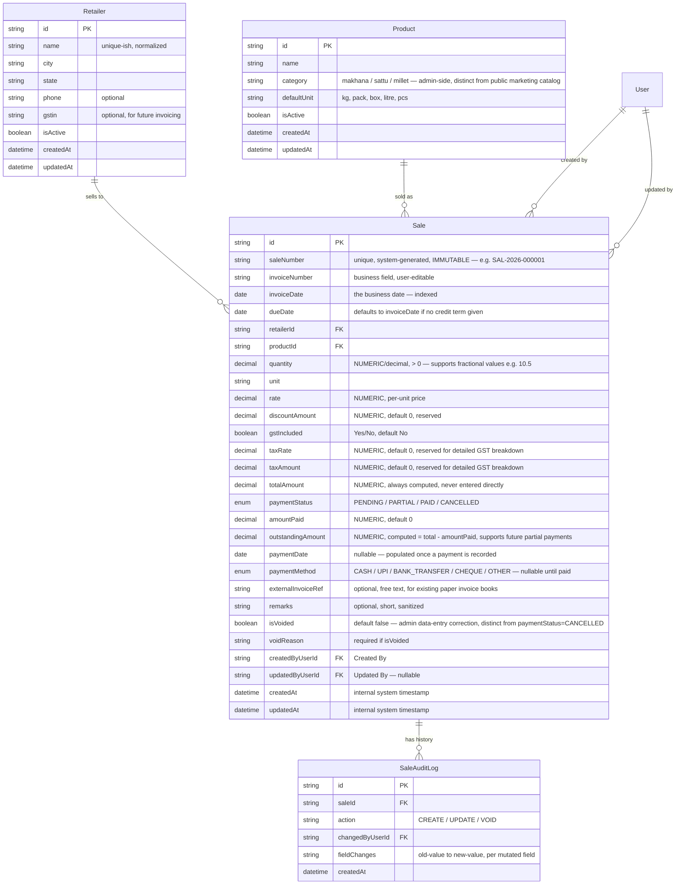
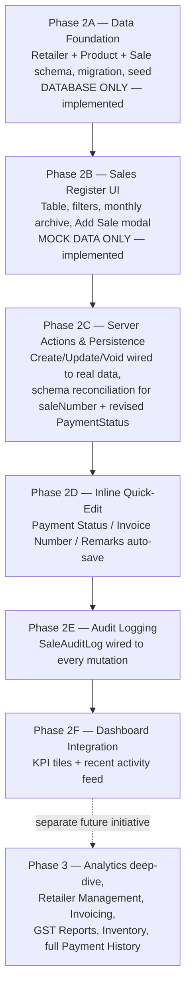

# Kandimillets Sales Register — Module Design

> **Status:** Design approved. Phase 2A (data foundation) and Phase 2B (user interface, mock data only) are implemented — see [§14](#14-recommended-implementation-phases). All other phases remain design-only.
> **Depends on:** the authentication foundation described in [`docs/ADMIN_SYSTEM.md`](ADMIN_SYSTEM.md) (Phase 1, implemented). This module is designed to sit entirely behind that existing `/admin` session/proxy protection — it introduces no new auth mechanism.
> **Relationship to `ARCHITECTURE.md`:** This document is the detailed design referenced by `ARCHITECTURE.md`'s Part VI roadmap ("Sales Register" stage) and by `docs/ADMIN_SYSTEM.md` §6/§10. It does not amend either document.
> **Revision note (business review round 1):** this design was extended with explicit Invoice Number, Invoice Date, Due Date, Payment Date, Payment Method, Outstanding Amount, GST Included, Created By, and Updated By fields on `Sale`. Two earlier field names were aligned to business terminology: the original `saleDate` → `invoiceDate`, and `amountDue` → `outstandingAmount`.
> **Revision note (business review round 2 — final design improvements):** three further corrections, reflected throughout this document:
> 1. An immutable, system-generated **Sale Number** (e.g. `SAL-2026-000001`) is introduced as the true unique internal identifier. **Invoice Number reverts to a user-editable business field** — uniqueness enforcement and immutability now belong to Sale Number, not Invoice Number.
> 2. **Quantity** is explicitly confirmed as decimal (e.g. `10.5 kg`, `2.75 kg`, `0.5 kg`), not integer-only — this was already the underlying design intent but is now stated unambiguously with examples.
> 3. **Payment Status** enum values are corrected to `PENDING` / `PARTIAL` / `PAID` / `CANCELLED` (replacing the earlier `PAID` / `PARTIAL` / `UNPAID` / `OVERDUE`). "Overdue" is no longer a stored status — it becomes a **UI-computed display state** (a sale that is `PENDING` or `PARTIAL` whose Due Date has passed), not a value an admin or the system writes to the database. "Cancelled" is a new status representing a sale whose payment obligation was called off (order cancelled, returned, written off) — distinct from `isVoided`, which represents an admin correcting a mis-entered row (see [§3](#3-database-design) for how the two differ).
>
> The database schema and migration from Phase 2A were **not** altered to reflect this second revision — reconciling them (a new migration adding `saleNumber`, changing the `PaymentStatus` enum values) is deferred to the phase that connects the Sales Register UI to real data. Phase 2B's interface (built against this revised design) currently runs on mock data only, so no live schema mismatch exists yet — see [§14](#14-recommended-implementation-phases).

---

## Table of Contents

1. [Business Goals](#1-business-goals)
2. [User Workflow](#2-user-workflow)
3. [Database Design](#3-database-design)
4. [Future Scalability Considerations](#4-future-scalability-considerations)
5. [Table UI Specification](#5-table-ui-specification)
6. [Add / Edit / Delete Flow](#6-addeditdelete-flow)
7. [Search, Filter, Pagination and Sorting Strategy](#7-search-filter-pagination-and-sorting-strategy)
8. [Dashboard Integration](#8-dashboard-integration)
9. [API Contract](#9-api-contract)
10. [Validation Rules](#10-validation-rules)
11. [Future Analytics](#11-future-analytics)
12. [Future Retailer Management Compatibility](#12-future-retailer-management-compatibility)
13. [Security Considerations](#13-security-considerations)
14. [Recommended Implementation Phases](#14-recommended-implementation-phases)
15. [UI Design Guidelines Matching the Existing Admin Theme](#15-ui-design-guidelines-matching-the-existing-admin-theme)

---

## 1. Business Goals

The Sales Register is the core business feature the entire Admin Portal (and its authentication foundation) was built to eventually support. Its goals:

- Give the business owner and staff a **manually editable, month-wise record of every sale** — replacing the informal/paper tracking implied by the business's current process, without changing how the business actually sells (this is a record-keeping tool, not a POS or e-commerce system).
- Capture exactly the fields already agreed as necessary: **Sale Number (internal), Invoice Number, Invoice Date, Due Date, Retailer Name, City, Product, Quantity, Unit, Rate, Total, Payment Status, Payment Date, Payment Method, Outstanding Amount, GST Included, Remarks, Created By, Updated By** — while fixing the specific correctness risks identified for these fields during architecture review (see [§3](#3-database-design) and [§10](#10-validation-rules)).
- Provide **trustworthy financial totals** — every number a business owner might use to make a decision (today's sales, pending payments, top products) must be derived from data that cannot silently drift or be entered inconsistently.
- Be the **foundation for everything downstream**: Dashboard Analytics, Retailer Management, Invoicing, and GST Reports (per the roadmap in `ARCHITECTURE.md` Part VI) all depend on Sales Register data being structured correctly from the start — this module is deliberately over-engineered in exactly the two places (Retailer/Product normalization, audit logging) identified as expensive to retrofit later, and deliberately kept simple everywhere else.
- Remain usable by a small number of trusted staff (today: the same individuals with `/admin` access) with **no new authentication or authorization mechanism** — it reuses the existing session/proxy protection entirely.

---

## 2. User Workflow

```mermaid
flowchart TD
    A[Admin logs in] --> B[/admin/dashboard<br/>Business KPIs]
    B --> C[/admin/sales<br/>Sales Register table]
    C --> D{What does the admin want to do?}
    D -->|Record a new sale| E[Click + Add Sale]
    D -->|Fix a mistake| F[Click Edit on a row]
    D -->|Remove a wrong entry| G[Click Delete on a row]
    D -->|Find something| H[Search / Filter / Sort]

    E --> E1[Modal opens over the table]
    E1 --> E2[Fill Date, Retailer, Product, Qty, Rate, Payment Status...]
    E2 --> E3[Save & Close — or — Save & Add Another]
    E3 --> C

    F --> F1{Which field?}
    F1 -->|Payment Status / Remarks| F2[Inline quick-edit in the row]
    F1 -->|Date / Retailer / Product / Qty / Rate| F3[Same modal, pre-filled]
    F2 --> C
    F3 --> C

    G --> G1[Confirmation dialog: reason required]
    G1 --> G2[Row is voided, not deleted]
    G2 --> C

    H --> C
```

**Narrative:**

1. **Landing page stays `/admin/dashboard`**, unchanged — per the earlier UX conclusion, an admin logging in wants the pulse of the business first. Sales Register is reached via the primary admin navigation, not the landing page itself.
2. **`/admin/sales` is the day-to-day workhorse screen** — the single table an admin spends most of their time in, listing sales rows most-recent-first.
3. **Adding a sale is a high-frequency, repetitive action** — a modal keeps the table's current filter/search/scroll state intact and supports a fast "save, then immediately add the next one" loop, rather than a full-page navigation per entry.
4. **Editing is deliberately split** by field sensitivity: quick, low-friction inline editing for non-financial fields; a deliberate modal + explicit save for anything that changes a financial total (see [§6](#6-addeditdelete-flow) for the full reasoning).
5. **Deleting never destroys data** — it voids the row, requiring a stated reason, because this is a financial ledger.
6. **Every other action** (search, filter, sort) happens in place on the same table without navigating away.

---

## 3. Database Design

> No Prisma schema changes have been made. The models below are a **design proposal** for a future implementation phase, described in plain terms (not Prisma syntax) so this document does not constitute code.

### Entity-Relationship Overview



### `Retailer` (new — normalization, not currently present anywhere in the app)

The single highest-leverage fix identified during architecture review: storing retailer identity as a free-text string on every sale row would guarantee dirty, duplicated data ("Sharma Traders" vs. "Sharma Trader's") that quietly breaks every retailer-level report. `Retailer` is a first-class entity from day one, referenced by every `Sale` via a foreign key, not typed inline. Fields cover exactly what's needed today (name, city, state) plus what invoicing/GST reporting will need later (`gstin`) — reserved now rather than retrofitted.

### `Product` (new, admin-side — distinct from the public marketing catalog)

**Important distinction:** this is **not** the same as `src/data/products.ts`, which is public-facing marketing copy (descriptions, highlights, images) for the six products shown on the website. The Sales Register needs a separate, admin-only product record concerned with SKU/category/default unit for data-entry and reporting purposes — the two lists will likely describe the same real-world products but serve entirely different purposes and must not be merged into one model. Keeping them separate also means the public site's content is never at risk of being affected by anything in the admin database (preserving the isolation already established between the two subsystems).

### `Sale` (new — the core table)

Carries every field from the original request plus the business fields added across two revisions (Sale Number, Invoice Number, Invoice Date, Due Date, Payment Date, Payment Method, Outstanding Amount, GST Included, Created By, Updated By), with the following deliberate design decisions:

- **`totalAmount` is always computed** (`quantity × rate`, adjusted for `discountAmount`/`taxAmount`), never an independently-typed field. Storing it as a raw input risks silent disagreement with quantity/rate if either is edited later — a correctness bug in a financial ledger.
- **`discountAmount` and `taxRate`/`taxAmount` are reserved now**, defaulting to zero and invisible in the UI until a discount or GST-reporting feature exists — because retroactively adding tax fields after thousands of historical rows exist would mean those old rows can never be GST-correct. See the **GST Included** note below for how this relates to the new `gstIncluded` flag.
- **All money fields are `NUMERIC`/`Decimal`, never floating-point** — floating-point rounding errors compound silently across years of rows; this is a correctness requirement, not a style preference.
- **`paymentStatus` is a fixed enum plus `amountPaid`/`outstandingAmount`**, not a free-text status string — a plain string can't reliably answer "how much is still owed" once partial payments exist, which the Dashboard's Pending Payments KPI (§8) depends on.

**Sale Number** (`saleNumber`) is the **true unique, immutable internal identifier** for every sale — automatically generated by the system at creation, never editable by anyone (not even an admin correcting a mistake), and never changes for the lifetime of the row. Format: `SAL-{year}-{6-digit sequence}` (e.g. `SAL-2026-000001`), where the year segment matches the sale's Invoice Date and the sequence resets to `000001` at the start of each calendar year — this keeps numbers short, human-scannable, and aligned with how the business already thinks in calendar years (see [§5](#5-table-ui-specification)'s Monthly Archive, which groups by the same year). Sale Number is enforced **unique** at the database level and is the "primary business identifier" referenced throughout the UI (table, search, future reports) — it is deliberately not user-facing terminology like "invoice," because it is a record-keeping identifier, not a billing document number.

**Invoice Number** (`invoiceNumber`) is a **separate, user-editable business field** — this is a correction from the design's first revision, which had made it the system-generated unique identifier. That role now belongs entirely to Sale Number above. Invoice Number represents the number on the actual paper/PDF invoice the business issues (or references) for a transaction, which a business may legitimately need to correct after the fact (a typo, a reissued invoice, a renumbering) — locking it as immutable and system-generated would have prevented exactly that. It is not enforced as a hard database-unique constraint, since edits could otherwise collide; the practical expectation is that it *should* be distinct per transaction, but that is a business convention, not a system constraint. `externalInvoiceRef` remains a separate, genuinely free-text field for the case where the business additionally references its own paper invoice book numbering — Sale Number, Invoice Number, and External Invoice Ref are three distinct fields serving three distinct purposes and must not be conflated.

**Invoice Date** (`invoiceDate`, renamed from the earlier draft's `saleDate`) is the business-facing transaction date — what "month-wise" browsing, filtering, and sorting key off throughout this document; the underlying role is unchanged from the original design, only the name is aligned to business terminology. It is distinct from `createdAt`/`updatedAt`, which remain purely **internal system timestamps** recording when the database row itself was created or last modified. For example, an admin could enter a sale today (`createdAt` = today) for a transaction that happened last week (`invoiceDate` = last week) — the two must never be conflated or substituted for one another. It is also distinct from the year segment of Sale Number, which is *derived from* Invoice Date at creation time but, once assigned, never changes even if Invoice Date is later corrected across a year boundary (Sale Number is immutable by definition).

**Quantity** (`quantity`) is an explicitly **decimal** value, not integer-only — this was already the underlying design intent (see the Indexing/type notes throughout this document) but is restated here without ambiguity: real-world quantities like `10.5 kg`, `2.75 kg`, or `0.5 kg` must be representable exactly, and the same `NUMERIC`/`Decimal` correctness requirement that applies to money fields applies here too.

**Due Date** (`dueDate`) defaults to the Invoice Date when no explicit credit term is given (i.e., payment is due immediately), and must never be earlier than the Invoice Date. With a real Due Date now available, "overdue" is understood purely as a **UI-computed display state** — a sale that is `PENDING` or `PARTIAL` and whose Due Date has passed — rather than a value stored anywhere. The `paymentStatus` enum (see below) does not include an `OVERDUE` value at all; "overdue-ness" is computed at render/query time from Due Date + current status, not written to the database.

**Payment Status** (`paymentStatus`) is a fixed enum with four values: `PENDING`, `PARTIAL`, `PAID`, `CANCELLED` (corrected from the first revision's `PAID`/`PARTIAL`/`UNPAID`/`OVERDUE` — `UNPAID` is renamed `PENDING`, `OVERDUE` is removed as a stored value per the Due Date note above, and `CANCELLED` is newly added). `CANCELLED` represents a real business outcome — the sale's payment obligation was called off (the order was cancelled, the goods were returned, or the amount was written off) — and is deliberately **distinct from `isVoided`**: `isVoided` is an administrative correction (an admin fixing a mis-entered row, hiding it from the default view while preserving the audit trail per [§6](#6-addeditdelete-flow)), whereas `paymentStatus = CANCELLED` describes a transaction that genuinely happened in the business sense but will never be paid. A sale can in principle be both `CANCELLED` and later `isVoided` (if it also turns out to have been a data-entry error), but the two flags answer different questions and neither substitutes for the other.

**Payment Date** (`paymentDate`) and **Payment Method** (`paymentMethod`) are reserved as **nullable** fields, populated once a payment is actually recorded against a sale (i.e., once `paymentStatus` becomes `PARTIAL` or `PAID`). They are intentionally simplified in this design to a single "most recent/only payment" pair rather than a full payment history — a proper multi-payment history (needed once a sale is paid off across more than one installment) is explicitly a later phase (see [§14](#14-recommended-implementation-phases)); these two fields are the minimal placeholder that keeps today's schema forward-compatible with that future model without inventing it now. `paymentMethod` is a fixed enum — `CASH`, `UPI`, `BANK_TRANSFER`, `CHEQUE`, `OTHER` — matching the business's own stated set, not open free text.

**Outstanding Amount** (`outstandingAmount`, renamed from the earlier draft's `amountDue`) is always computed as `totalAmount − amountPaid`, and is explicitly designed to **support future partial payments** — it can be non-zero after a partial payment is recorded, and is what the Dashboard's Pending Payments KPI ([§8](#8-dashboard-integration)) sums across retailers. No partial-payment UI is required until that later phase; the field itself is ready for it from day one.

**GST Included** (`gstIncluded`, boolean, default `No`) is a simple Yes/No flag captured on every sale now, answering "does this total already include GST?" — a coarser, immediately-usable signal distinct from the more granular `taxRate`/`taxAmount` fields, which remain reserved (default 0, invisible in the UI) for a future, more detailed GST breakdown once formal GST reporting is built. The two are complementary, not redundant: `gstIncluded` is a fact captured today; `taxRate`/`taxAmount` are the finer-grained numbers a future Invoicing/GST module will need and that cannot be reconstructed retroactively if not reserved now.

**Created By** (`createdByUserId`) and **Updated By** (`updatedByUserId`, renamed from the earlier draft's `lastEditedByUserId`) reference the existing `User` model from the authentication system (`docs/ADMIN_SYSTEM.md` §6) exactly as before — no new user concept is introduced. Created By is set once, at creation, and required; Updated By remains nullable until a sale's first edit, then records whichever admin most recently changed it.

`isVoided`/`voidReason` implement soft-delete (see [§6](#6-addeditdelete-flow)) — a financial ledger should never lose a row to a hard `DELETE`.

### `SaleAuditLog` (new — data-mutation audit trail)

Distinct from (and in addition to) the login-only audit trail implicit in the existing `Session` table. Every create, update, or void of a `Sale` row writes one entry here recording who changed it, when, what action, and (for updates) the specific old→new field values. This was identified during architecture review as a near-mandatory requirement once more than one person can edit shared financial records — "who changed this number and what did it used to say" is a question that will eventually be asked, and is far cheaper to answer if logged from the first write than reconstructed after the fact.

### Relationships

- `Retailer 1 —— * Sale` — one retailer has many sales; a `Sale` cannot exist without a valid `Retailer`.
- `Product 1 —— * Sale` — one product has many sales; a `Sale` cannot exist without a valid `Product`.
- `User 1 —— * Sale` (as Created By, and separately as Updated By) — reuses the existing authentication `User` model directly; no duplicate "staff" concept.
- `Sale 1 —— * SaleAuditLog` — one sale accumulates a full history of mutations over its lifetime.

### Indexing Considerations (design intent, not a migration)

`invoiceDate`, `retailerId`, `productId`, `paymentStatus`, and `dueDate` are the columns every filter/search/dashboard-aggregation query in this document relies on — they should be indexed together as this module is actually built. "Month-wise" browsing (an explicit business requirement) should be served by an **index on `invoiceDate`** (e.g. `date_trunc('month', "invoiceDate")`), not by a separately stored `salesMonth` column — a redundant derived column risks silently drifting from the real date if ever edited independently, which an index cannot. `saleNumber` requires its own **unique index** to enforce its uniqueness/immutability requirement at the database level, not merely in application code — `invoiceNumber` does **not** carry a unique constraint (see the `Sale` field notes above).

---

## 4. Future Scalability Considerations

Designed against the explicit growth scenario already discussed: **500 retailers, 50,000 sales, multiple admins, warehouse staff, accountants.**

- **Retailer/Product normalization ([§3](#3-database-design)) is the single change that makes analytics trustworthy at this scale** — free-text names would make "top retailers"/"top products" reporting meaningless well before 50,000 rows.
- **Server-side pagination, filtering, and sorting from day one** ([§7](#7-search-filter-pagination-and-sorting-strategy)) — a naive "load every row into the browser" table breaks outright long before 50,000 rows; this must be the default design, not a later optimization.
- **System-generated Sale Numbers** ([§3](#3-database-design)) — the immutable internal identifier, not the user-editable Invoice Number, is what guarantees no duplicates/gaps at this volume; a manually-typed or user-editable field could never provide that guarantee.
- **Audit logging from the first mutation** ([§3](#3-database-design), [§13](#13-security-considerations)) — becomes essential, not optional, the moment more than the three founding admins can edit rows (warehouse staff, an accountant).
- **`NUMERIC` money types** — protects against rounding-error accumulation across tens of thousands of rows over multiple years.
- **Soft-delete only** — preserves historical integrity and invoice-numbering consistency as volume grows; a hard-delete policy becomes a genuine data-loss/audit risk at scale.
- **Dashboard aggregation strategy should be revisited, not redesigned, as data grows**: simple live `SUM`/`GROUP BY` queries (with the indexes above) are the right starting point and will perform fine well past initial scale; if multi-year trend charts or heavier GST reporting eventually make live aggregation slow, the next step is a materialized view or a scheduled nightly aggregation job — not a schema change.
- **Explicitly avoid over-engineering in the other direction**: no multi-currency support (this is a domestic, INR-only business), no multi-tenancy, and no premature "generic Party" table merging `Retailer` with a future Supplier/Distributor concept before a second real use case (e.g. a future Purchase Register) actually exists. A dedicated `Supplier` table later, independent of `Retailer`, is the right call when that need is real — forcing a shared abstraction now would be speculative complexity the business doesn't need yet.

---

## 5. Table UI Specification

**Container:** the register lives inside the existing admin shell (`admin/layout.tsx` — no public Navbar/Footer, minimal branded background). The table itself sits inside a `premium-card`-style white surface (`rounded-2xl`, `border-warm-200`), matching every other card-based surface already used across the site and the existing `/admin/dashboard` page.

**Header row:** `font-heading text-2xl font-bold text-brown-900` page title ("Sales Register"), matching the pattern already established on `/admin/dashboard`, with a right-aligned primary "+ Add Sale" button (solid `green-600` → `green-700` hover, matching every other primary CTA on the site).

**Toolbar row** (below the title, above the table): search box (left), filter controls (date range, retailer, product, payment status, "show voided" toggle — see [§7](#7-search-filter-pagination-and-sorting-strategy)), and pagination page-size selector (right).

**Columns (desktop):** Sale Number · Invoice Date · Retailer · City · Product · Qty · Unit · Rate · Total · Payment Status · Invoice Number · Remarks (truncated) · Actions.

Sale Number leads the table as the "primary business identifier" ([§3](#3-database-design)) — rendered as a plain, non-editable monospace-leaning text value (not a pill or link), immediately establishing which row is which without relying on Invoice Date/Retailer alone. Invoice Number remains present as its own column further along the row, now clearly a secondary, editable business reference rather than the row's unique key.

Due Date, Payment Date, Payment Method, and GST Included are part of the underlying data model ([§3](#3-database-design)) but are **not** default dense-table columns — surfacing all of them at once would overcrowd a row-scannable table. They are visible in the row-detail expansion (or the Edit modal) instead; Due Date specifically also drives the "overdue" visual state of the Payment Status pill below, so it is implicitly represented even without its own column.

- **Typography:** `text-sm text-brown-900` for primary cell values, `text-brown-500` for secondary/muted values (city, unit) — matching the existing color convention used in `ContactCard` and `ProductCard`.
- **Payment Status column** renders as a colored pill, reusing the site's existing badge convention (`rounded-full`, tinted background + matching text), for the four stored enum values:
  - `PAID` → `bg-green-100 text-green-700`
  - `PARTIAL` → `bg-gold-100 text-brown-700`
  - `PENDING` → `bg-warm-200 text-brown-600` (neutral, not yet alarming)
  - `CANCELLED` → `bg-brown-100 text-brown-500` (muted/inactive, not alarming — a cancelled sale isn't a problem to fix, just a closed outcome)
  - **Overdue (visual-only, not a stored value):** when a row's status is `PENDING` or `PARTIAL` **and** its Due Date has passed, the same pill is rendered with the "needs attention" treatment instead — `bg-red-50 text-red-700`, reusing the same red already used for form validation errors elsewhere in the app, since red appears nowhere else in the brand palette. This is computed at render time from Due Date + status, per [§3](#3-database-design) — never written to the database as its own value.
- **Actions column:** small icon buttons (inline SVG, matching the site's existing icon style — `w-4`/`w-5`, `strokeWidth 1.5–2`) for Edit and Delete (Void).
- **Voided rows** (when the "show voided" filter is on) render with reduced opacity and a small "Voided" tag, and their Edit action is disabled — a voided row is historical record, not something to keep editing.

**Responsive behavior:** on mobile widths, the table becomes a stacked list of individual `premium-card` tiles (one per sale — Date/Retailer/Total prominent, other fields secondary, Actions as a small menu), rather than a horizontally-scrolling table — consistent with this codebase's existing "cards over dense tables" instinct on small screens (see `ARCHITECTURE.md` §13's responsive strategy). A horizontally-scrolling table with a sticky first column is an acceptable fallback if implementation time is constrained, but the card-stack approach is the better fit for this design system.

**Empty state:** a friendly, on-brand message (matching the site's warm copy tone — not a sterile "No data") plus a prominent "+ Add Sale" call-to-action, shown when the current filters/search return zero rows.

**Loading state:** reuse the existing spinner pattern already implemented in `InquiryForm`'s submit button (`animate-spin` SVG) for both the table's initial load and any in-flight filter/pagination change.

---

## 6. Add/Edit/Delete Flow

```mermaid
flowchart TD
    subgraph Add
        A1[Click + Add Sale] --> A2[Modal opens]
        A2 --> A3[Fill fields, Total shown live-computed]
        A3 --> A4[Save & Close / Save & Add Another]
        A4 --> A5[Server recomputes Total authoritatively]
        A5 --> A6[Row created + SaleAuditLog: CREATE]
    end

    subgraph Edit
        E1[Click Edit] --> E2{Field type?}
        E2 -->|Payment Status or Remarks| E3[Inline edit in row, auto-saves]
        E3 --> E4[SaleAuditLog: UPDATE, single field]
        E2 -->|Date, Retailer, Product, Qty, Rate| E5[Modal opens, pre-filled]
        E5 --> E6[Explicit Save Changes button]
        E6 --> E7[Server recomputes Total authoritatively]
        E7 --> E8[SaleAuditLog: UPDATE, old-\>new per field]
    end

    subgraph Delete
        D1[Click Delete] --> D2[Confirmation dialog:<br/>reason required, non-empty]
        D2 --> D3[Row marked isVoided = true]
        D3 --> D4[Row hidden from default view]
        D4 --> D5[SaleAuditLog: VOID + reason]
    end
```



**Add:** a modal (not a full-page navigation), because sale entry is high-frequency and repetitive. Fields: Invoice Number (a plain editable business reference — not the row's unique key), Invoice Date (defaults to today), Due Date (defaults to Invoice Date if left blank), Retailer (select from the normalized `Retailer` list — see [§3](#3-database-design)), Product (select from the admin `Product` catalog), Quantity (decimal — e.g. `10.5`, `2.75`, `0.5`), Unit (auto-filled from the product's default unit, editable), Rate (auto-suggested from the most recent rate used for that product, editable), GST Included (Yes/No toggle), Payment Status, Amount Paid + Payment Date + Payment Method (shown only when status is `PARTIAL` or `PAID` — recording a payment is a simplified single-entry capture at this stage, not a full payment history; see [§3](#3-database-design)), External Invoice Ref (optional), Remarks (optional). **Sale Number is never entered — it is assigned by the server on save and remains fixed for the life of the row**, exactly the way `id` itself is never a form field. Total and Outstanding Amount are shown live in the modal as a **preview**, but the values actually persisted are always recomputed server-side from the submitted quantity/rate/discount/tax/amountPaid — the client-side preview is never trusted as the source of truth. Two submit actions: **"Save & Close"** (returns to the table) and **"Save & Add Another"** (clears the form, keeps the modal open) — supporting the realistic workflow of entering several sales from one paper record in one sitting without losing table context each time.

**Edit — deliberately split by field sensitivity**, per the earlier UX conclusion that silent editing of financial fields on a financial ledger is a real risk, not a nicety to skip:

- **Non-financial quick-edit** (Payment Status, Invoice Number, Remarks): editable directly in the table row (a dropdown for status, plain text fields for the other two), auto-saving on change with a brief inline confirmation. Low friction — correcting a payment status, an invoice reference, or a note is common and, critically, never changes a computed total.
- **Financial edit** (Invoice Date, Due Date, Retailer, Product, Quantity, Rate, GST Included, and recording Payment Date/Method): opens the same modal used for Add, pre-filled with the row's current values, requiring an explicit "Save Changes" click — never a silent auto-save. Any change here changes the computed Total or Outstanding Amount, so it must be a deliberate action, not an accidental one.
- **Sale Number is never part of either editing path** — it has no edit affordance anywhere in the UI, by design.
- Every edit — inline or modal — writes a `SaleAuditLog` entry recording the specific field(s) changed, their old and new values, who made the change (`updatedByUserId`), and when.

**Delete — never a hard delete.** Clicking "Delete" opens a confirmation dialog that requires a non-empty reason before it will proceed. Confirming sets `isVoided = true` and stores the `voidReason` — the row remains in the database, disappears from the default table view, and is recoverable/inspectable via the "show voided" filter toggle. This preserves the audit trail and invoice-reference integrity that a genuine `DELETE` would destroy, consistent with the earlier architectural conclusion that financial rows should never be physically removed.

---

## 7. Search, Filter, Pagination and Sorting Strategy

All four are **server-side**, driven by one combined query per table view (search + filters + sort + page), not client-side operations on a fully-loaded dataset — this is non-negotiable at the stated 50,000-row growth target; a client-side approach would work today and break silently as data accumulates.

- **Search:** a single free-text box matching against Sale Number, Retailer name, Invoice Number, External Invoice Ref, and Remarks. Because this searches the normalized `Retailer` name (not a free-text field on every row) plus the immutable Sale Number, results stay reliable and precisely referenceable as data grows — this is precisely the benefit the Retailer normalization and Sale Number in [§3](#3-database-design) are meant to unlock.
- **Filters:**
  - Date range, via **quick presets** — Today, Yesterday, This Week, This Month, Last Month, This Year — plus a **Custom** range (explicit from/to date pickers), and independent **Month** and **Year** selector dropdowns for jumping straight to a specific period. All of these resolve to the same underlying `{from, to}` range applied to Invoice Date — supporting the "month-wise register" mental model explicitly requested.
  - A **Monthly Archive** — a collapsible Year → Month tree (e.g. `2026 ▶ January (12) ▶ February (18) ▶ March (22) ▶ April (31)`) showing how many sales fall in each month; clicking a month applies that month's date range to the table in one action. This is a browsing affordance layered on top of the same date-range mechanism above, not a separate filtering system.
  - Retailer (select, searchable once the list grows).
  - Product (select).
  - Payment Status (multi-select chips over the four stored values — e.g. viewing "Pending + Partial" together to see everything still owed).
  - "Show voided" toggle, off by default.
  - **Clear Filters** — a single control that resets every active filter (search, date, retailer, product, status, voided toggle) back to the default view in one action.
- **Sorting:** default is Invoice Date descending (most recent first — the natural way an admin thinks about "this month's entries"). Sortable columns: Sale Number, Invoice Date, Retailer, Total, Payment Status, via clickable column headers with a small ascending/descending arrow indicator (inline SVG, matching the site's existing icon conventions).
- **Pagination:** classic numbered pagination (page size selectable — e.g. 25/50/100), not infinite scroll. A financial ledger benefits from a stable, referenceable page position (an admin might say "the entry was near the bottom of page 3") in a way a consumer-style infinite feed does not — this is a deliberate choice suited to the audience, not a default.

---

## 8. Dashboard Integration

The `/admin/dashboard` page (currently a Phase 1 placeholder — see `docs/ADMIN_SYSTEM.md` §10) becomes the consumer of Sales Register data once this module exists. Per the earlier Dashboard Review conclusions:

**KPI tiles fed by Sales Register data:**
- Today's Sales (₹ total + count of non-voided sales dated today).
- This Month vs. Last Month (₹ total, with a trend indicator) — the "Monthly Sales Summary" already named in the roadmap.
- **Pending Payments** — total `outstandingAmount` across all non-voided sales with status `PENDING`/`PARTIAL` (deliberately excluding `CANCELLED`, whose outstanding amount was written off rather than genuinely owed — see [§3](#3-database-design)), plus a count of affected retailers, and a visual split for how many of those are "overdue" (Due Date passed — a UI-computed subset, not a separate stored status). Identified earlier as likely the single most operationally useful tile for a small distributor watching cash flow.
- Top Products this month (by revenue or volume — a small ranked list, not a full chart, on the dashboard itself).
- Top Retailers this month (by revenue).
- Recent Activity — the last N `SaleAuditLog`/`Sale` creation events, showing what was entered and by whom.

**Explicitly excluded from this integration:** a "Website Traffic" widget — that is marketing analytics from an entirely different data source (e.g. Vercel/GA), not something the Sales Register produces, and was already flagged during architecture review as scope creep that shouldn't influence this module's design or the core dashboard's schema dependencies.

**Query strategy:** at the scale this module is initially built for, direct aggregate queries (`SUM`, `COUNT`, `GROUP BY`, filtered to non-voided rows) against the indexed columns named in [§3](#3-database-design) are the right starting approach — simple, and fast enough. Revisit only if real usage shows it's too slow (see [§4](#4-future-scalability-considerations)'s note on materialized views/scheduled aggregation as the next step, not the starting point).

**Full analytics pages** (deeper drill-downs beyond these summary tiles) are a separate future stage — see [§11](#11-future-analytics) — kept off the dashboard itself to avoid overloading a screen meant to be scannable in a few seconds each morning.

---

## 9. API Contract

Consistent with this codebase's existing convention (the public inquiry form uses a Next.js **Server Action**, not a separate REST API layer — see `ARCHITECTURE.md` §11), Sales Register mutations follow the same pattern rather than introducing a new API style. Reads happen via direct server-side data-fetching inside Server Components (the same way every other page in this app already fetches its content), not via a client-side REST call.

The contract below describes purpose and shape only — no implementation code.

| Operation | Kind | Purpose | Key Inputs | Key Outputs |
|---|---|---|---|---|
| **List sales** | Server-side data fetch (used by `/admin/sales`) | Retrieve one page of sales rows matching the current search/filter/sort state | search text, date range, retailer, product, payment-status filter, "include voided" flag, sort column + direction, page number, page size | Rows for the current page + total matching count (for pagination controls) |
| **Get dashboard sales summary** | Server-side data fetch (used by `/admin/dashboard`) | Retrieve the aggregate KPI values described in [§8](#8-dashboard-integration) | none (always "today"/"this month" relative to the request time) | Today's total, this-month vs. last-month totals, pending-payments total + count, top products, top retailers, recent activity |
| **Create sale** | Server Action | Record a new sale | invoiceNumber (optional business reference), invoiceDate, dueDate (optional, defaults to invoiceDate), retailerId, productId, quantity (decimal), unit, rate, discountAmount, gstIncluded, taxRate/taxAmount (reserved, default 0), paymentStatus, amountPaid, paymentDate/paymentMethod (only if recording a payment immediately), externalInvoiceRef, remarks | Success/validation-error state (mirroring the existing `FormState` pattern from `submitInquiry`) + the created row's id and system-generated, unique, immutable `saleNumber` |
| **Update sale** | Server Action | Modify an existing sale's fields | sale id + the changed field values (same shape as create) | Success/validation-error state; writes a `SaleAuditLog` `UPDATE` entry recording old→new values for each changed field; sets `updatedByUserId` to the acting admin |
| **Void sale** | Server Action | Soft-delete a sale | sale id, void reason (required, non-empty) | Success/error state; sets `isVoided`/`voidReason`; writes a `SaleAuditLog` `VOID` entry; never physically removes the row |

**Authorization on every mutation:** every Server Action independently re-verifies the caller's session server-side (the same `auth.api.getSession(...)` pattern already used by `/admin/dashboard` — see `docs/ADMIN_SYSTEM.md` §4) before touching any data. This is defense-in-depth consistent with how the existing authentication system already treats the proxy's cookie check as a fast gate, not the sole authority. `createdByUserId` (on Create) and `updatedByUserId` (on Update) are always taken from the verified server-side session, never from client input.

**Server-computed Total:** on both Create and Update, `totalAmount`/`outstandingAmount` are always computed server-side from the submitted quantity/rate/discount/tax/amountPaid — any client-submitted total or outstanding-amount value is ignored, per [§3](#3-database-design)'s correctness requirement.

---

## 10. Validation Rules

All validation is server-side (client-side hints are a UX nicety, never the source of truth), following the existing sanitize → validate pattern already established in `app/actions.ts`'s `submitInquiry`:

- **Sale Number:** never accepted as direct input from the client, ever — not on create, not on update; always server-generated and must be unique — enforced by a database-level unique constraint, not merely application logic (see [§3](#3-database-design)). There is no code path, UI or API, that allows this value to be supplied or changed.
- **Invoice Number:** optional business field; free text, length-capped, sanitized the same way as Remarks/External Invoice Ref. Editable on create and on subsequent edits (see [§6](#6-addeditdelete-flow)). Not enforced as database-unique (see [§3](#3-database-design)'s note on why).
- **Invoice Date:** required; not more than ~1 day in the future (catches obvious typos without being overly restrictive); not before a sane earliest bound (e.g. the business's founding date).
- **Due Date:** required at the database level, but not required from the admin at entry time — if left blank, defaults to Invoice Date; must never be earlier than Invoice Date.
- **Retailer:** required; must reference an existing `Retailer` record — no free-text fallback, since normalization is a day-one requirement of this design, not a later cleanup.
- **Product:** required; must reference an existing `Product` record.
- **Quantity:** required; **decimal**, not integer-only — real values like `10.5`, `2.75`, or `0.5` (kg, litres, etc.) must be accepted exactly; must be greater than zero.
- **Unit:** required; constrained to a small known set matching the business's actual packaging units (e.g. kg, g, pack, box, litre, pcs) rather than open free text — keeps future reporting clean.
- **Rate:** required; numeric; must be greater than zero. Consider a soft warning (not a hard block) if a submitted rate deviates sharply from the product's recent average rate — catches fat-finger entry errors without blocking a legitimate price change.
- **GST Included:** required boolean; defaults to `No` if not explicitly set.
- **Total:** never accepted as direct input from the client; always computed server-side (see [§3](#3-database-design), [§9](#9-api-contract)).
- **Payment Status:** required; one of the fixed enum values — `PENDING`, `PARTIAL`, `PAID`, `CANCELLED`. "Overdue" is never submitted or stored — it is a UI-computed display state (see [§3](#3-database-design), [§5](#5-table-ui-specification)).
- **Amount Paid:** required and must be strictly between 0 and the total when status is `PARTIAL`; must equal 0 when status is `PENDING` or `CANCELLED`; must equal the total when status is `PAID` (the UI should set this automatically rather than requiring duplicate entry).
- **Outstanding Amount:** never accepted as direct input from the client; always computed server-side as `totalAmount − amountPaid` (see [§3](#3-database-design)) — the same server-authority principle as Total, and the field that must correctly support future partial payments.
- **Payment Date:** optional/nullable; when provided, must not be earlier than Invoice Date; only meaningful once Payment Status is `PARTIAL` or `PAID`.
- **Payment Method:** required whenever Payment Date is set (a payment cannot be recorded without stating how it was made); one of the fixed enum values (`CASH`, `UPI`, `BANK_TRANSFER`, `CHEQUE`, `OTHER`); left null otherwise.
- **External Invoice Ref:** optional; length-capped; sanitized (HTML/dangerous-character stripping, reusing the existing `sanitize()` approach) — this field may eventually appear on a printed or exported document, so it must never carry unescaped markup.
- **Remarks:** optional; length-capped (e.g. ~500 characters); sanitized the same way. Explicitly **not** intended as a place for structured data — if admins are regularly writing something like "GST no: ..." or "discount 5%" into Remarks, that's a signal a real field is missing and should be added, not a pattern to accommodate.
- **Created By / Updated By:** never accepted as direct client input; always derived from the authenticated session's user id, server-side, at the moment of the write (Created By set once, at creation; Updated By set on every subsequent edit) — never trust a client-submitted user id.
- **Void reason:** required, non-empty, whenever a sale is voided — the system must never allow a void without a stated reason.
- **Session/authorization:** every mutation re-confirms the acting user has a currently valid session before any write is attempted (see [§9](#9-api-contract), [§13](#13-security-considerations)).

---

## 11. Future Analytics

Beyond the dashboard summary tiles in [§8](#8-dashboard-integration), the Sales Register's normalized data model is designed to directly support a future, dedicated analytics area without any schema rework:

- **Monthly Sales Summary** — full trend view (not just the dashboard's this-month/last-month comparison), by month over the business's full history.
- **Product Analytics** — revenue/volume by product and by category (makhana / sattu / millet), trends over time.
- **Retailer Analytics** — revenue by retailer, new-vs-repeat retailer counts per month, retailer activity trends.
- **Pending Payments Aging** — how overdue outstanding amounts are, grouped by retailer or by age bracket.
- **GST-ready reporting** — once an Invoicing/GST module exists, the `taxRate`/`taxAmount` fields reserved now (rather than retrofitted) make historical data usable for that reporting without a data-migration gap; the simpler `gstIncluded` flag captured on every sale from Phase 2A onward already lets a coarse "GST vs. non-GST sales" split be reported before that fuller module exists.

As with the dashboard, when reporting eventually needs multi-year trend data or heavier aggregation than simple live queries comfortably serve, the next step is a materialized view or scheduled aggregation job (see [§4](#4-future-scalability-considerations)) — not a schema change, because the underlying `Sale` rows already carry everything these reports need.

---

## 12. Future Retailer Management Compatibility

The `Retailer` entity introduced in [§3](#3-database-design) is deliberately designed to support a full future "Retailer Management" screen — list/search retailers, edit their details, view a retailer's complete sales history, manage GSTIN/contact info for invoicing — **without requiring any schema change** when that screen is eventually built. The `Sale.retailerId` foreign key is exactly the hook such a screen needs.

Per the earlier architecture review, a **dedicated Retailer Management UI is conditional** — "if ever needed at scale." At low retailer counts, the Sales Register's own Retailer select/search (in the Add/Edit modal and the table filter) may remain fully adequate, and a separate management screen becomes necessary only once the retailer list grows large enough that self-service creation/editing of retailer records needs its own dedicated space. What must happen now, regardless of whether that screen is ever built, is the **data normalization itself** — that is the expensive-to-retrofit part; the UI screen on top of it is comparatively cheap to add later.

**Explicitly avoided:** merging `Retailer` with a future Supplier/Distributor concept into one generic "Party" table ahead of a second real use case (e.g. a future Purchase Register). That kind of premature shared abstraction was identified during architecture review as something to resist — a standalone `Supplier` table, built when a Purchase Register actually exists, is the right call.

---

## 13. Security Considerations

- **No new authentication mechanism.** Sales Register pages and Server Actions live entirely under the existing `/admin` route protection — the same `proxy.ts` cookie check and the same `auth.api.getSession()` defense-in-depth pattern already used by `/admin/dashboard` (see `docs/ADMIN_SYSTEM.md` §4). This module introduces no login flow, no session logic, and no cookie handling of its own.
- **Every mutation independently re-verifies the session server-side** before touching data — consistent with the existing dashboard's defense-in-depth approach, rather than trusting the proxy's fast cookie-presence check alone.
- **Every mutation is auditable.** The `SaleAuditLog` model ([§3](#3-database-design)) is not optional polish — it was identified during architecture review as a near-mandatory requirement before multiple non-founding staff (warehouse, accountant) are trusted to edit shared financial records. Every create/update/void writes an entry.
- **All free-text input is sanitized** (External Invoice Ref, Remarks, Void Reason) using the same stripping approach already proven in `app/actions.ts` — no unescaped HTML or dangerous characters ever reach the database or a future printed/exported document.
- **Money values are never trusted from the client.** Total and Outstanding Amount are always server-computed (see [§3](#3-database-design), [§9](#9-api-contract), [§10](#10-validation-rules)) — a compromised or buggy client cannot cause an incorrect financial total to be persisted.
- **Designed for role enforcement that doesn't exist yet, without depending on it.** The authentication system already reserves a `role` field (`SUPER_ADMIN`/`ADMIN`) that is not currently enforced anywhere (`docs/ADMIN_SYSTEM.md` §5). This module's Server Actions are kept cleanly separated by concern (read vs. create vs. update vs. void) specifically so that, when role enforcement is eventually built, restricting (for example) "who may void a sale" or "who may view financial totals at all" is a small policy check inserted at an existing seam — not a redesign of this module.
- **Rate limiting is a known, pre-existing gap, not something this module solves.** The only rate-limiting in this codebase today is a weak in-memory approach on the public inquiry form, already flagged elsewhere as insufficient for production. Sales Register mutations are authenticated-only traffic (lower risk than a public form), but should eventually sit behind the same durable rate-limiting solution (e.g. Upstash/Vercel KV) recommended for the authentication system generally, once that infrastructure exists — this is a shared platform concern, not something to solve twice.
- **No new secrets or third-party integrations.** Sales Register is pure database CRUD behind existing authentication; it introduces no new environment variables.

---

## 14. Recommended Implementation Phases



Each phase is scoped to be independently shippable and reviewable, deliberately following the same "build the foundation first" discipline the authentication system was built with:

1. **Phase 2A — Data Foundation (database only — implemented):** extend the Prisma schema for `Retailer`, `Product`, and `Sale` (including every field in the first revision) and generate/apply the migration; seed sample Retailers and Products (deliberately **no** sample Sales — see [§6](#6-addeditdelete-flow)'s note that Sale rows are always created through a validated, session-authenticated path, never seeded data). No UI, no API routes, no Server Actions in this phase — it exists purely so nothing built afterward has to be retrofitted onto free-text data or a missing column. `paymentDate`/`paymentMethod` are included in the schema now as the nullable placeholder described in [§3](#3-database-design), even though nothing populates them until a later phase.
2. **Phase 2B — Sales Register User Interface (mock data only — implemented):** the complete `/admin/sales` page — a TanStack Table–driven table (sorting, pagination, global search, column filters, responsive card layout on mobile), the top action bar (search, date range, month/year selectors, quick date presets, Payment Status/Product/Retailer filters, Clear Filters, Add Sale), the Monthly Archive browser, a branded empty state, and the Add Sale modal (Sale Number/Total/Outstanding Amount computed and displayed but never submitted as input). Built entirely against **mock/sample data in memory** — no database connection, no API routes, no Server Actions, nothing persisted. This second design revision (Sale Number, decimal Quantity, the corrected Payment Status enum) is what the Phase 2B UI is built against, precisely so the *next* phase's real data-wiring doesn't have to fight a UI built on the old, superseded field shapes. Editing and voiding an existing row are **not** part of this phase's scope — only browsing/filtering and the Add Sale flow.
3. **Phase 2C — Server Actions & Persistence:** wire the Phase 2B interface to real Create/Update/Void Server Actions with server-computed `totalAmount`/`outstandingAmount` and server-assigned, immutable `saleNumber`; replace the client-side mock filtering built in Phase 2B with the server-side search/filter/sort/pagination strategy from [§7](#7-search-filter-pagination-and-sorting-strategy); add the Edit and Void row actions the UI doesn't yet have. This phase also carries a **schema reconciliation migration** — Phase 2A's live database still has the first-revision shape (no `saleNumber` column, and the old `PAID`/`PARTIAL`/`UNPAID`/`OVERDUE` enum); that migration must run before this phase's Server Actions can go live.
4. **Phase 2D — Inline Quick-Edit:** non-financial inline editing (Payment Status, Invoice Number, Remarks) with auto-save, as distinct from the modal-based financial edit shipped in Phase 2C.
5. **Phase 2E — Audit Logging:** introduce `SaleAuditLog` and wire every mutation (including those shipped in Phase 2C/2D) to write an entry — treated as its own phase so it gets dedicated review rather than being an afterthought.
6. **Phase 2F — Dashboard Integration:** wire the KPI tiles and recent-activity feed from [§8](#8-dashboard-integration) into `/admin/dashboard`, replacing its current Phase 1 placeholder content.
7. **Phase 3 and beyond (separate future initiatives, not part of this module's build-out):** deeper analytics pages ([§11](#11-future-analytics)), a conditional Retailer Management screen ([§12](#12-future-retailer-management-compatibility)), a full multi-installment Payment History model (superseding the simplified single `paymentDate`/`paymentMethod` pair from Phase 2A), Invoice generation/numbering, GST reporting, and eventually Inventory/Purchase Register — each warranting its own design document when it becomes a real near-term need, per `ARCHITECTURE.md` Part VI's roadmap.

---

## 15. UI Design Guidelines Matching the Existing Admin Theme

Sales Register introduces **no new design system** — it strictly reuses what the admin portal (and, beneath it, the public site) already established:

- **Shell:** lives inside the existing `admin/layout.tsx` shell (no public Navbar/Footer, minimal branded background with soft blurred decorative circles) — a new `/admin/sales` page inside that same layout, not a new layout of its own.
- **Page header:** matches the pattern already used on `/admin/dashboard` — `font-heading text-2xl font-bold text-brown-900` title, `border-b border-warm-200` beneath it, with the primary action (here, "+ Add Sale") occupying the same top-right slot the existing `LogoutButton` currently sits in.
- **Cards and containers:** the table surface, modals, and any summary tiles all reuse `premium-card` (`rounded-2xl`, white, `border-warm-200`, `shadow-sm`) — the same surface used throughout the public site and already established for the admin auth cards (`AdminAuthCard`).
- **Typography:** `font-heading` (Outfit) for headings/titles, Inter (default body font) for table content and form labels — no new fonts.
- **Color tokens:** exclusively the existing `green-*`/`brown-*`/`gold-*`/`warm-*` palette defined in `globals.css`'s `@theme`, plus the existing `red-*` tokens already used for form validation errors (reused specifically for the overdue visual state of the payment-status pill, per [§5](#5-table-ui-specification)) — no new hex values, no new tokens invented for this module. If a genuinely new visual need arises that these tokens can't express, it should be added to the existing `@theme` block following the pattern already documented in `ARCHITECTURE.md` §7/§8, not hardcoded inline.
- **Table library:** `@tanstack/react-table` is the one new dependency this module introduces (see [§5](#5-table-ui-specification)) — a **headless** table library that provides sorting/pagination/filtering *logic* only, with zero bundled markup or styling of its own. This was the deciding factor: every visual aspect of the table (cells, headers, pills, spacing, the mobile card fallback) is still hand-built with this codebase's existing Tailwind conventions, so adopting it does not import a competing design system the way a pre-styled table component library would.
- **Buttons:** primary actions reuse the existing solid `green-600`/hover `green-700` white-text button style already used by `LoginForm`'s submit button; secondary/destructive actions reuse the existing bordered `brown-300`/`brown-700` style already used by `LogoutButton`.
- **Form fields (inside the Add/Edit modal):** reuse the exact input chrome already defined and used in `LoginForm`/`InquiryForm` — `rounded-xl border border-warm-300 bg-warm-50`, `focus:ring-2 focus:ring-green-500/30`, `focus:border-green-500` — rather than inventing new field styling.
- **Modals:** white `premium-card`-style surface, centered over a dimmed backdrop (reusing the translucent/blur aesthetic already present in `.glass-card`), with a small inline-SVG close icon matching the site's existing icon sizing/stroke conventions (`w-5`/`w-6`, `strokeWidth 1.5–2`).
- **Badges/pills:** the Payment Status pill styling (§5) follows the exact `rounded-full`, tinted-background-plus-matching-text convention already used by `ProductCard`'s availability badge and `WhereWeOperate`'s status badges.
- **Spinners/loading states:** reuse the existing `animate-spin` SVG spinner pattern already implemented in `InquiryForm`'s submit button — no new loading-indicator component.
- **Tone of copy:** empty states, confirmation dialogs, and validation messages should read in the same warm, plain-language tone already used across the site's existing copy (e.g. `InquiryForm`'s messages) — not generic or sterile system text.

---

*This document is the living design specification for the Sales Register module. Phases 2A and 2B (see [§14](#14-recommended-implementation-phases)) are implemented against this design; every other phase remains design-only and unimplemented. Authentication logic itself has never been, and should never be, modified as part of building this module — Sales Register only ever consumes the existing `/admin` session/proxy protection (see [`docs/ADMIN_SYSTEM.md`](ADMIN_SYSTEM.md)). Implementation should continue phase-by-phase per [§14](#14-recommended-implementation-phases), with each phase reviewed before the next begins.*
